<table class="tbl-heading"><tr><td class="td-logo">

June 24, 2019
</td>
<td class="td-banner">
# Lab 12: Building Apex application on dedicated autonomous database
</td></tr><table>

## Introduction

Oracle Application Express (Oracle APEX) is a rapid web application development tool for the Oracle database. Using only a web browser and limited programming experience, you can develop and deploy professional applications that are both fast and secure. Oracle APEX is a fully supported, no cost option of the Oracle database.

Why would you use Oracle APEX?

Oracle Application Express (APEX) is a low-code development platform that enables you to build scalable, secure enterprise apps, with world-class features, that can be deployed anywhere.

**Low Code Development**

With Oracle APEX and low code, your organization can be more agile - develop solutions faster, for less cost, and with greater consistency. You can adapt to changing requirements with ease. Empower professional developers and everyone else in your organization to be a part of the solution.

[Learn More](https://apex.oracle.com/en/platform/low-code/)


To **log issues**, click [here](https://github.com/cloudsolutionhubs/autonomous-transaction-processing/issues/new) to go to the github oracle repository issue submission form.

## Objectives

- Access OCI autonomous database console and get URL for apex web cosole
- Create a VNC connection to developer client VM and access apex on your database as admin user
- Setup additional apex developer users 

## Required Artifacts

- An Oracle Cloud Infrastructure account with access to Autonomous Transaction Processing console
- A pre-provisioned autonomous database with admin access
- A pre-provisioned developer client machine with network access to database


## Steps

### **STEP 1: Accessing the OCI Autonomous Transaction Processing console and finding APEX URL**

To get the APEX URL for your ATP Dedicated instance, 

- Log onto to Oracle Cloud and navigate to Autonomous Transaction Processing option from the Hamburger menu. 
- On the Autonomous Database console, select the ATP-Dedicated database you created.
- On your database console, click on DB Connection -> Click on Application Connection -> copy the URL for APEX.
- Save the URL as we are going to need it later in this lab.

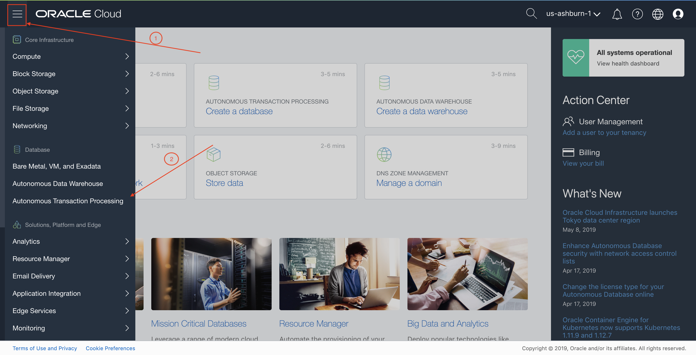
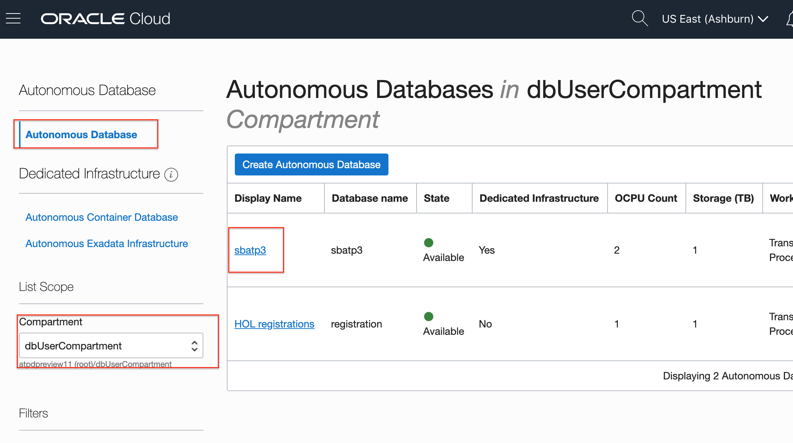
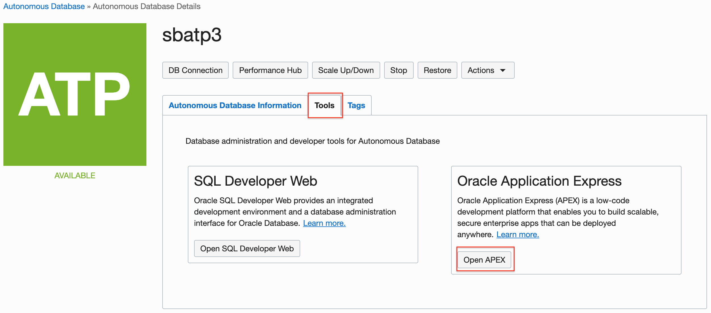
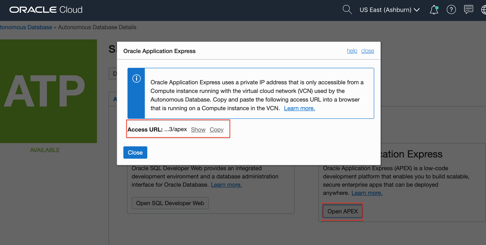


### **STEP 2: Setup VNC connection to the developer client VM and access APEX on the database as an admin user**

Since ATP Dedicated instances are typically deployed in a private network, one way to get to your APEX console is via a developer client machine setup in the same network

Refer to [Lab 6: Connecting a developer client to an Autonomous Database](./ConfigureDevClient.md) for instructions on setting up and connecting to a developer client machine.

For the purpose of this lab we assume that your have already deployed and have ssh access to a developer client virtual machine in a public application subnet

**Alternatively, you may also access the Apex console of your dedicated ATP instance from your local web browser If you are in the same OCI Network / VCN as your database. For detailed instruction on setting up a VPN connection into your private database cloud infrastructure, refer to [Lab 5](ConfigureVPN.md)**


**Steps**

- Open a terminal window on your machine and log into the developer VM

```
$ssh -i <private ssh key> opc@<public ip of developer image vm>
```

- A VNC Server is pre-installed in the developer client image. Simply start your vnc server and provide a password when prompted,

```
$vncserver
```

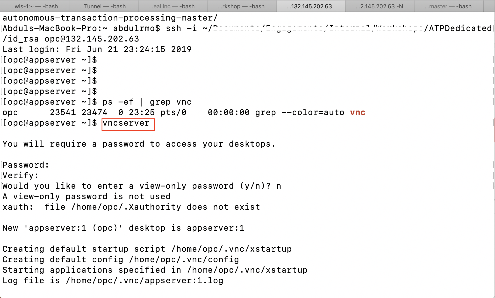

- On another terminal window and execute the below command to create a tunnel from your local machine to the developer VM.

```
ssh -i <private ssh key> -L 5901:127.0.0.1:5901 opc@<public ip developer image vm> -N
```

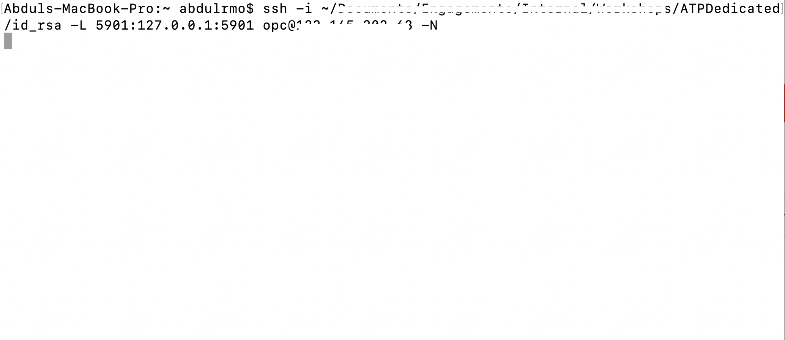

Note :  If you are a windows user, you can use Putty  to create a tunnel into the Developer VM.

- Open the VNC Viewer application running on your local computer and connect to the VNC server as show below.

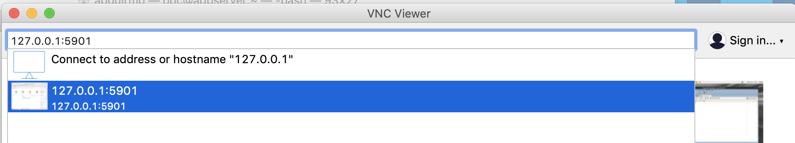
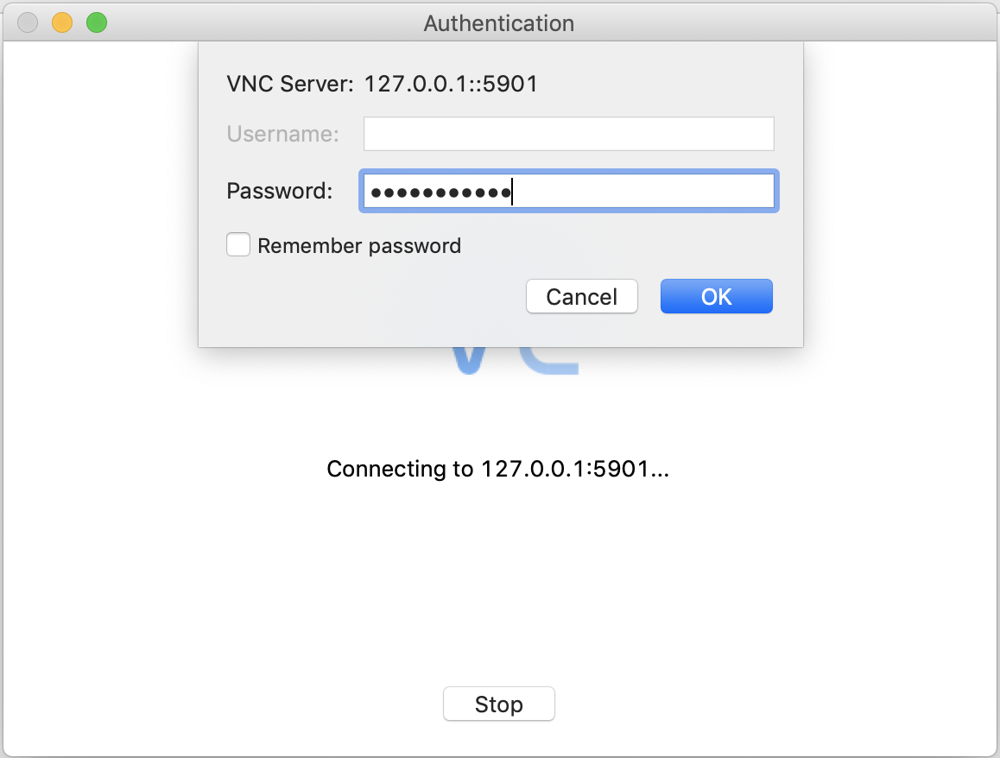
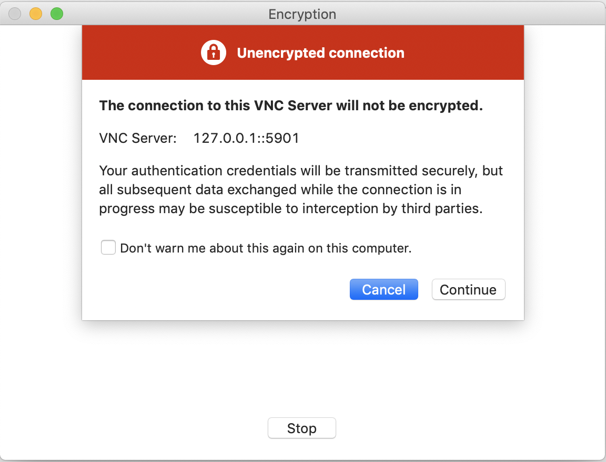
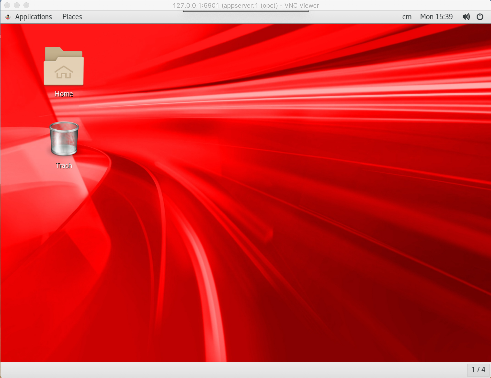

### **STEP 3: Setting up additional users on APEX**

When you have logged into the VNC, use the URL you saved in step 1 and paste it in the browser in the VNC to connect to APEX on your ATP-D database. You will the APEX login page for your database.


#### Steps to Log into APEX and Create addtional users

- Login to APEX, by using the following credentials.

```
Workspace : Internal
username : Admin
password : <You database admin password>
```


Note : If you are an experienced APEX user, you can just click on Create a Workspace and skip the next 3 steps.

- Click on Manage Workspace, this page will have all the options for you to manage your workspace or all the workspaces if you are an admin.

- Click on Monitor activity, this page allows you to manage and monitor your applications.


- Now, go back to the Manage workspace page and click on create workspace option.


- Enter a workspace name for your new workspace.Click next.

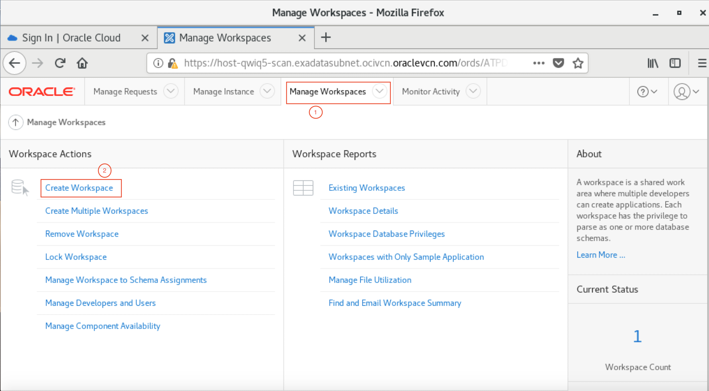

- In the dialog box, Select yes, if you want to re-use schema from your database. Select No, if you want to create a new schema for your workspace. in this lab we are going to create a new schema.


- Enter a Schema Name and a password for that schema. Click next.

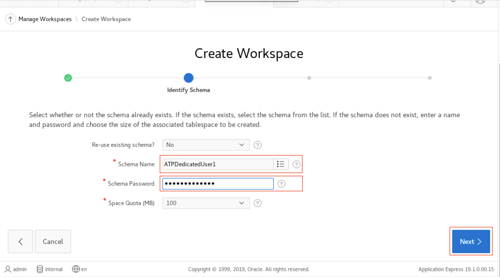

- Enter a password for the workspace admin, enter name(optional) and give an email id for the confirmation email.


- Verify the information you just entered and click Create Workspace.


- You will see a conformation message stating that the workspace has been created.

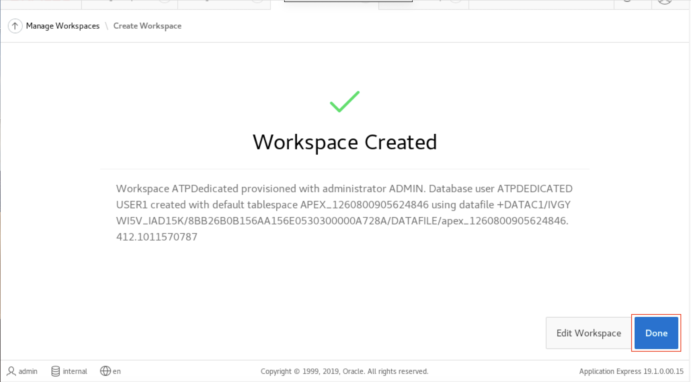

- On the top right corner of the page, click on the profile menu and sign out. Sign in to the new workspace using the workspace credentials you just created.

```
Workspace : new workspace name
username : Admin
password : <You new workspace admin password>
```


- Change the workspace password, if prompted.


- You have now logged into the new workpace that you have created and can start developing your application right away!

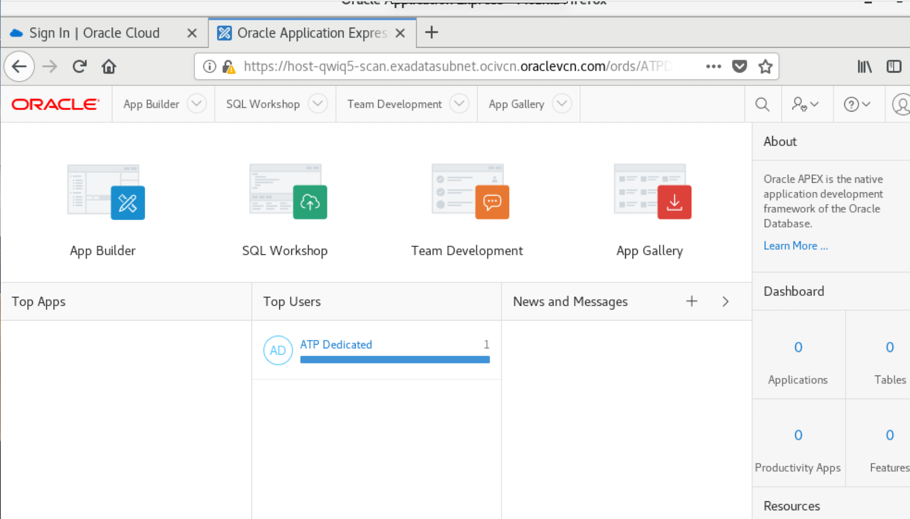


<table>
<tr><td class="td-logo">[](#)</td>
<td class="td-banner">
#### Great Work! You successfully learned to access the Apex console, create worksheets and add additional database users to Apex.
</td>
</tr>
<table>