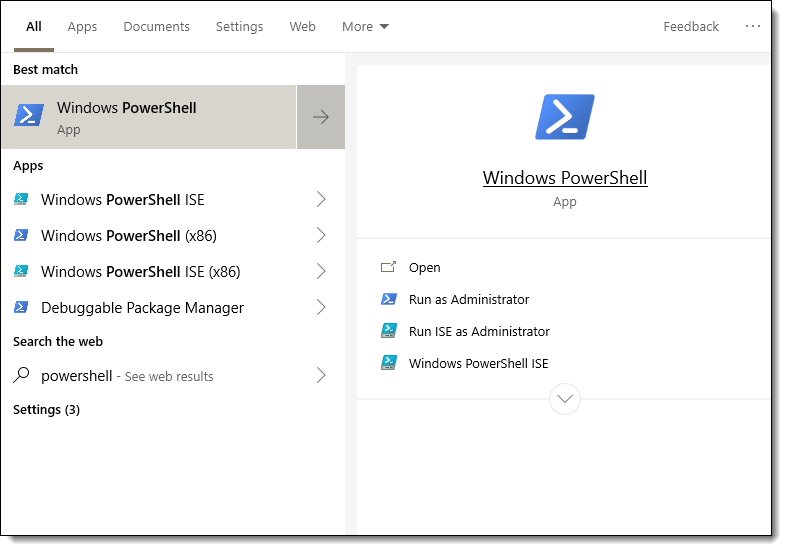
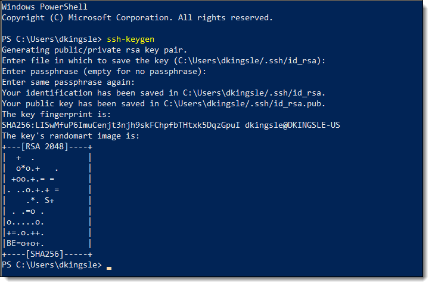
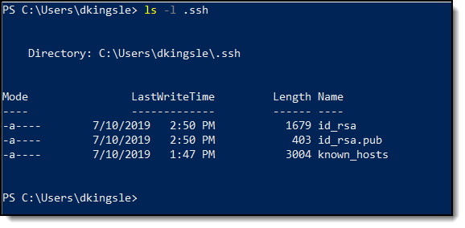
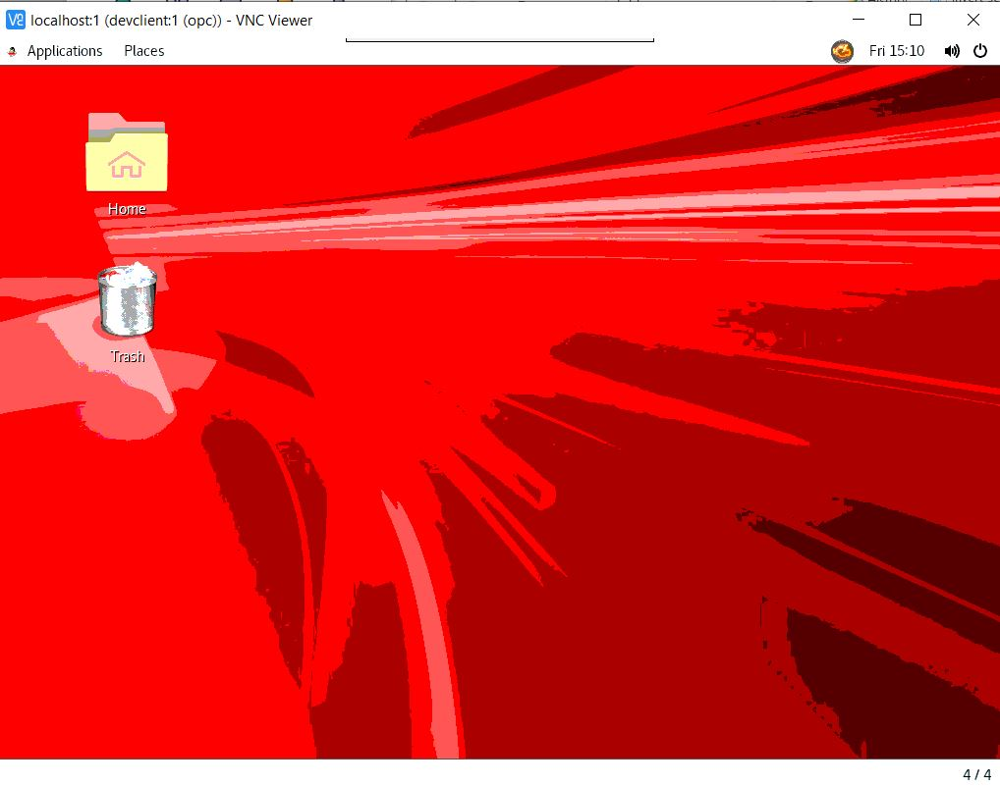

<table class="tbl-heading"><tr><td class="td-logo">

September 1, 2019
</td>
<td class="td-banner">
# Windows Appendix
</td></tr><table>

# Windows Appendix

This Appendix covers how to perform some of the steps in the labs from Windows environments.

## Objectives

- Cover steps to perform different labs from Windows environments

## Required Artifacts
- Windows system
- An Oracle Cloud Infrastructure account with IAM privileges to provision compute instances.
- VNC Viewer or other suitable VNC client on your local computer.

## **Steps**

### **STEP 1: Create an SSH-key**

SSH keys are required to access a running OCI instance securely. You can use an existing SSH-2 RSA key pair or create a new one. Below are instructions for generating your individual key pair for Linux, Mac, Windows, and Windows 10.  Windows 10 is the first Windows version to natively support ssh and terminal access.   Insructions for creating SSH keys can also be found on the OCI documentation page.
<https://docs.cloud.oracle.com/iaas/Content/GSG/Tasks/creatingkeys.htm>

## Windows Versions earlier than Windows 10

A third party SSH client needs to be installed for Windows versions prior to Windows 10 in order to generate SSH keys. You can use Git Bash, Putty, or a tool of your choice. This tutorial will use Putty as an example. Git Bash or any third party shell program instructions will likely be the same as the Linux instructions above.

**Note:** *If you don’t already have it, download the Putty application and install it on your Windows machine. [Download Putty](https://www.chiark.greenend.org.uk/~sgtatham/putty/latest.html).  Puttygen is a utility that comes with the Putty package and is used to generate SSH keys.  

**For Oracle employees, Putty is also available from the MyDesktop application.**

If you clicked on the link above you will be at the main putty donwload page.

From the **Package Files** section select the 32 or 64 bit version depending of which version of Windows you are running. The download windows will pop up as shown above. Save the file on your local Windows system. Most likely to your *Downloads** directory unless you select a different location.

Doubleclick on the downladed file (for example **putty-64bit-0.73-installer.msi**). This will launch the Putty installer.

Click **Next** and leave the Destination Folder unchanged unless you have a good reason to select a different destination. Click **Next**

On the next screen don't change any settings, and click **Install**

- After installing Putty, from the Windows start menu, run the PuTTYgen utility

- Click the Generate button and follow the instructions for generating random information.

- After the key information has been generated, enter an optional **passphrase** and press the **Save private key** button to save the key to your system.

**Note:** *A passphrase is not required but recommended for stronger security.*

- The private key should have the .ppk extension. Name it whatever you want and store it in a folder that’s easily accessible.

**NOTE:**  *We will not use the ‘Save public key’ option in PuttyGen, as the keyfile is not compatible with Linux openSSH. Instead, we will copy and paste the key information into a text file.*

- Left click on the Public key information and choose ‘Select All’ to select everything in the key field. Then left click again and copy the selected information to the clipboard.

- Save your public key to a text file with Notepad. Open a plain text editor and paste the key information. Name and save the file with a .pub extension.

- Close the Puttygen application

## Windows 10 Based Operating System  

- **Open Powershell window** Either select the application from the Windows Start menu or type 'cmd' or 'powershell' from the Windows search menu.  

- From your home directory (should be the default C:\Users\<Your Name>) type the `ssh-keygen` command.  Press **Enter** when asked for the filename, and press **Enter** twice for *no passphrase*.

    `PS C:\Users\myhome> ssh-keygen`

Typing *ssh-keygen* by itself creates a key named id_rsa under the default .ssh directory.  If you want to name your key, store it in another directory, or add other security options, the ssh-keygen command takes a number of useful switches.  

**ssh-keygen command switch guide:**

    -t – algorithm
    -N – “passphrase” Not required but best practice for better security
    -b – Number of bits – 2048 is standard
    -C – Key name identifier
    -f - \<path/root\_name\> - location and root name for files

- The key pair you generated is now stored in the default .ssh directory.  Use the `ls -l .ssh` command to verify.

### **STEP 2: Connecting to your Developer Image from a Windows system**

To connect to your instance, you can SSH directly from your machine and use command line to interact, or you can use a VNC viewer  access the image through a full graphical interface. This later method is highly recomended as you will have full graphical access to your cloud developer image vs. command line access through SSH.
However some initial setup may need to be done with SSH commands before full GUI access to the image is possible. 

**Usage Instructions Getting Connected with SSH**

When launching the instance, you will need to provide an SSH key that you previously created. Once the instance launches, you can connect to it using SSH. When attempting a connection from your Windows system to the cloud developer image, make sure that you are in the directory that contains your **id_rsa** file generated in the step above or your connection will not work.

On your Windows machine launch a **Command Prompt** window

- Use the following information to connect to the instance when issuing the commang below:

User: opc

IP Address: public IP address of the instance

id_rsa: path to the SSH-2 RSA private key file

For example:

$ cd .ssh

$ ssh –i id_rsa opc@IP Address

Once connected to the cloud developer image you will see the remote prompt **[opc@devclient ~]$**

**Usage Instructions Accessing via VNC  Graphical User Interface (GUI)**

To access a GUI via VNC, do the following:

- Install a VNC viewer on your local computer. A common VNC Viewer can be downloaded from https://www.realvnc.com/en/connect/download/viewer/

From the website select, select Windows and **Download VNC Viewer**. That will save a file to your downloads directory as in the previous step. Doublick on the file and it will launch the installer.

Follow the installation steps in the installer to install VNC Viewer.

In order to use VNC viewer, you must still establish an initial connection to the image through SSH to enable the remove VNC service to start and configure security in your newly created cloud developer image. This is a one time process on the image.

- Use SSH to connect to the compute instance running the Oracle Cloud Developer Image, as described above in **Usage Instructions Getting Connected with SSH** (connect to the opc user)

- Once connected and at the remote image prompt, configure a VNC password by typing **vncpasswd**

- When prompted, enter a new password and verify it
- Optionally, enter a view only password
- After the vncpasswd utility exits, start the VNC server by typing **vncserver**

This will start a VNC server with display number 1 for the opc user, and the VNC server will start automatically if your instance is rebooted.

Now to connect to the image from your local Windows computer you need to execute the following command after every restart of your local Windows comuter to re-establish a connection to the remote image. On your local computer, 

-  connect to your instance and create an ssh tunnel for port 5901 (for display number 1): by running the following in a **Command Prompt** window:

    **cd .ssh** - make sure you are in the .ssh directory on your local machine

    **ssh -L 5901:localhost:5901 –i id_rsa opc@IP Address** - specify your images IP address

If the connection request times out, try again

- Start a VNC viewer on your local machine by selecting **VNC Viewer** from the **Start** menu, or typing **VNC Viewer** in the search bar.
- Establish a VNC connection to: **localhost:1**

If you get a warning message about the communication not being encrypted click continue

- Enter the VNC password you set earlier, when you ran the **vncpasswd** command in the cloud developer image, in the password dialog and you will be connected!

<table>
<tr><td class="td-logo">

</td>
<td class="td-banner">

eg1.0
</td>
</tr>
<table>