<table class="tbl-heading"><tr><td class="td-logo">

Sept 1, 2019
</td>
<td class="td-banner">
# Setup ADB event notifications through OCI Notification Service
</td></tr><table>

To **log issues**, click [here](https://github.com/oracle/learning-library/issues/new) to go to the github oracle repository issue submission form.

## Introduction

**The Oracle Cloud Infrastructure Notifications service broadcasts messages  to distributed components through a publish-subscribe pattern, delivering secure, highly reliable, low latency and durable messages for applications hosted on Oracle Cloud Infrastructure and externally. You may get notified when service events occur, such as database creation, termination etc. or when alarms trigger eg. cpu usage exceeds threshold. Subscribers may choose to be notified via email, SMS messages to their phones or via Slack channels**

## Objectives

As an database developer or adminstrator,
- Learn how to set up autonomous database event topics
- Subscribe to database events via email and SMS
- Setup a Slack channel to receive ONS notifications

## Required Artifacts

- An Oracle Cloud Infrastructure account with priviledges to provision an autonomous database and create ONS topics and events

## Steps

### **Setup email / SMS notification on ADB provisioning events**

Lets start by setting up a simple email / SMS notification when autonomous database instances are provisioned in the users compartment

Login to your OCI tenancy and navigate to 'Application Integration' --> 'Notifications' from top left hamburger menu

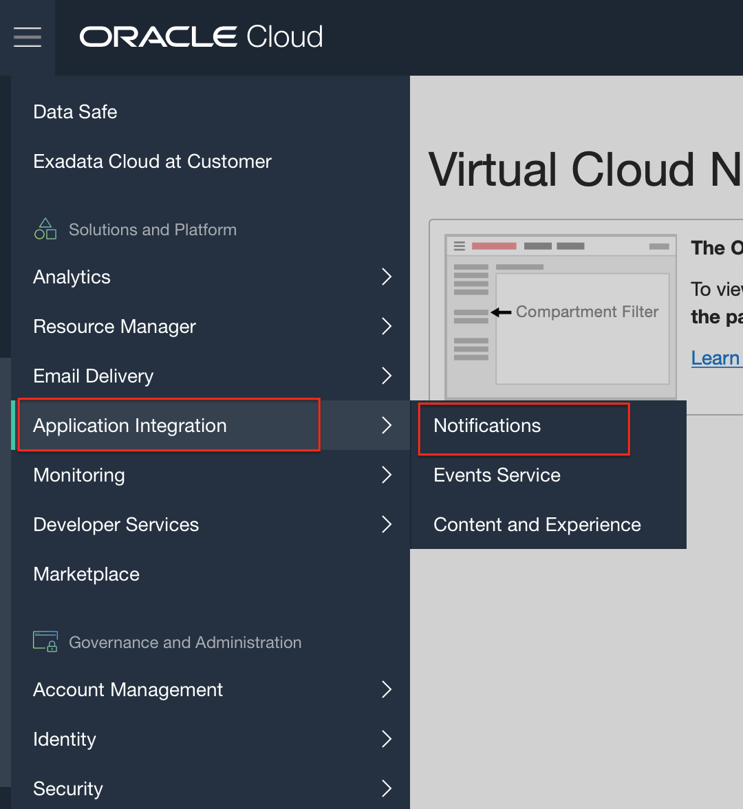

Select the desired compartment from the drop down and hit 'Create Topic'

Provide a topic name, an optional description and hit 'Create'

Next, lets add some subscribers to this topic. On the Notification page, select 'Subscriptions' on top left

On the 'Create Subscription' page, select the topic you just create, pick 'Email' from the protocol dropdown and provide your email address as shown

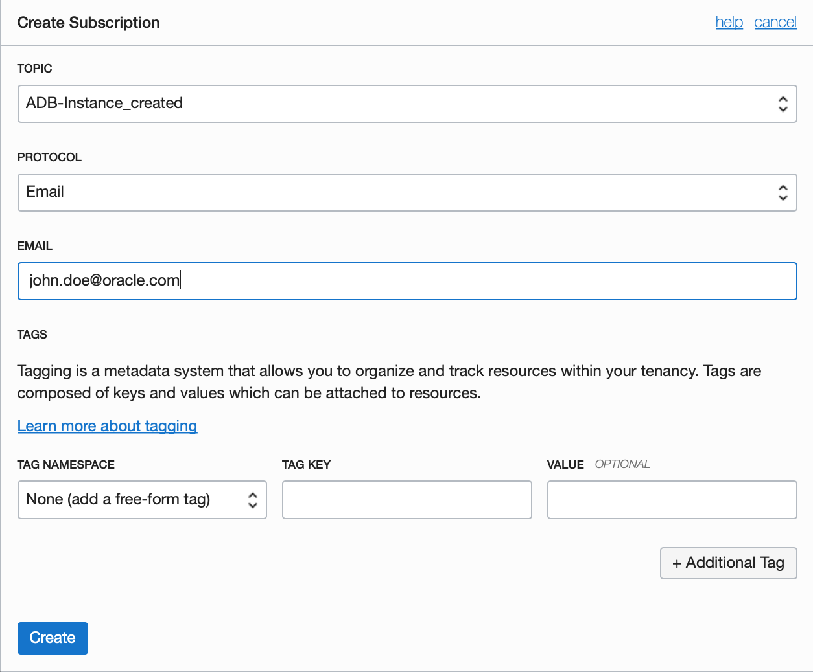

To setup an SMS notification simply add your email-to-SMS address. Most carriers support sending SMS over email. For eg. AT&T users can send SMS messages using the email id <10-digit-phone#>@mms.att.net

A complete list of email-to-SMS formats supported by various carriers is provided **[here](https://avtech.com/articles/138/list-of-email-to-sms-addresses/)**

Now that we have a topic and subscribers in place, lets create an event that feeds to this topic. Navigate to OCI Events from the main menu

On the Create Rule page provide a name and event conditions as shown in the screen shot below. A rule condition can be an event-type with one or more attributes and fiter tags. 

For eg. here our event-type is 'Autonomous Database - Create Instance Begin' and is set on the 'Database' service for compartment user04Compartment (we provide the OCID in the attribute) with a filter tag to indicate 'production' instances only

Basically, what we are saying here is 'Trigger a notification event when an Autonomous Database with a tag tier=production is created in the compartment with OCID xyz...

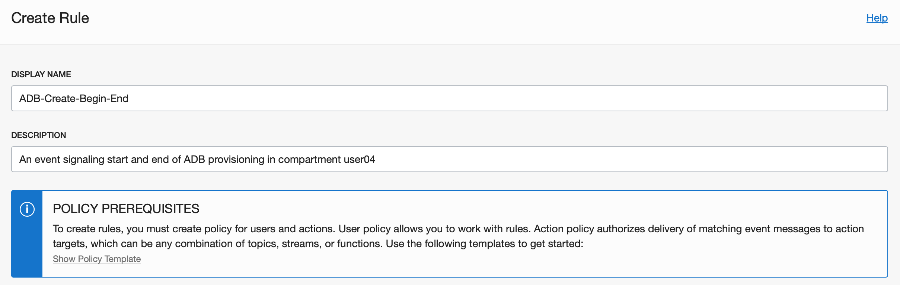

Scroll down to select the Action type for this event and pick Notifications and the topic you just created.

Thats it! To test your notification setup, create an autonomous database service instance as explained in Lab 4.

### **Setup a Slack channel to receive event notificationss**

Lets see how we can setup group notifications to a slack channel. First you would need to get a webhooks URL to your slack channel.

Sign into your slack workspace. If you don't have done, you can get one for free for the purposes of this lab at https://slack.com

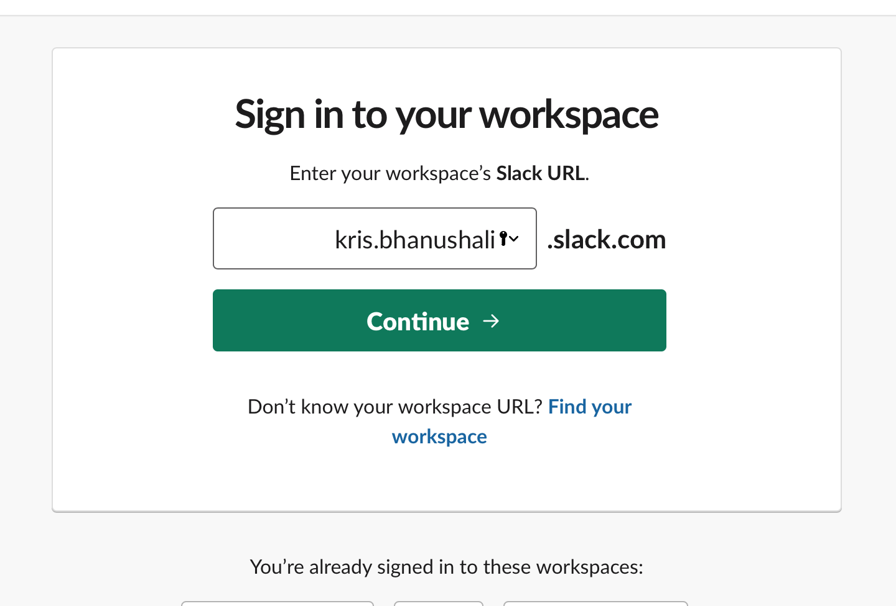

Once signed in, create a slack channel to receive ADB event notifications

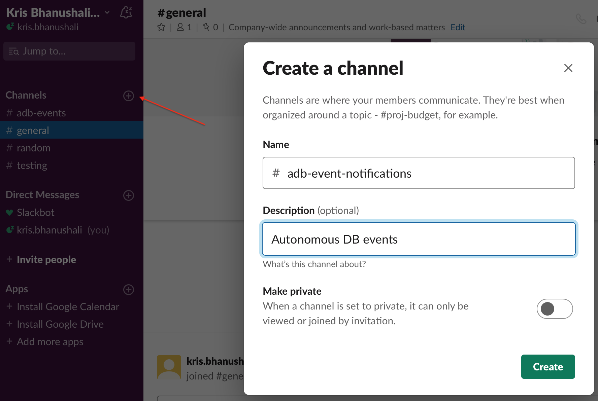

Next, lets buid a slack app that can receive notifications from OCI using a webhooks URL and pass it on to the channel we created. Open https://api.slack.com/apps in your browser

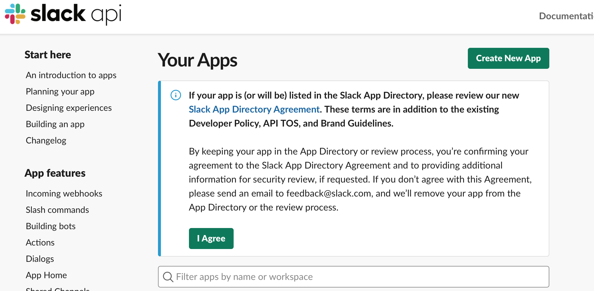

Provide a name and select a slack workspace. If you do not have one, click 'Sign into a different workspace' and scroll down to the bottom to access link to 'Create a new workspace'

Once you click 'Create App', on the application information page, click on the 'Incoming Webhooks' tile and activate webhooks as shown below
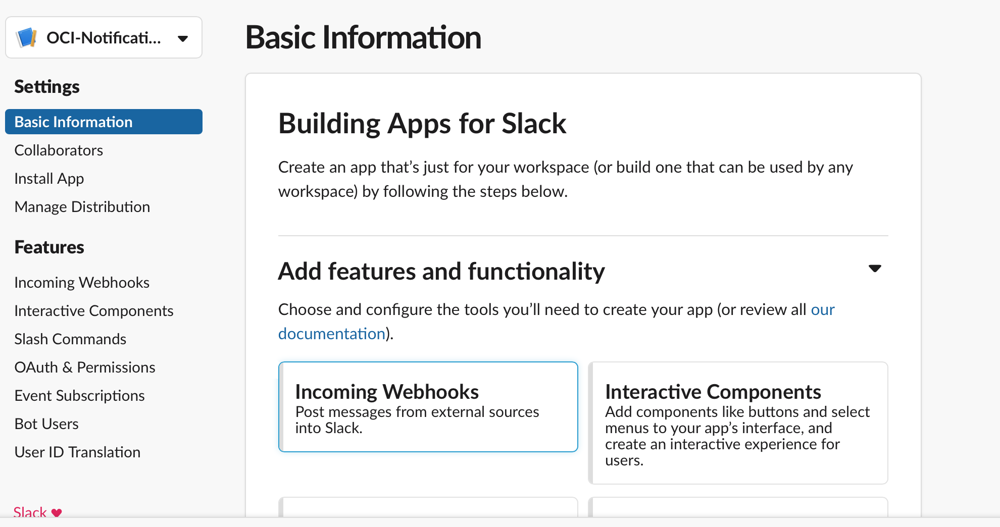
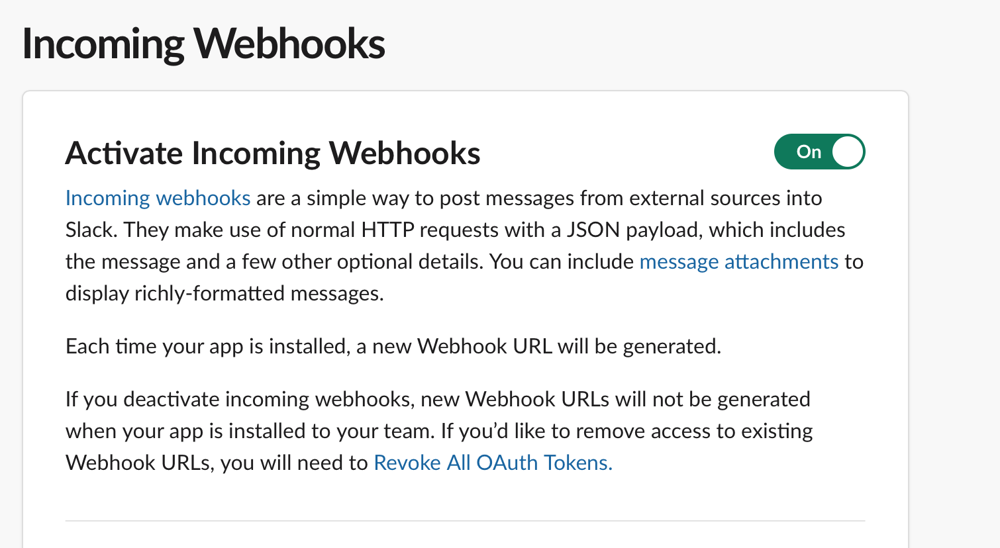

Once activated, scroll down and hit the 'Add New Webhook to Workspace' button
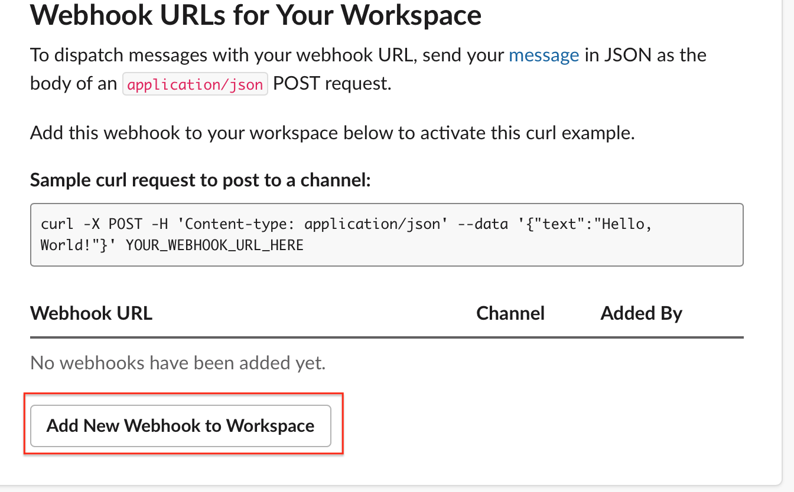

Next, pick a channel for the app to post to - 

Confirm, and scroll down to copy the Webhooks URL for your workspace. You will need to provide this in the OCI notification setup page. 

Copy the URL and navigate to the OCI Subscriptions page once again. On the 'Create Subscription' page, select 'Slack' as protocol, and paste the webhook URL for your slack workspace. Scroll down and hit 'Create'

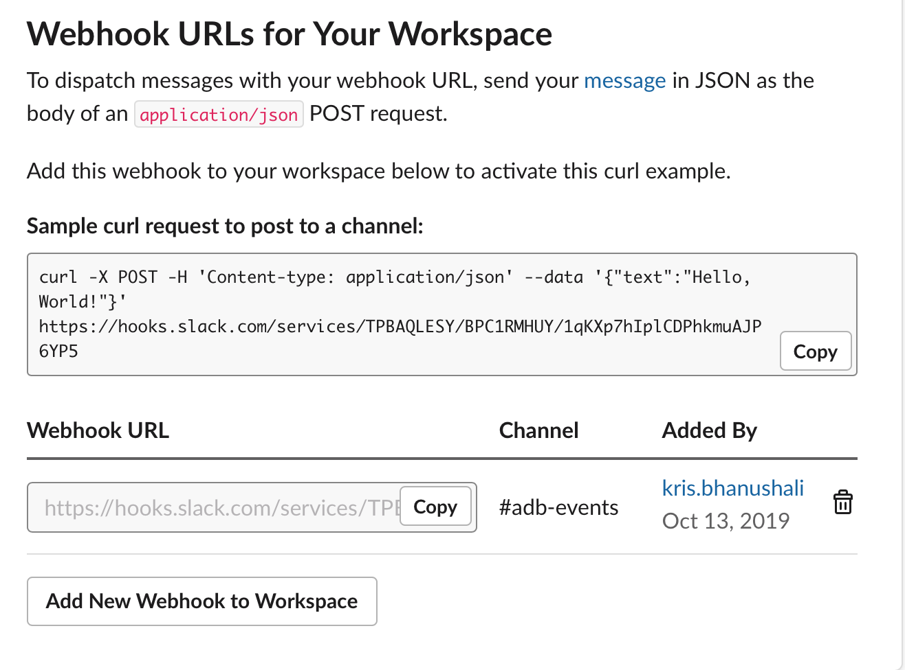

OCI Notification Service will then send a confirmation URL to your slack channel. Go back to slack and click the link to confirm your subscription.

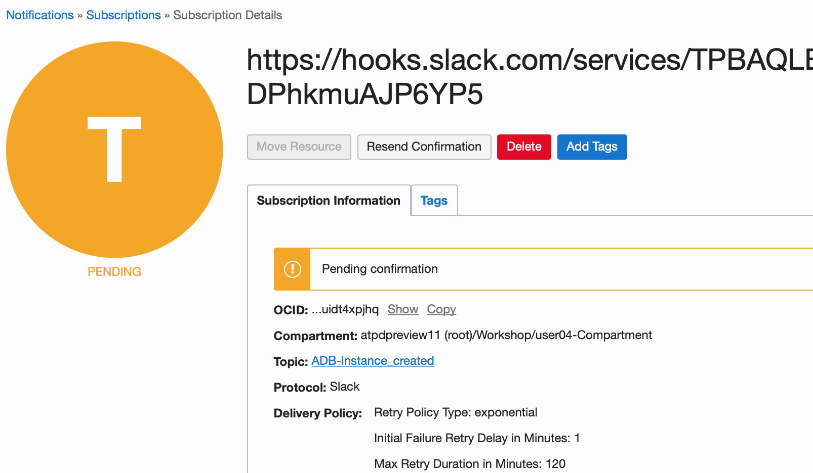

That is it! Try creating another ADB instance and receive notifications to this slack channel.

<table>
<tr><td class="td-logo">

</td>
<td class="td-banner">
### Congratulations! You successfully learnt to create DB event subscriptions and setup multi-channel notifications!

</td>
</tr>
<table>