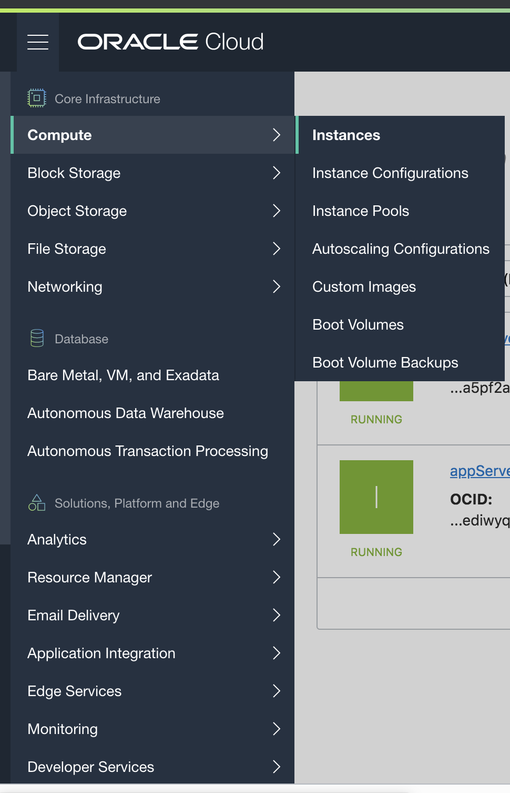
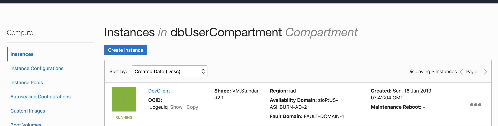

<table class="tbl-heading"><tr><td class="td-logo">

June 13, 2019
</td>
<td class="td-banner">
# Lab 6: Configuring a development system for use with your dedicated autonomous database
</td></tr><table>

To **log issues**, click [here](https://github.com/oracle/learning-library/issues/new) to go to the github oracle repository issue submission form.

## Introduction
The Oracle Cloud Infrastructure marketplace provides a pre-built image with necessary client tools and drivers to build applications on autonomous databases. As an application developer you can now provision a developer image within minutes and connect it to your dedicated or serverless database deployment. 

 The image is pre-configured with tools and language drivers so that you can configure a secure connection using Oracle SQL Developer, SQLCL and SQL*Plus.
For a complete list of features, login to your OCI account, select 'Marketplace' from the top left menu and browse details on the 'Oracle Developer Cloud Image'


## Objectives

As a database user, DBA or application developer,
- Configure a development system from a pre-built marketplace image
- Create an ssh tunnel from your local laptop into your development system
- Invoke SQL Developer on your development system over a VNC connection from your local laptop 
Configure a secure connection from your development system to your dedicated autonomous database using Oracle SQL Developer, SQLCL and SQL*Plus.

## Required Artifacts

- An Oracle Cloud Infrastructure account with IAM privileges to provision compute instances
- A pre-provisioned dedicated autonomous database instance. Refer <a href="./LabGuide100ProvisionAnATPDatabase.md" target="_blank">here</a> on how provision an ATP database.
- VNC Viewer or other suitable VNC client on your local laptop


## Steps

### **STEP 1: Provision a OCI Marketplace Developer Client image instance**

Let's take a step by step approach to setting up your development environment.

- Log into your cloud account using your tenant name, username and password
- Click Compute Instance in the left side menu under services 



<br>

- Click create Instance


<br>

- Specify a name for compute instance


<br>

- Choose Oracle Cloud Developer image from Oracle Image section


<br>

- Choose instance type for Virtual Machine


<br>

- Add SSH key, you can choose to import ssh public key or paste ssh public key


<br>

- Choose network, specify VCN that is used for ATP Dedicated Instance


<br>

#### Note: A network administrator needs to pre-provision a client network and setup access path to your autonomous database network. Please contact your cloud account / network / fleet administrator for application subnet information.

<br>


- Within a few mins your developement instance will be available and a public IP address assigned (if it is provisioned in a public subnet)


<br>

- Once provisioned, you can click on the instance name to see details



<br>
<br>

### **STEP 2: Download the secure connection wallet for your autonomous database**

- Click on Menu and select Autonomous Transaction Processing

- On the ATP console, select the dedicated ATP instance provisioned in <a href="./LabGuide400ProvisiondatabaseonyourdedicatedAutonomousInfrastructure.md" target="_blank">Lab 4</a>.


<br>

- Click on  **DB Connection** to open up Database Connection pop-up window


<br>

- Click on **Download** to supply a password for the wallet and download your client credentials.
#### Please use below Keystore password to download the client credentials

```
WElcome#1234
```


<br>
- Once you have downloaded your wallet, you will be navigated to ATP overview page

- The credentials zip file contains the encryption wallet, Java keystore and other relevant files to make a secure TLS 1.2 connection to your database from client applications. Store this file in a secure location.

<br>
<br>

### **STEP 3: Connect to ATP Dedicated instance using Oracle SQL Developer**

In this step, you will need the wallet zip file in the developer client machine.

You may either, 

- secure copy the file using scp, sftp or a windows ftp client

    ```
        $ scp <wallet_filename.zip> -i <path/to/keyfile> opc@<ipaddress-of-dev-client>:/home/opc

    ```
- or you may simply download it directly on the client once you connect over VNC


Next, let's invoke the VNC server on the development system


- SSH into your dev client compute instance

    ```
    $ ssh -i <private-key> opc@PublicIP
    ```

- Change the password on the VNC server
    
    ```
    $ vncpasswd
    ```
- Once you update the password, start your VNC server as a background process with the following command,
    ```
    $ vncserver -geometry 1280x1024  &
    ```
- Your development system may now be ready for accepting VNC connections


On your local laptop,

- Mac or Linux users can open a terminal window and create an ssh tunnel using the following command,
    ```
    $ ssh -N -L 5901:127.0.0.1:5901 -i \<priv-key-file\> opc@\<publicIP-of-your-devClient\> &
    ```
### For Windows users

- You can connect to and manage linux host mahine using SSH client. Recent versions of Windows 10 provide OpenSSH client commands to create and manage SSH keys and make SSH connections from a command prompt.

- Other common Windows SSH clients you can install locally is PuTTY. Click [here](https://docs.microsoft.com/en-us/azure/virtual-machines/linux/ssh-from-windows) to follow the steps to connect to linux host machine from your windows using PuTTY.

You now have a secure ssh tunnel from your local laptop to your developement system in OCI on VNC port 5901

### Note: As mentioned earlier, you need a VNC client installed on your laptop. This lab uses VNC Viewer


Start VNC Viewer on your laptop and configure a client connection using the settings as shown


Note how the connect string for VNC Server is simply localhost:1  That is because the default port 5901 on your local machine is forwarded to 5901 on your OCI dev client over an ssh tunnel

- Connect to your VNC desktop and provide the password you changed on the host earlier

- On your linux desktop, invoke SQL*Developer from the top left Applications menu as shown below


Create an new connection in sql*developer and provide the following information,

**Connection Name**: Name for your connection

**Username**: admin

**Password**: WElcome#1234

**Connection Type**: Cloud Wallet

**Role**: Default

**Configuration File**: Click on Browse and select the wallet file you downloaded

**Service**: 'databasename_high' Database name followed by suffix low, medium or high. These suffixes determine degree of parallelism used and are relevant for a DSS workload. For OLTP workloads it's safe to select any of them. Example: **atpd_high**

- Test your connection and save. The **Status** bar will show **Success** if it is a successful connection!


### **Connect to ATP instance using Oracle SQLCL**

Assuming you are still connected to your OCI development system over VNC, simply open a terminal window and start command line sql as follows,

```
$ sql /nolog
```
Point to your database wallet folder,
```
SQL> set cloudconfig /home/opc/Wallet_ATPD.zip
```
Connect to your database,


```
SQL> connect admin@atpd_high  (replace 'atpd_high' with an appropriate service for your instance)
```
Provide your admin password and you are in!


<br>
<br>

### **Connect to ATP instance using Oracle SQL*Plus**

SQL PLUS

For SQL*Plus, you will need to unzip the wallet in your local folder and edit sqlnet.ora as follows-

- Edit the sqlnet.ora file in /home/opc/wallet and change the line ?/network/admin:

Before:
```
WALLET_LOCATION = (SOURCE = (METHOD = file) (METHOD_DATA = (DIRECTORY="?/network/admin")))
SSL_SERVER_DN_MATCH=yes
```

After:
```
WALLET_LOCATION = (SOURCE = (METHOD = file) (METHOD_DATA = (DIRECTORY="/home/opc/wallet")))
SSL_SERVER_DN_MATCH=yes
```

Set the TNS_ADMIN env variable to point to wallet folder

        $export TNS_ADMIN=/home/opc/wallet

- Now, run:

```
sqlplus admin@atpd_high
```


-   Provide your admin password when prompted and you should be in!

<table>
<tr><td class="td-logo">[](#)</td>
<td class="td-banner">
### Great Work! You successfully created a client machine and connected to your autonomous database instance using SQL Developer and command line tools.
</td>
</tr>
<table>