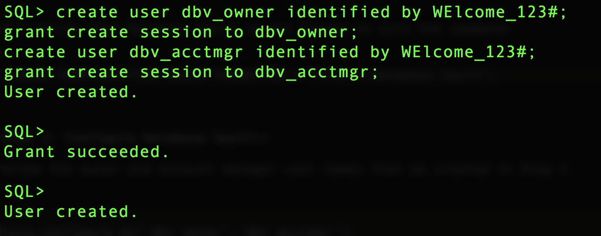
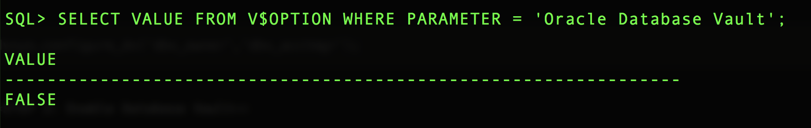

<table class="tbl-heading"><tr><td class="td-logo">


Sept 1, 2019
</td>
<td class="td-banner">
# Protect your data with Database Vault
</td></tr><table>

To **log issues**, click [here](https://github.com/oracle/learning-library/issues/new) to go to the github oracle repository issue submission form.

## Introduction


**Oracle Autonomous Database supports Oracle Database Vault, which you can use to implement powerful security controls within your dedicated database. These unique security controls restrict access to application data by privileged database users, reducing the risk of insider and outside threats and addressing common compliance requirements.

You can deploy controls to block privileged account access to application data and control sensitive operations inside the database. Trusted paths can be used to add additional security controls to authorized data access and database changes. Through the runtime analysis of privileges and roles, you can increase the security of existing applications by implementing least privileges and reducing the attack profile of your database accounts. Oracle Database Vault secures existing database environments transparently, eliminating costly and time consuming application changes.**


## Objectives

As a database security admin,

- Enable database vault in your autonomous database service
- Implement separation of duties to protect sensitive data in your autonomous database

## Required Artifacts

- An Oracle Cloud Infrastructure account

- A pre-provisioned instance of Oracle Developer Client image in an application subnet. Refer to [Lab2](20DeployImage.md)

- A pre-provisioned Autonomous Transaction Processing instance. Refer to [Lab 1](./10ProvisionAnATPDatabase.md)

## Steps

### **STEP 1: Create Database Vault Owner and Account Manager**

Connect to your dedicated autonomous database instance as user 'admin'

Create the Database Vault owner and account manager users as shown below

````
create user dbv_owner identified by WElcome_123#;
grant create session to dbv_owner;
create user dbv_acctmgr identified by WElcome_123#;
grant create session to dbv_acctmgr;
````



Next, verify if Database Vault is enabled:

````
SELECT VALUE FROM V$OPTION WHERE PARAMETER = 'Oracle Database Vault';
````



### **STEP 2: Configure Database Vault**

Login as the ADMIN user. Provide the owner and account manager user names that you created in Step 1

````
exec dvsys.configure_dv('dbv_owner','dbv_acctmgr');

````

### **STEP 2: Add objects to Vault**

Connect to your autonomous database as the Database Vault owner (dbv_owner)

Let's create a table in this schema and add a single row for testing

````
create table Test(column1 int, column2 int);
insert into Test values(1,2);
commit;

````

Next, let's enable the Database Vault

````
exec dbms_macadm.enable_dv;

````
Restart the Autonomous Database instance

Once the Database is back up and running, let's verify that Database Vault is turned on.

Connect as ADMIN user and run:

````
SELECT VALUE FROM V$OPTION WHERE PARAMETER = 'Oracle Database Vault';
````
We can see that now the value is TRUE. Database vault is now enabled. 

Now as the privileged 'admin' user try running a select statement on a table in the vault.

````
select * from dbv_owner.test;

````

This will return a realm error. The data in your database vault is protected.


<table>
<tr><td class="td-logo">

[](#)</td>
<td class="td-banner">
### Congratulations! You successfully learnt to use  database vault in your autonomous database


</td>
</tr>
<table>