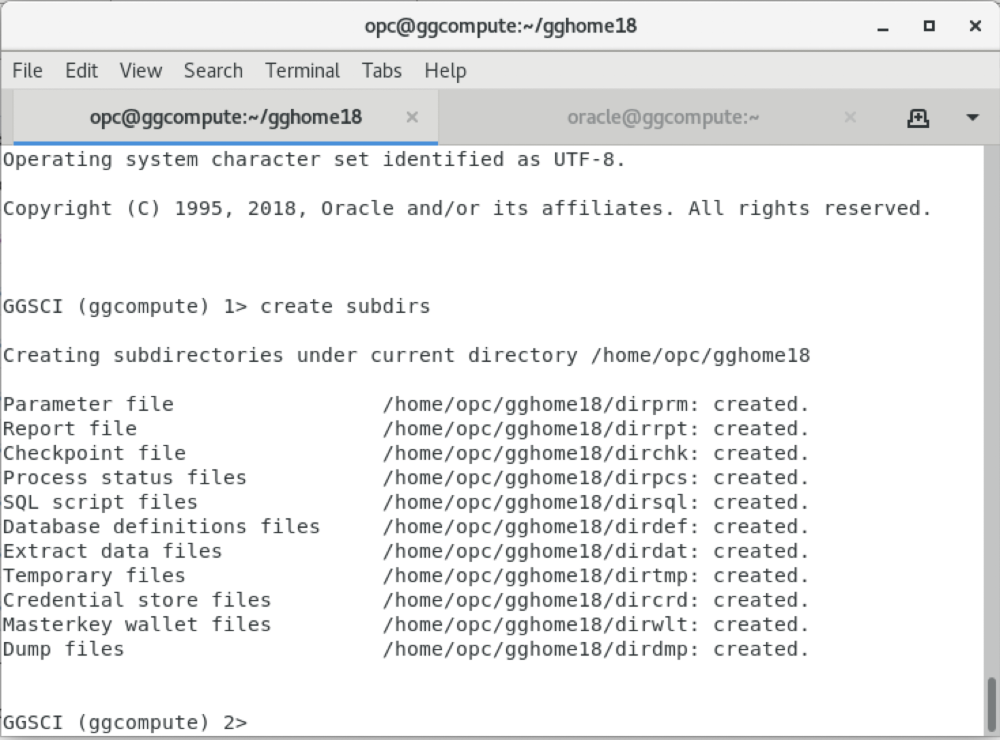
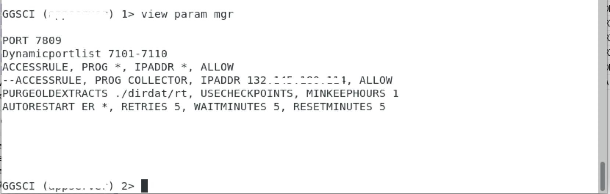

<table class="tbl-heading"><tr><td class="td-logo">

July 30, 2019
</td>
<td class="td-banner">
# Lab 14: Live migration to ATP-Dedicated using Oracle Goldengate replication
</td></tr><table>

## Introduction

Oracle GoldenGate 12c offers a real-time, log-based change data capture (CDC) and replication software platform to meet the needs of today’s transaction-driven applications. The software provides capture, routing, transformation, and delivery of transactional data across heterogeneous environments in real time. Oracle GoldenGate only captures and moves committed database transactions to insure that transactional integrity is maintained at all times. The application carefully ensures the integrity of data as it is moved from the source
database or messaging system, and is applied to any number of target databases or messaging systems.

Why would you use Oracle Golden Gate?

Oracle GoldenGate 12c offers several key advantages:
- » Continuous, real-time data movement with low latency
- » Negligible impact and overhead on source and target systems
- » No requirement for a middle-tier server
- » Tight integration with Oracle Data Integrator Enterprise Edition for complex transformations
- » No downtime for batch processing
- » Complete data recoverability in case of outages or failures
- » Read-consistent data movement while maintaining referential integrity
- » Ability to apply transformations and mappings within the target database
- » Ability to use the same product in different topologies for different solutions such    as continuous availability and zero-downtime upgrades and migrations

[Learn More](http://www.oracle.com/us/products/middleware/data-integration/oracle-goldengate-realtime-access-2031152.pdf)

To **log issues**, click [here](https://github.com/cloudsolutionhubs/autonomous-transaction-processing/issues/new) to go to the github oracle repository issue submission form.

## Objectives

As a database admin,

- Install Golden Gate on both source and target database
- Configure extract,pump and replicat processes on source and target golden gate instances respectively
- Replicate real time data from a simulated on-premise database to ATP-Dedicated

## Required Artifacts

-   The following lab requires an Oracle Cloud account. You may use your own cloud account, a cloud account that you obtained through a trial, or a training account whose details were given to you by an Oracle instructor.
- Access to OCI console
- Access to on-premise source database with admin access and VNC Server installed on it.
- A pre-provisioned Autonomous Transaction Processing-Dedicated as target database.
- A pre-provisioned developer client with network access to autonomous database for installing golden gate as a replicat and VNCServer installed on it..


## Steps

### **STEP 1: Install Golden Gate on source database and on a compute instance on OCI for target database**

To download and install Golden Gate, 

- Log onto to Oracle's e-delivery website by clicking on [this](https://edelivery.oracle.com) link. 
- Search for Golden Gate, you will see a list of Golden Gate versions. Select the appropriate version for your database. For this lab, we will need 2 different versions since our on-premise database is 12.1.0.2, so we need to select Golden Gate version 12.2.0.1 and the latest version of Golden Gate for the target database which is Autonomous Transaction Processing.
- Select the platfrom for which you want to download the software. In our case it will be Linux 64 bit. Click on continue.
- Accept the agreement and click on the package name to download the zip file.
- Create a directory for Golden Gate on your machine.
- unzip the zip file in the new directory created.
- Navigate to the installer

    ```
    ]$ mkdir ~/gghome
    ]$ mv V100692.zip ~/gghome
    ]$ cd ~/gghome
    ]$ unzip V100692.zip .
    ]$ cd fbo_ggs_Linux_x64_shiphome
    ]$ cd Disk1
    ]$ ./runInstaller
    ```

- Repeat the above steps for downloading the appropriate version for the target database instance.

### Note : In this lab, we are considering the architecture where the ATP-Dedicated is provisioned in a private subnet and hence we need two Golden Gate instances for replication. If the ATP-Dedicated instance is located in a public subnet, then we can configure both the extract and replicat process in the same Golden Gate instance, avoiding the need for two Golden Gate instances.


### **STEP 2: Configuring the source Golden Gate instance**

In the Oracle GoldenGate On Premises instance, you need to complete the following:


**Steps**

1. Log into your Oracle GoldenGate On Premises Oracle Database Server and configure the environment variables.

    ```
    export ORACLE_HOME="/u01/app/oracle/product/12.1.0.2/dbhome_1"
    export PATH=$PATH:<ORACLE_HOME PATH>/bin
    export TNS_ADMIN=$ORACLE_HOME/lib
    export GGHOME="<Golden Gate installation directory>"
    ```

    

2. Create a new Oracle GoldenGate On Premises user, create tables and load data if you havent done already.

    Note:The example shown below is just for reference, you can use any user and table. For our lab, we are going to use user abdul and table supplier.

    ```
    CREATE user abdul IDENTIFIED BY WElCome12_34#;
    grant dba, connect, resource to abdul;
    ```

    ```
    DROP TABLE abdul.supplier;
    CREATE TABLE abdul.supplier (n number, vc varchar2(10),PRIMARY KEY (n));
    alter database add supplemental log data;
    ```

    To verify that the tables exist in the schema abdul, we can connect sqldeveloper to the database or use sqlclient to connect and check the tables and the data exists.

    
    

3. Create the subdirectories needed to configure the extract processes. 

    ```
    GGSCI >  create subdirs
    ```

    

4. Create the extract process.

    Note : You can either use the username and password or a user id alias if created.

    ```
    extract ext1
    setenv (ORACLE_SID='<sid>')
    setenv (ORACLE_HOME='<path to oracle home>')
    userid abdul, password WElCome12_34#
    --useridalias cabdul_alias
    exttrail ./dirdat/rs
    table pdb1.abdul.supplier;
    ```

    

5. Create the extract data pump process

    Note : You can either use the username and password or a user id alias if created.

    ```
    extract ext1pump
    userid abdul, password WElCome12_34#
    --useridalias cabdul_alias
    RMTHOST host_IP_address, MGRPORT 7809
    rmttrail ./dirdat/rt
    table pdb1.abdul.supplier;
    ```

    

6. Add the extract processes and the trail processes.

    ```
    add extract ext1,integrated tranlog, begin now
    add exttrail ./dirdat/rs,extract ext1
    add extract ext1pump,exttrailsource ./dirdat/rs
    add rmttrail ./dirdat/rt,extract ext1pump
    ```

7. Login into the database from Golden Gate and configure the database.

    ```
    dblogin abdul, password WElCome12_34#
    add trandata pdb1.abdul.supplier
    ```

    

8. Connect to your Oracle GoldenGate On Premises instance.

    ```
    ssh -i private_key opc@IP_address_of_your_instance
    ```

9. Once you are connected to your Oracle GoldenGate On Premises instance, change user to    oracle.

    ```
    sudo su - oracle
    ```

10. Transfer the credentials ZIP file that you downloaded from Oracle Autonomous Data        Warehouse Cloud to your Oracle GoldenGate On Premises instance.

    In the Oracle GoldenGate On Premises instance, unzip the credentials file and copy everything except TNSNAMES.ORA and SQLNET.ORA into the directory you have configured as TNS_ADMIN.

11. To configure the connection details, 

    i. open your tnsnames.ora file from the wallet and copy the ATP-Dedicated connection    strings into the tnsnames.ora file in oracle client location or TNS_ADMIN in the     Oracle GoldenGate On Premises instance.

    ii. In the same tnsnames.ora file, copy the entry for the on-premise cdb and paste      it in the same file and then modify it to create an entry for the on-premise pdb.

        **Sample Connection String**
        connection_name = (description= (address=(protocol=tcps)(port=TNS Service port)(host=ADWC_IP)) (connect_data=(service_name=ADWC_Database_Name (security=(ssl_server_cert_dn="ADWC SSL certification")))

    iii. Open the sqlnet.ora file in present in the same folder and set the wallet location variable to the TNS_ADMIN path, as shown below:

        ```
        WALLET_LOCATION = (SOURCE=(METHOD=FILE)(METHOD_DATA=(DIRECTORY=$TNS_ADMIN)))
        ```

    Note:

    If your Oracle GoldenGate On Premises is associated with Oracle Database Cloud Service, the tnsnames.ora file will exist. Otherwise, you need to create the tnsnames.ora file and the network/admin directories under your $ORACLE_HOME/network/admin folder.

    ```
    cd $ORACLE_HOME/network/admin
    ls
    sqlnet.ora tnsnames.ora
    ```

    
    Note:

    The tnsnames.ora file provided with the credentials file contains three database service names identifiable as:
    ADWC_Database_Name_low
    ADWC_Database_Name_medium
    ADWC_Database_Name_high
    For Oracle GoldenGate replication, use ADWC_Database_Name_low. See Predefined Database Service Names for Autonomous Data Warehouse Cloud

    


12. Login into the source database, create a common user in the container and grant golden gate previliges to the user.

    ```
    create user C##abdul identified by WElCome12_34#;
    exec dbms_goldengate_auth.grant_admin_privilege('C##abdul',container=>'all');
    grant dba to C##_abdul;
    show parameter ENABLE_GOLDENGATE_REPLICATION;
    alter system set ENABLE_GOLDENGATE_REPLICATION=true scope=both;
    ```

13. Create a useridalias, start GGSCI.

    ```
    cd $GGHOME
    ./ggsci
    ```

13. Create the Oracle GoldenGate wallet and add the useridalias to the credential store.

    ```
    GGSCI> Create Wallet
    GGSCI> add credentialstore
    GGSCI> Alter credentialstore ADD USER C##ABDUL PASSWORD WElCome12_34# alias cabdul_alias 
    GGSCI> Alter credentialstore ADD USER abdul PASSWORD WElCome12_34# alias abdul_alias 
    GGSCI> DBLOGIN USERIDALIAS cabdul_alias
    ```

14. Edit the manager parameter file and configure the manager process.

    ```
    PORT 7809
    ACCESSRULE, PROG *, IPADDR *, ALLOW
    ```


15. Stop and start the manager and confirm that it started.

    ```
    GGSCI>stop mgr
    GGSCI>start mgr
    GGSCI>info mgr
    ```

    

16. start the extract and the datapump processes and confirm that they have started.

    ```
    GGSCI>start extract ext1
    GGSCI>start extract ext1pump
    GGSCI>info all
    ```

    
    


### **STEP 3: Configuring the target Golden Gate instance**

In the Oracle GoldenGate target instance, you need to complete the following:


**Steps**

1. Log into the developer client you provisoned as a pre-requisite for this lab.
2. Download the ATP-D instance client credentials wallet into the developer client.
3. Unzip the client credentials into a directory and set the TNS_ADMIN environment                variable to the client crednetials folder path.
4. Follow the steps in step-1 above to download and install golden gate. The only           difference would be while setting the ORACLE_HOME path, which should be the oracle       instant client folder in the developer client.

    
    
    
    
    

5. Create a new user for replication.

    ```
    drop user abdul cascade;
    create user abdul identified by WElCome12_34#;
    alter user abdul;
    grant create session, resource, create view, create table to abdul;
    ```
    

6. Log in as your new replication user.

    ```
    sqlplus abdul/WElCome12_34#@databasename_low
    ```

7. Create your replication tables.

    ```
    CREATE TABLE "ABDUL"."SUPPLIER" 
   (	"S_SUPPKEY" NUMBER NOT NULL ENABLE, 
	"S_NAME" CHAR(25 BYTE), 
	"S_ADDRESS" VARCHAR2(25 BYTE), 
	"S_CITY" CHAR(10 BYTE), 
	"S_NATION" CHAR(15 BYTE), 
	"S_REGION" CHAR(12 BYTE), 
	"S_PHONE" CHAR(15 BYTE)
   );
    ```

8. Unlock GGADMIN user and grant necessary previliges.

    ```
    alter user ggadmin identified by WElCome12_34# account unlock;
    alter table ggadmin quota unlimited on data;
    ```

    
    
    

9.  Connect to GGSCI.

    ```
    cd $GGHOME
    ./ggsci
    ```

10. Create the subdirectories needed to configure the replicat process. 

    ```
    GGSCI >  create subdirs
    ```

    

10. To configure, Oracle GoldenGate manager, open the mgr parameter file to edit it.

    Note: Ensure that the manager parameter file has the following information. you can specify any value for PORT, DYNAMIC PORT LIST, MINKEEPHOURS, RETRIES, WAITMINUTES and RESETMINUTES. Given below is just an example.
    ```
    GGSCI>edit param mgr
    ```
    ```
    PORT 7809
    Dynamicportlist 7800-7808
    ACCESSRULE, PROG COLLECTOR, IPADDR Source_Database_IP, ALLOW
    PURGEOLDEXTRACTS ./dirdat/rt, USECHECKPOINTS, MINKEEPHOURS 1
    AUTORESTART ER *, RETRIES 5, WAITMINUTES 5, RESETMINUTES 5
    ```

    
    
11. Add GGSCHEMA ggadmin to your GLOBALS file. From the Oracle GoldenGate installation location, run GGSCI and enter the following command, or open a file in a text editor.

    ```
    GGSCI> EDIT PARAMS ./GLOBALS
    ```

    
    

12. Add a checkpoit table for ggadmin schema in Golden Gate.

    ```
    GGSCI> add checkpointtable ggadmin.chktab
    ```

12. Stop and start the manager and confirm that it started.

    ```
    GGSCI>stop mgr
    GGSCI>start mgr
    GGSCI>info mgr
    ```

    

13. Configure your Replicat file. For a complete list of Replicat parameters, see Oracle     GoldenGate Parameters in [Oracle GoldenGate Reference](https://www.oracle.com/pls/topic/lookup?ctx=en/middleware/goldengate/core/18.1/oracle-db&id=GWURF-GUID-F0B2C37F-DEDC-4990-A51F-30687D48082E).

    ```
    GGSCI> edit param rep1
    ```

    ```
    replicat rep1
    setenv (ORACLE_HOME='<path to oracle instant client folder>')
    USERIDALIAS ggadmin_alias
    map pdb1.abdul.supplier, target abdul.supplier;
    ```

    Now save and exit.

    

14. Add your Replicat to create a Replicat group.

    ```
    Create Wallet
    ADD CREDENTIALSTORE
    ALTER CREDENTIALSTORE ADD USER ggadmin@databasename_low
    PASSWORD WElCome12_34# alias ggadmin_alias

    DBLOGIN USERIDALIAS ggadmin_alias

    add replicat rep1, exttrail ./dirdat/rt 
    ```
    
    
    
    
    

### **STEP 4: Starting the replication process**

In the Oracle GoldenGate source and target instance, you need to complete the following:


**Steps**

1. Make sure the mgr is running and start it if it is not running on both the source and targte golden gate instance.

    ```
    GGSCI>start mgr
    GGSCI>info mgr
    ```

    
    
    
    

2. On the source Golden Gate instance,Start the extract and extract data pump process.

    ```
    GGSCI>start ext1
    GGSCI>start ext1pump
    GGSCI>info all
    ```

    

3. On the target Golden Gate instance,Start the replicat process.

    ```
    GGSCI>start rep1
    GGSCI>info all
    ```

    

    Verify that there is no data currently on the target database.

    

4. Login to the Source database and insert rows into the source table and commit the changes.

    
    
    

5. Login to the target database and verify that the new rows have been replicated.

    


-   You are now ready to move to the next lab.

<table>
<tr><td class="td-logo">[](#)</td>
<td class="td-banner">
## Great Work - All Done!
</td>
</tr>
<table>