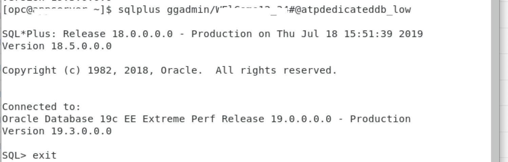
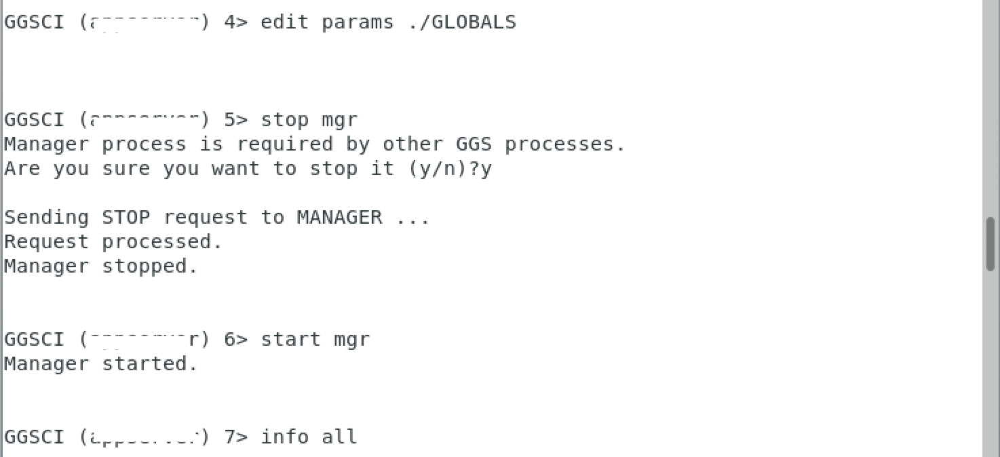
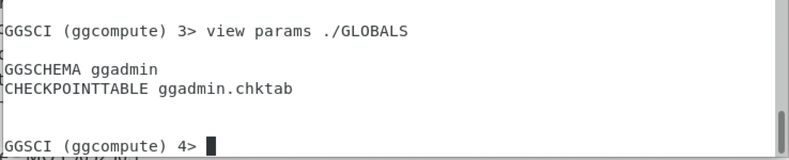
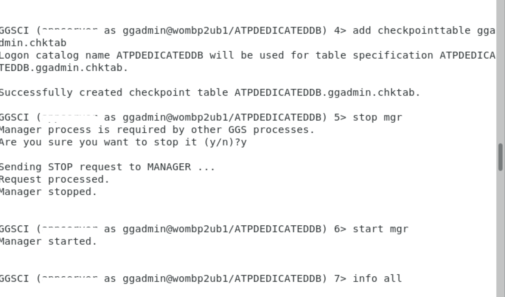
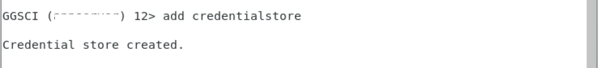
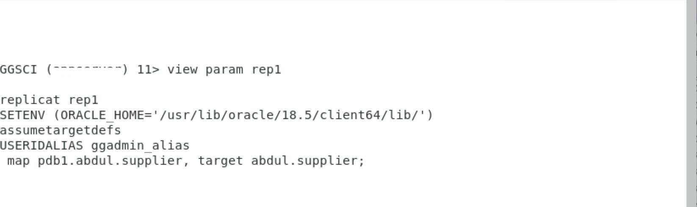
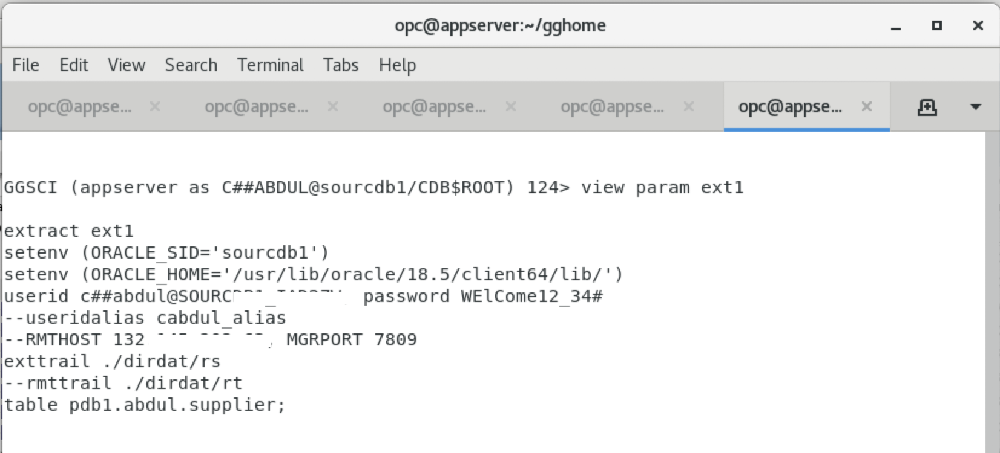
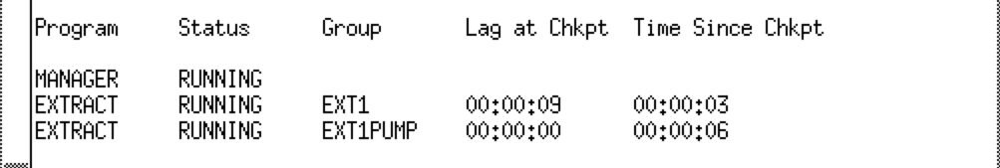

<table class="tbl-heading"><tr><td class="td-logo">

July 30, 2019
</td>
<td class="td-banner">
# Lab 14: SettingUpGoldenGatetoReplicateDataFromOn-PremiseDatabaseToATP-Dedicated-using-single-gg-instance
</td></tr><table>

## Introduction

Data Replication is a essential part of your efforts and tasks when you are migrating your oracle databases from one one provider to another. Oracle provides you with more than one option to acheive this based on the type of Oracle Database you want to move to. In this case, we are considering the usecase where we want to migrate to the Autonomous Transaction processing - Dedicated (ATP-D) database. Since your ATP-D is going to reside in your private network and will not be accessible from public internet. We have to achieve with a different approach to replicate data to an ATP-D instance rather than the normal methods which we use in general.

To achieve this usecase, we are going to use Oracle Golden Gate to perform real time data replication from your on-premise database to the ATP-D database. Oracle GoldenGate 12c offers a real-time, log-based change data capture (CDC) and replication software platform to meet the needs of today’s transaction-driven applications. The software provides capture, routing, transformation, and delivery of transactional data across heterogeneous environments in real time. Oracle GoldenGate only captures and moves committed database transactions to insure that transactional integrity is maintained at all times. The application carefully ensures the integrity of data as it is moved from the source
database or messaging system, and is applied to any number of target databases or messaging systems.

Why would you use Oracle Golden Gate?

Oracle GoldenGate 12c offers several key advantages:
- » Continuous, real-time data movement with low latency
- » Negligible impact and overhead on source and target systems
- » No requirement for a middle-tier server
- » Tight integration with Oracle Data Integrator Enterprise Edition for complex transformations
- » No downtime for batch processing
- » Complete data recoverability in case of outages or failures
- » Read-consistent data movement while maintaining referential integrity
- » Ability to apply transformations and mappings within the target database
- » Ability to use the same product in different topologies for different solutions such    as continuous availability and zero-downtime upgrades and migrations

[Learn More](http://www.oracle.com/us/products/middleware/data-integration/oracle-goldengate-realtime-access-2031152.pdf)

To **log issues**, click [here](https://github.com/cloudsolutionhubs/autonomous-transaction-processing/issues/new) to go to the github oracle repository issue submission form.

## Objectives

- Setup real time data replication from on-premise to ATP-D instance.

## Required Artifacts

- Access to OCI console
- Access to on-premise source database with admin access.
- A pre-provisioned Autonomous Transaction Processing-Dedicated as target database.
- A pre-provisioned developer client image, with VNC Server installed and network access to both source and target database, to install Golden Gate on it.
- VNC Viewer or other suitable VNC client on your laptop.


## Steps

### **STEP 1: Install Golden Gate on a compute instance (Developer Client Image from OCI Marketplace) on OCI**

- Provision a Developer Client image from OCI marketplace. For steps to provision, refer the <a href="./ConfigureDevClient.md" target="_blank">Configure Dev Client</a> lab.

- Install VNC server on the developer client
    - ssh into the developer client as OPC user.

    ```
    ssh -i <ssh_private_key> opc@ip_address
    ```

    - As opc user, create vnc server.

    ```
    ]$ vncserver
    ```

- Log in to the developer client, using the VNC server client on your desktop, using the ip address and the port number.

    - On your local terminal window, do local port forwarding using the below command.

    ```
    ssh -i id_rsa -L 5901:127.0.0.1:5901 opc@<ip-address_dev_client> -N
    ```
    - using your VNC client, login into the VNC server.
    ```
    ipaddress_of_dev_client:5901
    ```


To download and install Golden Gate, 

- Log onto to Oracle's e-delivery website from your browser on Dev Client,by logging on below website.  https://edelivery.oracle.com 

  

- Search for Golden Gate, you will see a list of Golden Gate versions. Select the latest version of Golden Gate. For this lab, we need to select Golden Gate version 18.0.0.0.

  

  

  

- Select the platform for which you want to download the software. In our case it will be Linux 64 bit. Click on continue.

  

  

- Accept the agreement and click on the package name to download the zip file.
  
  

- Create a directory for Golden Gate on your machine. Move the downloaded zip file into the created folder. 

    ```
    ]$ mkdir ~/gg
    ]$ mv V100692.zip ~/gg
    ```

    

- unzip the zip file in the new directory created.

    ```
    ]$ cd ~/gg
    ]$ unzip V100692.zip .
    ```

    

- Navigate to the installer and run it.

    ```
    ]$ cd fbo_ggs_Linux_x64_shiphome
    ]$ cd Disk1
    ]$ ./runInstaller
    ```

    

- Select the Golden Gate version, for this lab it is going to be 18c.

    

- Enter the folder path where you want to install Golden Gate on the Developer Client (Compute instance)

  

- verify the configurationa and click next.

    

- Click close after the installation is complete.

  
  
  

### **STEP 2: Configuring the Golden Gate instance**

In the Oracle GoldenGate target instance, you need to complete the following:


**Steps**

1. Log into the developer client you provisoned as a pre-requisite for this lab using a VNC Viewer or any suitable client from your laptop.

2. Download the ATP-D instance client credentials wallet into the developer client.

3. Transfer the credentials ZIP file that you downloaded from Oracle Autonomous Data Warehouse 
   Cloud to your Oracle GoldenGate instance.

    In the Oracle GoldenGate instance,Open a terminal window and navigate to the folder where you downloaded the credentials zip file and unzip the client credentials zip file to a location of your choice.

    

4. Now, To configure the connection details for source database,

    i. Copy the On-Premise/Source DB connection strings for both CDB and PDB into the tnsnames.ora file in oracle client location or TNS_ADMIN in the Oracle GoldenGate instance.

    ```
    **Sample Connection String**
    pdb1=(DESCRIPTION =(ADDRESS = (PROTOCOL = TCP)(HOST = ip address)(PORT = 1521))(CONNECT_DATA =(SERVER = DEDICATED)(SERVICE_NAME = pdb1.domain.oraclevcn.com)))
    ```

    


    ii. Open the sqlnet.ora file present in the same folder(i.e in Golden Gate Instance) and set the wallet location variable to the TNS_ADMIN path, as shown below:

    ```
    WALLET_LOCATION = (SOURCE=(METHOD=FILE)(METHOD_DATA=(DIRECTORY=$TNS_ADMIN)))
    ```

    

    ```
    cd $ORACLE_HOME/network/admin
    ls
    sqlnet.ora tnsnames.ora
    ```

    Note:

    The tnsnames.ora file provided with the credentials file contains three database service names identifiable as: ADWC_Database_Name_low ADWC_Database_Name_medium ADWC_Database_Name_high For Oracle GoldenGate replication, use ADWC_Database_Name_low. See Predefined Database Service Names for Autonomous Database Cloud

5. In your Oracle GoldenGate compute instance bash profile, configure the environment variables as        shown below and source the profile so that you do not have to manually set them again.

    Now, change user to oracle and open your bash profile.

    ```
    ]$ sudo su - oracle
    ]$ vi ~/.bash_profile
    ```

    Add the below lines to your bash profile and modify the values according to your machine as shown in the screenshot.

    ```
    export ORACLE_HOME="/usr/lib/oracle/18.5/client64/lib/"[Oracle Instant Client Path]
    export PATH=$PATH:<ORACLE_HOME PATH>/bin
    export TNS_ADMIN=$ORACLE_HOME/lib
    export GGHOME="<oracle Golden Gate installation directory>"
    export TNS_ADMIN="<Oracle Instant Client Path>/network/admin"
    export LD_LIBRARY_PATH="<Oracle Instant Client Path>"

    ```

    Source the bash profile.

    ```
    ]$ source ~/.bash_profile
    ```

    

6. Check the connectivity by login into the database using sql client and then exit.

    Source Database:

    ```
    sqlplus sys/<password>@cdb_name as sysdba
    exit
    ```

    Target Database:

    ```
    sqlplus admin/<password>@databasename_low
    exit
    ```

7. Now connect to the source database from your terminal using sql client or sql developer and create a new on-premises/source database user, create tables and load data, if you havent done already.

    Note:The example shown below is just for reference, you can use any user and table. For our lab, we are going to use user abdul and table supplier.

    ```
    sqlplus sys/<password>@pdb_name as sysdba
    ```

    ```
    CREATE user abdul IDENTIFIED BY WElCome12_34#;
    grant dba, connect, resource to abdul;
    ```

    ```
    DROP TABLE abdul.supplier;
    CREATE TABLE "ABDUL"."SUPPLIER" 
   (	"S_SUPPKEY" NUMBER NOT NULL ENABLE, 
	"S_NAME" CHAR(25 BYTE), 
	"S_ADDRESS" VARCHAR2(25 BYTE), 
	"S_CITY" CHAR(10 BYTE), 
	"S_NATION" CHAR(15 BYTE), 
	"S_REGION" CHAR(12 BYTE), 
	"S_PHONE" CHAR(15 BYTE)
   );
    alter database add supplemental log data;
    ```
    
    To verify that the tables exist in the schema abdul, we can connect sqldeveloper to the database or use sqlclient to connect and check the tables and the data exists.

    
    

8. create a common user in the container database and grant golden gate previliges to the user.

    ```
    create user C##abdul identified by WElCome12_34#;
    exec dbms_goldengate_auth.grant_admin_privilege('C##abdul',container=>'all');
    grant dba to C##abdul;
    show parameter ENABLE_GOLDENGATE_REPLICATION;
    alter system set ENABLE_GOLDENGATE_REPLICATION=true scope=both;
    ```

9. Log into your target database as your admin user.

    ```
    sqlplus admin/<db_admin_password>@databasename_low
    ```

10. Create a new user for replication in the target Database.

    ```
    drop user abdul cascade;
    create user abdul identified by WElCome12_34#;
    alter user abdul;
    grant create session, resource, create view, create table to abdul;
    ```

    

11. Create your replication tables.

    ```
    CREATE TABLE "ABDUL"."SUPPLIER" 
    ("S_SUPPKEY" NUMBER NOT NULL ENABLE, 
	"S_NAME" CHAR(25 BYTE), 
	"S_ADDRESS" VARCHAR2(25 BYTE), 
	"S_CITY" CHAR(10 BYTE), 
	"S_NATION" CHAR(15 BYTE), 
	"S_REGION" CHAR(12 BYTE),
	"S_PHONE" CHAR(15 BYTE));
    ```

12. Unlock GGADMIN user and grant necessary previliges.

    ```
    alter user ggadmin identified by WElCome12_34# account unlock;
    alter table ggadmin quota unlimited on data;
    ```

    
    

    Now try logging in to the target database using the "ggadmin" user.

    

13. Connect to GGSCI.

    ```
    cd $GGHOME
    ./ggsci
    ```

    

14. Create the subdirectories needed to configure the replicat process. 

    ```
    GGSCI >  create subdirs
    ```

    
        


15. To configure, Oracle GoldenGate manager, open the mgr parameter file to edit it.

    Note: Ensure that the manager parameter file has the following information. you can specify any value for PORT, DYNAMIC PORT LIST, MINKEEPHOURS, RETRIES, WAITMINUTES and RESETMINUTES. Given below is just an example.
    ```
    GGSCI>edit param mgr
    ```
    ```
    PORT 7809
    Dynamicportlist 7800-7808
    ACCESSRULE, PROG *, IPADDR Source_Database_IP, ALLOW
    PURGEOLDEXTRACTS ./dirdat/rt, USECHECKPOINTS, MINKEEPHOURS 1
    AUTORESTART ER *, RETRIES 5, WAITMINUTES 5, RESETMINUTES 5
    ```

    

16.  Add GGSCHEMA ggadmin to your GLOBALS file. From the Oracle GoldenGate installation location, run GGSCI and enter the following command, or open a file in a text editor.

    ```
    GGSCI> EDIT PARAMS ./GLOBALS
    ```

17. Add a checkpoint table for ggadmin schema in Golden Gate.

    ```
    GGSCHEMA ggadmin
    checkpointtable ggadmin.chktab
    ```

    
    

18. Stop and start the manager and confirm that it started.

    ```
    GGSCI>stop mgr
    GGSCI>start mgr
    GGSCI>info mgr
    ```

    
    
19. Create the Oracle GoldenGate wallet and add the useridalias to the credential store.

    ```
    GGSCI> Create Wallet
    GGSCI> add credentialstore
    GGSCI> Alter credentialstore ADD USER C##ABDUL PASSWORD <password> alias <cdb_user_alias>
    GGSCI> Alter credentialstore ADD USER abdul PASSWORD <password> alias <pdb_user_alias>
    GGSCI> ALTER CREDENTIALSTORE ADD USER ggadmin@databasename_low PASSWORD <password> alias <ggadmin_alias>
    GGSCI> DBLOGIN USERIDALIAS <cdb_user_alias>
    GGSCI> DBLOGIN USERIDALIAS <pdb_user_alias>
    GGSCI> DBLOGIN USERIDALIAS <ggadmin_alias>
    ```

    
    
    
    

    verify the connectivity to both the databases.

    
        
    


20. Configure your Replicat file. For a complete list of Replicat parameters, see Oracle     GoldenGate Parameters in [Oracle GoldenGate Reference](https://www.oracle.com/pls/topic/lookup?ctx=en/middleware/goldengate/core/18.1/oracle-db&id=GWURF-GUID-F0B2C37F-DEDC-4990-A51F-30687D48082E).

    ```
    GGSCI> edit param rep1
    ```

    ```
    replicat rep1
    setenv (ORACLE_HOME='<path to oracle instant client folder>')
    USERIDALIAS <ggadmin_alias>
    map <source_pdb>.<source_schema>.<source_table>, target <target_schema>.<target_table>;
    ```

    Now save and exit.

    

21. Create the extract process.

    Note : You can either use the username and password or a user id alias if created.

    ```
    extract ext1
    setenv (ORACLE_SID='<sid>')
    setenv (ORACLE_HOME='<path to oracle home>')
    useridalias <cdb_user_alias>
    exttrail ./dirdat/rs
    table pdb1.abdul.supplier;
    ```

    

22. Create the extract data pump process

    Note : You can either use the username and password or a user id alias if created.

    ```
    extract ext1pump
    useridalias <cdb_user_alias>
    RMTHOST host_IP_address, MGRPORT <mgr_port>
    rmttrail ./dirdat/rt
    table <source_pdb>.<source_schema>.<source_table>;
    ```

    

23. Add the extract processes and the trail processes.

    ```
    add extract ext1,integrated tranlog, begin now
    add exttrail ./dirdat/rs,extract ext1
    add extract ext1pump,exttrailsource ./dirdat/rs
    add rmttrail ./dirdat/rt,extract ext1pump
    ```
    

24. Login into the database from Golden Gate and configure the database.

    ```
    dblogin userid <cdb user>@<db connection from tnsnames>, password <password>
    add trandata <pdb_name>.<schema_name>.<table_name>
    ```

    For Example :

    ```
    dblogin userid c##abdul@SOURCDB1_IAD2ZW, password WElCome12_34#
    add trandata pdb1.abdul.supplier
    ```

    
    

25. Add your Replicat to create a Replicat group.

    ```
    DBLOGIN USERIDALIAS ggadmin_alias

    add replicat rep1, exttrail ./dirdat/rt 
    ```

    
    


### **STEP 3: Starting the extract and replication processes**

In the Oracle GoldenGate source and target instance, you need to complete the following:

**Note : When you run your extracts and replicat process, If you see "No route to host error" then you have to add rule in your Golden Gate compute instance firewall or iptables to accept connections from the source db.**

**Steps**

1. Make sure the mgr is running and start it if it is not running on both the source and targte golden gate instance.

    ```
    GGSCI>start mgr
    GGSCI>info mgr
    ```

    
    
    
    

2. On the source Golden Gate instance,Start the extract and extract data pump process.

    ```
    GGSCI>start ext1
    GGSCI>start ext1pump
    GGSCI>info all
    ```

    

3. On the target Golden Gate instance,Start the replicat process.

    ```
    GGSCI>start rep1
    GGSCI>info all
    ```

    

    Verify that there is no data currently on the target database.

    

4. Login to the Source database and insert rows into the source table and commit the changes.

    
    
    

5. Login to the target database and verify that the new rows have been replicated.

    


-   You are now ready to move to the next lab.

<table>
<tr><td class="td-logo">[](#)</td>
<td class="td-banner">
## Great Work - All Done!
</td>
</tr>
<table>