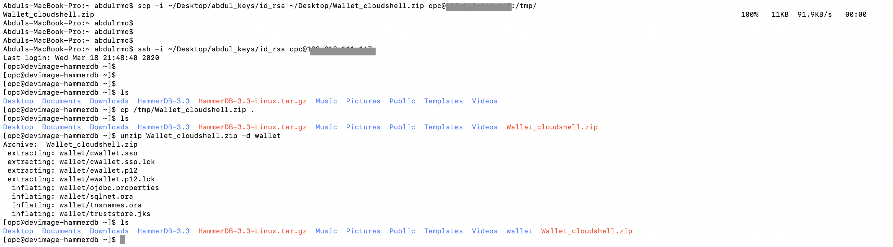

<table class="tbl-heading"><tr><td class="td-logo">


Sept 1, 2019
</td>
<td class="td-banner">
# Building 'Always-On' applications on the Autonomous Database
</td></tr><table>

To **log issues**, click [here](https://github.com/oracle/learning-library/issues/new) to go to the github oracle repository issue submission form.

## Introduction

The Oracle Autonomous Database allows you to build 'Always-On' applications. i.e. applications need not go down during planned maintenance operations on the database, database scaling or even unplanned database outages such as node failures. This is possible due to a feature of the Oracle Autonomous Database called 'Transparent Application Continuity'.

TAC uses a combination of Oracle RAC, Oracle Notification Service (ONS), Transparent Application Failover and Application Replay to cleanly failover your application to a surviving node and replaying in-transit transaction to provide a seamless user experience.

In this lab we will install and configure a workload generation tool called HammerDB, configure it for TAC and demonstrate the high availability features of the service while simulating a planned maintenance operation.


## Objectives

As an adminstrator,
- Install and configure HammerDB to simulate a transaction processing workload
- Configure application side parameters for Transparent Application Continuity
- Trigger a RAC failover operation and observe impact to workload

## Required Artifacts

- An Oracle Cloud Infrastructure account

- A pre-provisioned instance of Oracle Developer Client image in an application subnet. Refer to [Lab2](20DeployImage.md)

- A pre-provisioned Autonomous Transaction Processing instance. Refer to [Lab 1](./10ProvisionAnATPDatabase.md)

## Steps

### **STEP 1: Download and install HammerDB**

We will start with downloading and installing HammerDB in a developer client virtual machine provisioned in  [Lab5](20DeployImage.md)

Connect to your developer client machine via VNC. Detailed instructions are provided in [Lab2](20DeployImage.md).

**The remainder of this lab assumes you are connected to the image through VNC Viewer and are operating from the image itself and not your local machine (except if noted)**


Once connected, open a terminal window and download the latest version of HammerDB using the wget command below,

````
wget https://github.com/TPC-Council/HammerDB/releases/download/v3.3/HammerDB-3.3-Linux.tar.gz
````


- use the tar tool to extract HammerDB folder. It places the contents in the HammerDB folder

```
tar -zxvf HammerDB-3.3-Linux.tar.gz
```


If you are already running an older version of HammerDB, you would need to update the jdbc drivers in Oracle instant client to 18c jdbc drivers for TAC to work. Oracle 18c jdbc drivers may be downloaded from,

https://www.oracle.com/database/technologies/appdev/jdbc-ucp-183-downloads.html

**Note: 19c drivers have not been tested with HammerDB and may produce unpredictable results**

Use instructions below to update drivers if needed, else move on to transfer DB wallet

        1. Download ojdbc8-full.tar.gz to the downloads folder in your dev. client instance

        2. untar the archive

            ```
            tar -xvf ojdbc10-full.tar.gz
            ```

        3. Copy the contents of ojdbc10-full to <Oracle instant client path>/lib, replacing the existing files.

    - Note : In a Developer client, Oracle instant client can be generally found in the following location:
    
    '''
    /usr/lib/oracle/18.5/client64/lib
    '''

**Transfer DB Wallet to HammerDB client machine**

Unless you have already moved the wallet to your Dev Client machine in an earlier lab,

- Create a VNC connection to your machine following steps in [Lab2](20DeployImage.md)
- Open up firefox in your VNC terminal from the Applications menu on the top left.


 -  Once Firefox is open go to **cloud.oracle.com**


- Login to Oracle Cloud Infrastructure account and select **Autonomous Transaction Processing** from menu


- Click on Autonomous Database and select your previously created database


- Click on DB Connection and under Download Client Credential(Wallet) click **Download**


- Provide a password for your wallet and  download wallet


- The credentials zip file contains the encryption wallet, Java keystore and other relevant files to make a secure TLS 1.2 connection to your database from client applications. The wallet will be downloaded to your downloads directory.

Alternatively, you can scp the wallet into the developer client as well as shown below.



- unzip the wallet file into a folder and set the wallet path in the TNS_ADMIN environment variable.

- set the $ORACLE_HOME and LD_LIBRARY_PATH environment variables as shown below.


- set the directory parameter in the sqlnet.ora file present in the wallet to TNS_ADMIN path.


### **STEP 2: Build and setup sample HammerDB schema**

Now that you have installed HammerDB, the next step is to build the TPC-C schema in the database.

ssh into your dev client machine and change directory to /home/opc/HammerDB-x.y . Please replace "x.y" with the version you have downloaded as shown below.

```
cd /home/opc/HammerDB-3.3
```

Run the HammerDB wizard.

```
./hammerdb
```


The launch screen will look similar to this:


**Note : You might see an error here stating that the "libXft.x.x.x" is missing. In that case download the appropriate library from the respective repositories based on the OS you have. For linux systems, the library can be downloaded as shown below.**


**Once we have HammerDB up and running, let us setup the schema and load data for our benchmark test**

**Setting up Schema and loading data**

- Under the Benchmark Panel on the left side. Click on Oracle > TPC-C > Schema Build

- Double click on options and you will see the pop-up window. Fill in the details as listed below.


    - Oracle Service Name : \<Database Name\>_low (or medium or high)
    - System User : admin
    - System User Password : \<Admin User Password\>
    - TPC-C User : tpcc
    - TPC-C User Password : <You can provide any password which complies with the database password rules. for eg : WElcome_123#>
    - TPC-C Default Tablespace : tpcctab
    - Orderline Tablespace : tpcctab
    - TPC-C Temporary Tablespace : temp
    - Number of Warehouses : 4
    - Virtual Users to build schema : 4


- Click OK. Then Double click on Build option to start the process.


- Your output should be similar to this:


**Since our Schemas are built and data is loaded. Now we can load the driver script which will execute workload on the database**

**Loading the driver script**

- To load the script, click on the Driver Script option on the benchmark panel on the left side.

- To set the database connection details and configure other parameters for the script. Click on options and fill in the details. You can either use values mentioned below or your own values if you are an experienced hammerDB user.

    - Details:
        - Oracle Service Name : \<Database Name\>_low (or medium or high)
        - System User : admin
        - System User Password : \<Admin User Password\>
        - TPC-C User : tpcc
        - TPC-C User Password : <The password you gave while creating the schemas and loding the data earlier>
        - TPC-C Driver Script : Test Driver Script (You can also choose the timed driver script option based on your test requirement). With the Timed Driver Script you will be able to set more parameters like Test Duration and Asynchronous Scaling.
        - Total number of Transactions  : You can set any value but for this exercise we will the default value of 1 Mil Transactions
    - Click OK.


Now, You are ready to run HammerDB workloads on ATP. Workloads are simulated by users submitting transactions to the database. To do this, the virtual users must be configured as shown below. 


**Setting the number of virtual users and logging parameters**

- Double click on the Virtual Users option on the benchmark panel on the left.


- Double click on options and set the parameters as listed below:

    - Details:
        - Virtual Users : 4 (You can set it to any value you would like)
        - User Delay : default value
        - Repeat Delay : Default value
        - Iterations : Let us keep it to 1 for this exercise
        - enable the checkbox for show output,log output to temp.
        - You may also enable checkbox for use unique log name and log timestamps if you would like to.
    - Click OK.
    - Double click on create option to create the virtual users


### **STEP 3: Run workload using hammerDb on ADB-D**

There are atleast 2 options to run your HammerDB workload.

1. GUI
2. hammerDB CLI

**Using the HammerDB GUI**

- Click on the Virtual Users option on the benchmark panel on the left.
- Double click on run option to kick-off the workload.


You should see the workload running as shown below.


Now let's setup transaction counters and metrics counters to track the database statistics.

**Setting up Transaction Counter**

- Under the benchmark panel, click on Transactions and then Options.


- Fill in the details as listed below.
    - Details:
        - Oracle Service Name : \<Database Name\>_low (or medium or high)
        - System User : admin
        - System User Password : \<Admin User Password\>
        - Refresh Rate : 10
- Double click on Counter option to start the transaction counter.


**Setting up Metrics Counter**

- Under the benchmark panel, click on Metrics and then Options.


- Fill in the details as listed below.
    - Details:
        - Oracle Service Name : \<Database Name\>_low (or medium or high)
        - System User : admin
        - System User Password : \<Admin User Password\>
- Double click on Display option to start the transaction counter.
        


That is it. You have successfully executed the workload against ADB-D and can monitor the statistics using the Transaction Counter and Metrics Counter.

### **STEP 4: Simulate a failover event and observe workload**

- To be Updated.

<table>
<tr><td class="td-logo">

[](#)</td>
<td class="td-banner">
### Congratulations! You successfully configured the HammerDB application with Transparent Application Continuity and tested it with a simulated planned maintenance scenario.


</td>
</tr>
<table>
