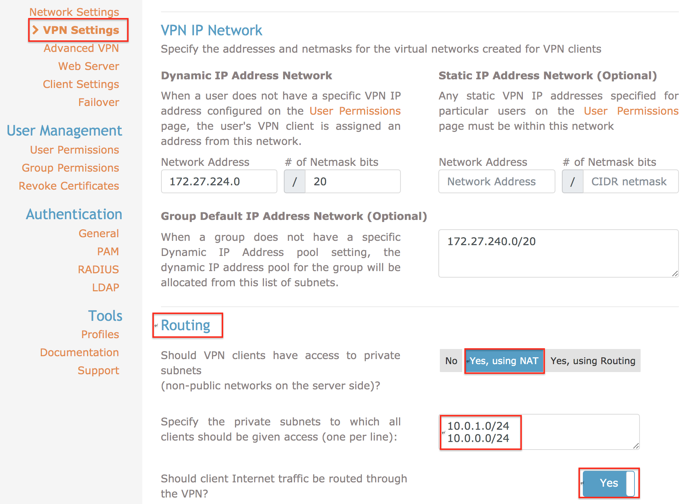
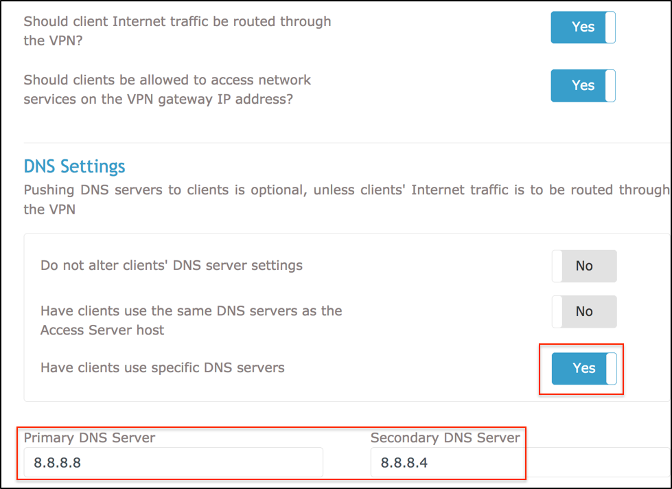
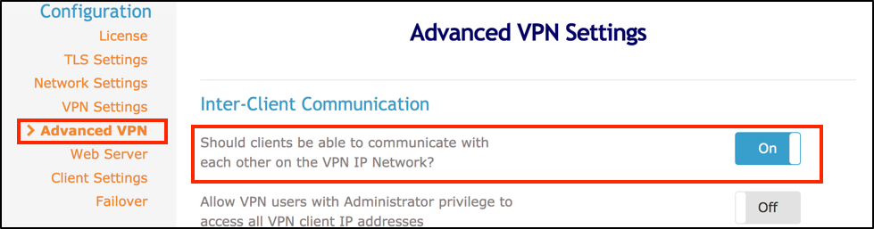
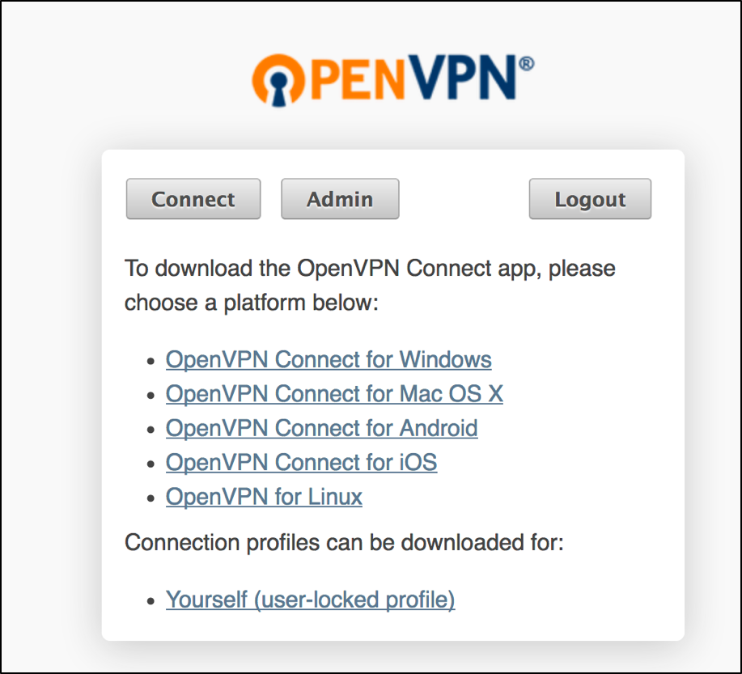
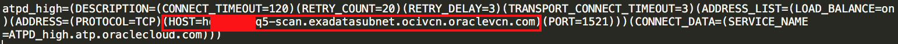
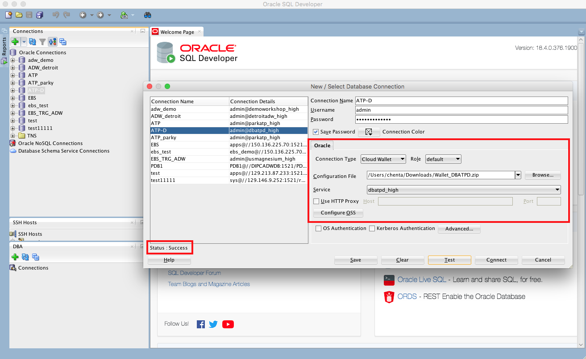

<table class="tbl-heading"><tr><td class="td-logo">

November 08, 2018
</td>
<td class="td-banner">
# Lab 1200: Connection to ATP Dedicated from Remote User
</td></tr><table>


## Introduction

Companies have increasingly mobile workforces and therefore need to be able to provide their employees with convenient and secure access to their networks. A VPN allows users to connect sercurely to their networks over the public internet which is a convenient way to support mobility.

One type of VPN is an SSL VPN which uses Secure Socket Layer protocols. SSL VPN provides more granular access control than IPSec. It allows companies to control the types of resources a user can access through the VPN.

This lab walks you through the steps to create a secure SSL VPN connection between Autonomous Transaction Processing Dedicated  and remote users using OpenVPN.

To **log issues**, click [here](https://github.com/oracle/learning-library/issues/new) to go to the github Oracle repository issue submission form.

## Objectives
- Learn how to configure Oracle Cloud Infrastructure for OpenVPN
- Learn how to install and configure the OpenVPN server
- Learn how to install the OpenVPN client 
- Learn how to configure Remote DNS server

The following diagram shows the high-level architecture of the proposed steup:


## Required Artifacts

- The following lab requires an Oracle Public Cloud account. You may use your own cloud account, a cloud account that you obtained through a trial, or a training account whose details were given to you by an Oracle instructor.
- A Oracle Autonomous Exadata Infrastructure, Autonomous Container Database and Autonomous Transaction Processing Dedicated.
- A VCN network including one public subnet and one private subnet.


# Configure Oracle Cloud Infrastructure for OpenVPN

In this section you will learn how to configure OpenVPN in Oracle Cloud Infrastructure compute instance.

## Steps

### **STEP 1: Sign in to Oracle Cloud Infrastructure console**

- Go to cloud.oracle.com, click Sign In to sign in with your Oracle Cloud account.


- Enter your Cloud Account Name and click My Services.


- Enter your Oracle Cloud username and password, and click Sign In.


- Once you are logged in, you are taken to the cloud services dashboard where you can see all the services available to you.

- Click **Compute** on the hamburger menu icon on the top left of the screen, and click **instances**


&nbsp;
### **STEP 2: Create an OpenVPN Compute Instance**

-  Click on **Create Instance**


&nbsp;

- Name your instance and choose an operating system or image source to **CentOS7** 


- Select **Virtual Machine** and add your SSH key file <cat (location of ssh [~./ssh/id_rsa.pub]) | pbcopy>


-  Configure network for OpenVPN Compute Instance
    - Virtual cloud network compartment: select the compartment where your VCN resides
    - Virtual cloud network: select VCN that you provisioned
    - Subnet compartment: select the compartment where the public subnet of the same VCN
    - Subnet: select public subnet 
    


#### Note that ATPD and OpenVPN compute instance are within the same VCN network. OpenVPN is in the Public subnet while ATPD is in the private subnet. 

For example, ATPD and OpenVCN both are in ociVCN network. OpenVPN is in the appSubnet(public subnet), while ATPD is in the exadataSubnet subnet(private subnet).

<br />

-  Click Create

#### Note: It will take up to 5 minutes to provision OpenVPN Compute Instance

        
- Once it finishes provisioning, you can click on the instance name to see more details 


&nbsp;
### **STEP 3: Configure VCN Network**

#### Note: Since we have provisioned a VCN with one public subnet(appSubnet) and one private subnet(exadataSubnet). We will configure appSubnet before setting up OpenVPN Compute Instance within it.


-   Configuring Public Subnet **appSubnet**

    -   Add **Internet Gateway** on Public Subnet
    
         -  Click on the top left humburger menu >> **Network** >> **Virtual Cloud Networks**
         
         
         
         -  Select the VCN that you provisioned (for ex: **ociVCN**)
         
         
         
         #### Note that ociVCN is the VCN network you created.
         
         -  Click **Internet Gateways** on the left side bar under **Resources**, click **Create Internet Gateway**
         
         
         
         Note: **Create Internet Gateway** is unclickable in the picture since we created Internet Gateway for ociVCN.
         
         -  Name your Internet Gateway and click **Create Internet Gateway**
         
         
         
         
         -  Add your Internet Gateway to Public Subnet Route Rule
         
         in **ociVCN** left side bar under **Resources**, click **Route Table**, click **Add Route Rules**
         
         
         
         **_TARGET TYPE: Internet Gateway_**
         
         **_DESTINATION CIDR BLOCK: 0.0.0.0/0_**
         
         **_COMPARTMENT: Compartment that your VCN is created_**
         
         **_TARGET INTERNET GATEWAY: name of your Internet Gateway_**
         
         -  Click **Add Route Rules**
         
         
         
         -  You will see the Route Rules under routeTable
         
         


    -   Configure Public Subnet's Security List
    
        -   In **ociVCN**, click **Security Lists** under **Resources** on the left side bar. Choose security list for Public Subnet and Click Add Ingress Rules

        
    
        -   Create an engress rule to allow traffic to all destinations. 
       
        **_Destination CIDR: 0.0.0.0/0 and IP Protocol: ALL PROTOCOLS_**
        
        -   Create ingress rules that allow access on:

        **_TCP Port for SSH: 22_**

        **_TCP Port for OpenVPN TCP connection: 443_**

        **_TCP Port for OpenVPN Web-UI connection: 943_**

        **_TCP Port for OpenVPN UDP port: 1194_**

        
        -   Once created, you will see all ports that you opened

        
    
    
-   Configure Private Subnet Route Rules(exadataSubnet)

    -   Add Route Rules for Private Subnet (make sure that your Compute Instance **'Skip Source/Destination Check'** is selected, if not follow the steps below on how to create another VNIC).
    
        

        **_TARGET TYPE: Private IP_**

        **_DESTINATION: CIDR Block_**

        **_DESTINATION SELECTION: CIDR BLOCK of onprem remote user_**

        **_COMPARTMENT: Compartment of VCN_**

        **_TARGET SELECTION: Private IP of OpenVPN Compute Instance_**

        
        
 -   Create new VNIC for OpenVPN compute Instance
    
        Click OpenVPN Compute Instance, click **Attached VNICS** under **Resources**, and then click **Create VNIC** 
    
        

        
        
        #### Note: Check _Skip Source/Destination Check_ to skip the check and forward the traffic 
   
#### Note: You need to create a new VNIC for OpenVPN Compute Instance to set _skip Source/Destination Check: Yes_ 
#### Destination CIDR BLOCK can be 0.0.0.0/0 which allows all traffic go to OpenVPN server. Add specific CIDR BLOCK if you want selected IP to go through OpenVPN server.


### **STEP 4: Install and Configure OpenVPN Server**

-   Download the software package for your OS platform from the OpenVPN website

    ```
    $ ssh opc@OpenVPN_IP
    ```
    ```
    $ wget http://swupdate.openvpn.org/as/openvpn-as-2.5.2-CentOS7.x86_64.rpm
    ```

   


-   Use the RPM command to install the package


-   Change password of OpenVPN Server

    ```
    $ passwd openvpn
    ```

-    Connect to the Admin UI address (**https://compute instance public ip:943/admin**), using the password for OpenVPN user
 


-   Once you are logged in, click **Network Settings** and replace the **Hostname or IP address** with the public IP of the OpenVPN Server Instance


-   Click **VPN settings** and add the private subnet address range in the routing section

Note that in the **Routing** section, ensure that the option **Should client Internet traffic be routed through the VPN?** is set to **YES**




-   Under **Have Clients user these DNS servers**, manually sest the DNS resolvers that will be used by your VPN client machiens




-   In the **Advanced VPN** section, ensure that the option **Should clients be able to communicate with each other on the VPN IP Network?** is set to **Yes**



Note: Once you have applied your changes, click **Save Settings**. You are prompted to **Update Running Server** to push your new configuration to the OpenVPN server.


### **STEP 5: Install OpenVPN Client**

-   Connect to the OpenVPN Access Server Client UI **https://compute instance public IP:943**, Download the OpenVPN client for your platforms.
    
    
    

-   Once the installation process has completed, you can see an OpenVPN icon in your OS taskbar. Right-Click this icon to bring up the context menu to start your OpenVPN connection

    
    
    
    ##### Note: IP should be Public IP for OpenVPN Compute Instance

-   Click **Connect** brings up a window asking for the OpenVPN username and password. Enter the credentials for your OpenVPN user and click **Connect** to establish a VPN tunnel

    


### **STEP 6: Configure Remote DNS server**

-   Find ATPD Hostname in credential Wallet file (tnsnames.ora). 

    
    
#### Note: Credential Wallet file can be downloaded from Autonomous Transaction Processing Web Console. For more information, please refer to Lab500 >> ConfigureADevelopmentSystemForUseWithYourDedicatedAutonomousDatabase. 
    
-   Search Private IP address of ATP Dedicated Instance

    -   Login to OpenVPN Compute Instance
    
    ```
    $ ssh opc@OpenVPN_IP
    ```
    -   Search Private IP of ATP Dedicated Instance

    ```
    $ nslookup ATPD_Hostname
    ```
    
    
    
    #### Note: To find the private IP of ATP dedicated instance, We need to ssh into a public subnet within the same VCN network of ATPD. On this lab, since OpenVPN Compute Instance is within the same VCN we will use this to find the private IP of ATPD.


-   Add ATPD Private IP and Hostname in Local Platform

    e.g. in MAC: add IP and hostname to **/etc/hosts** file

    ```
    Private_IP Hostname
    ```
    e.g.

    ```
    10.x.x.6 hosxxxxxxxan.exadatasubnet.ocivcn.oraclevcn.com
    ```

-   You are now ready to connect ATP Dedicated instance remotely.


### **STEP 7: Remote Connection to ATP Dedicated Instance**

-   Connect to ATPD using SQL Developer
    -   Connect OpenVPN client from local platform, more information please refer to **Step 3**
    -   Connect ATPD using SQL Developer
    
    
    
    
    
    
##### Note: If you are unable to connect using SQL Developer. Make sure that the SQL Developer Version is at least 18.3.0.0 +.   more information on how to connect ATPD using SQL developer please refer Lab 500 >>  ConfigureADevelopmentSystemForUseWithYourDedicatedAutonomousDatabase.


-   Application Connection to ATPD

    Login ATPD instance, click **DB connection** 
    
    

    -   Connect Oracle Application Express(APEX) to ATPD
    
        -   copy Access URL under Oracle Application Express
        
        
        
        


    -   Connect Oracle SQL Developer Web to ATPD
    
        -   copy Access URL under Oracle SQL Developer Web
        
        

        

        

    

-   You are now ready to move to the next lab.

<table>
<tr><td class="td-logo">[](#)</td>
<td class="td-banner">
## Great Work - All Done!
</td>
</tr>
<table>
