<table class="tbl-heading"><tr><td class="td-logo">

June 13, 2019
</td>
<td class="td-banner">
# Lab 4: Provisioning databases on your dedicated Autonomous Infrastructure
</td></tr><table>

## Introduction

This lab walks you through the steps to get started using the Oracle Autonomous Transaction Processing Database on Oracle dedicated Autonomous Infrastructure. You will provision a new database.

To **log issues**, click [here](https://github.com/oracle/learning-library/issues/new) to go to the github oracle repository issue submission form.

## Objectives

As a database user, DBA or application developer,

- Rapidly deploy autonomous transaction processing databases
- Manage your database backups

## Required Artifacts

- An Oracle Cloud Infrastructure account with a pre-provisioned Exadata Infrastructure and Container Database


# Provisioning an Autonomous Transaction Processing Database Instance

In this section you will be provisioning a dedicated autonomous database using the cloud console.
## Steps

### STEP 1: Create an Autonomous Transaction Processing Database

**Login to your OCI account as a database user**

-  Click on the hamburger menu icon on the top left of the screen

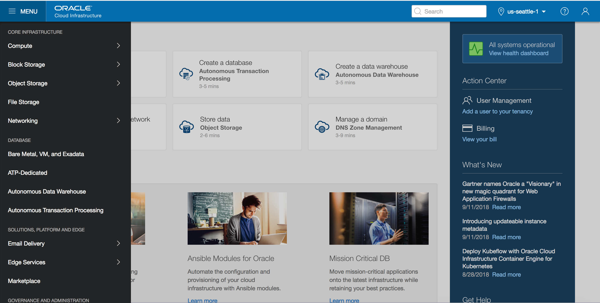

-  Click on **Autonomous Transaction Processing** from the menu

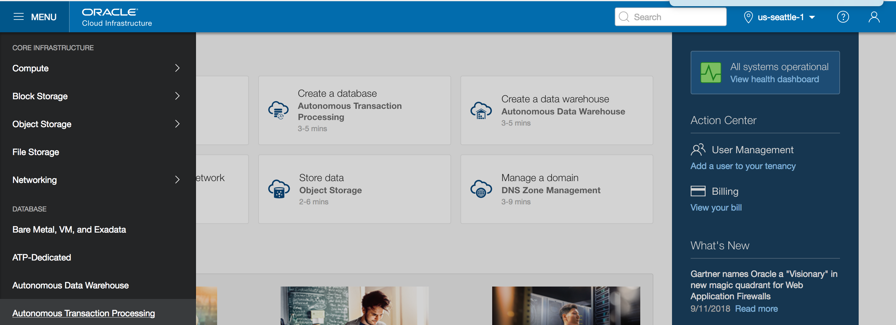

- Select **userXX-Compartment under the Workshop Compartment** 

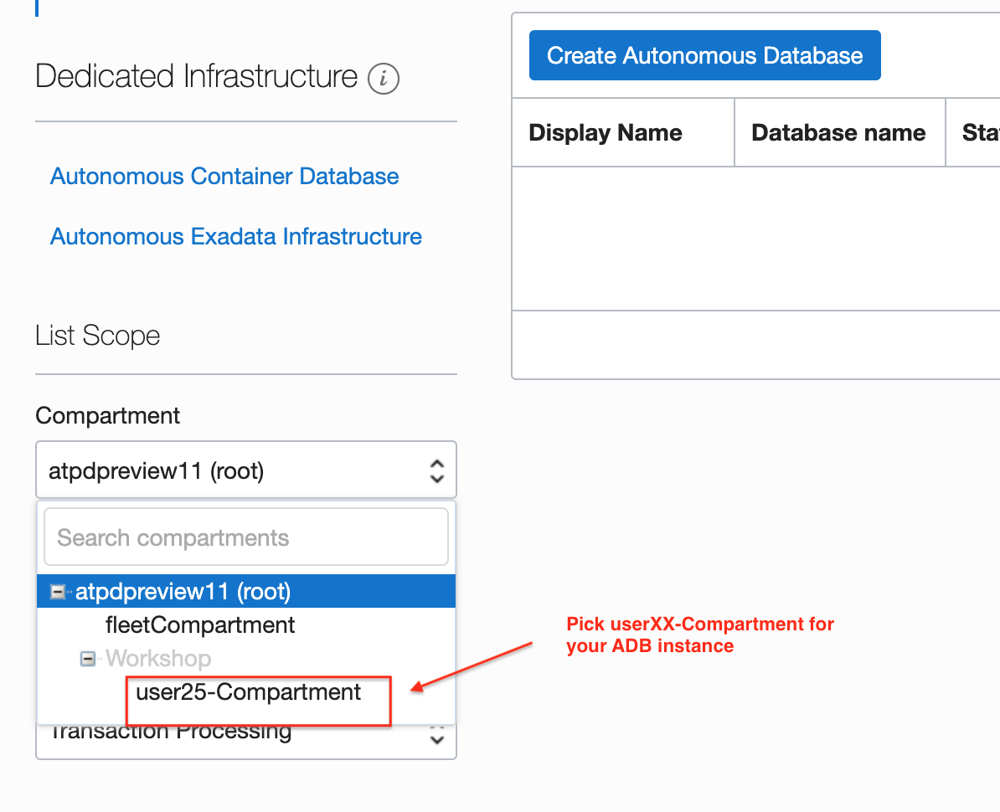


**Note:** Oracle Cloud Infrastructure allows logical isolation of users within a tenancy through Compartments. This allows multiple users and business units to share an OCI tenancy while being isolated from each other.

**If you have chosen the compartment you do not have privileges on, such as a root compartment or fleet Compartment, you will not be able to provision an ADB instance in it.**

More information about Compartments and Policies is provided in the OCI Identity and Access Management documentation [here](https://docs.cloud.oracle.com/iaas/Content/Identity/Tasks/managingcompartments.htm?tocpath=Services%7CIAM%7C_____13).

-  Click on **Create Autonomous Transaction Processing Database** button to start the instance creation process

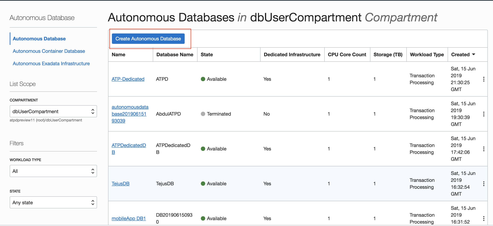

-  This will bring up Create ATP Database screen where you specify the configurations of the instance

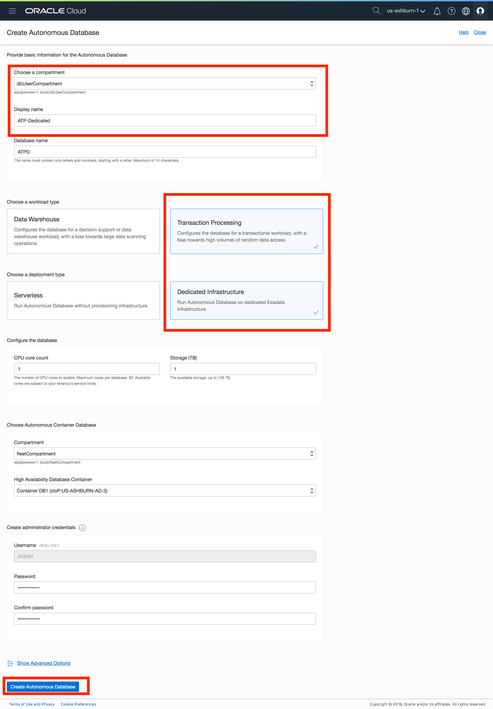


-  Choose workload type to Transaction Processing and deployment type to Dedicated Infrastructure

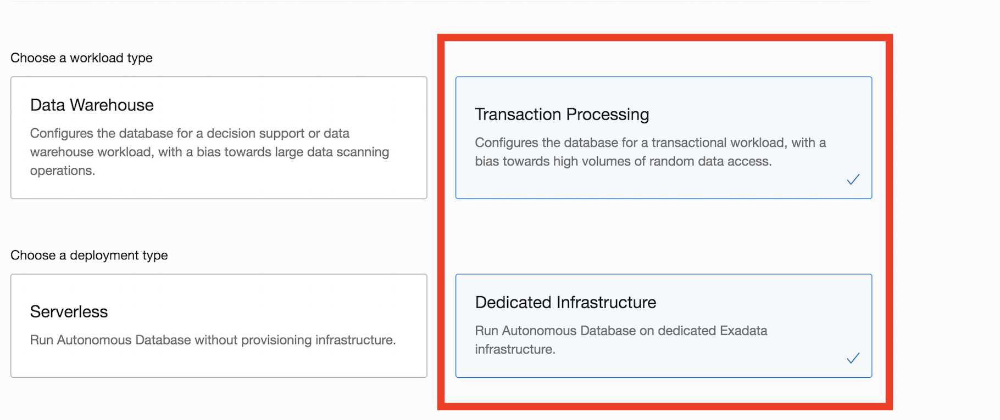


-  You can choose an instance shape, specified by the CPU count and storage size. Default CPU count is 1 and storage is 1 TB.

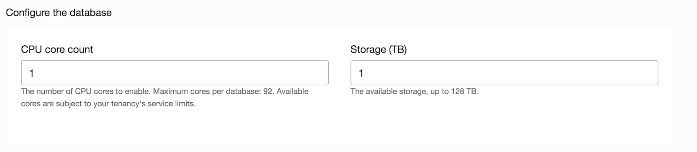

-  Specify the password for the instance

#### For this lab, we will be using the following as password

```
WElcome#1234
```

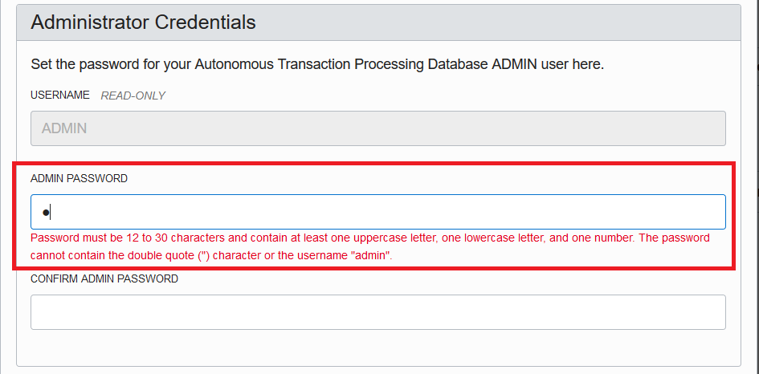

- Select a compartment where the container database resides. **Note this would be the fleetCompartment**

- Choose an Autonomous Container Database from the drop down

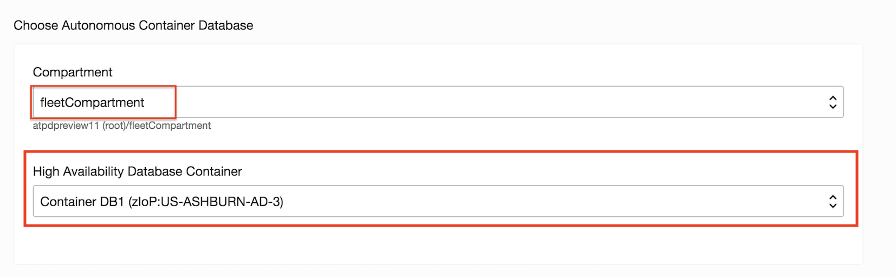


-  Click on **Create Autonomous Database** button to start provisioning the instance.


- Your autonomous database instance should be up and running in a few minutes.

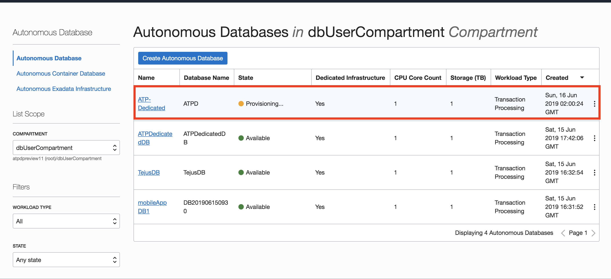

-  Once provisioned, you can click on the instance name to see instance details.


There is a few other things you can do as an administrator of your autonomous database

1. You can take a manual on-demand backup in addition to the scheduled daily backups

    - Click 'Create Manual Backup' on the database details page, provide a name and click 'Create Manual Backup' once again on the dialog box

2. You can do a point in time restore on your database

    - The service allows you to flash back your database to a specified time in the past using a combination of flashback logs and backups. 
    
    - You can restore from a previous backup

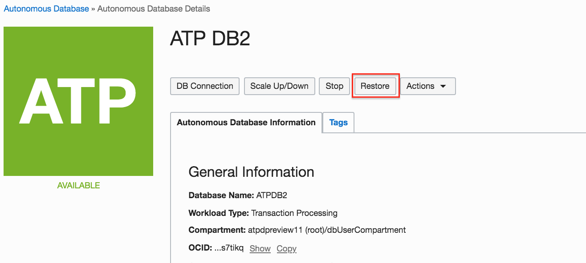

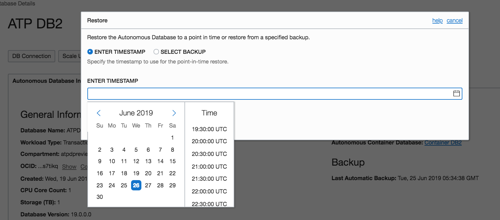


<table>
<tr><td class="td-logo">[](#)</td>
<td class="td-banner">
### All Done! You have successfully deployed your Autonomous Database instance and it should be ready for use in a few minutes.
</td>
</tr>
<table>