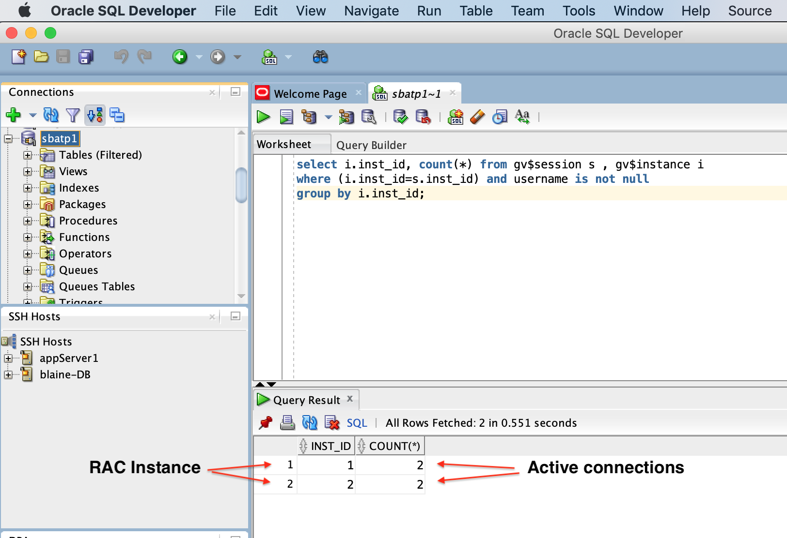
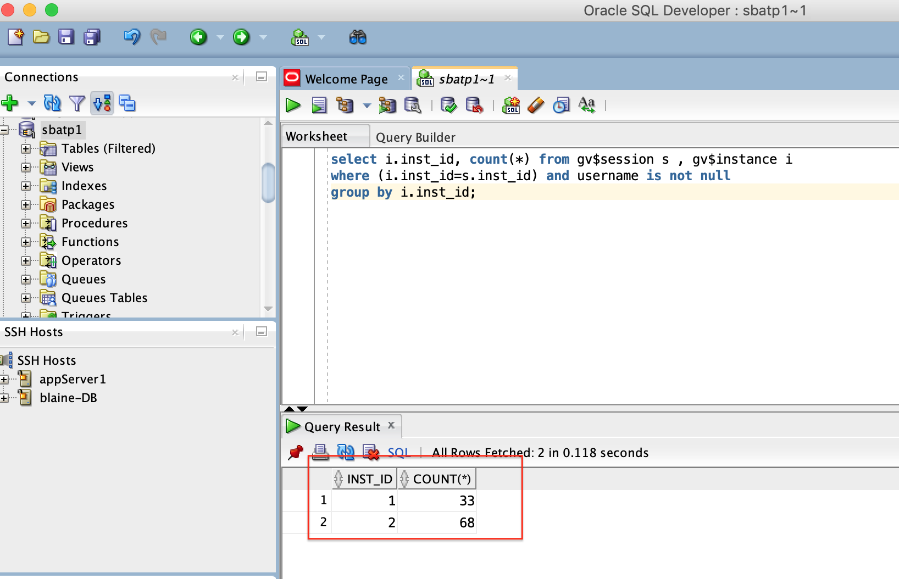
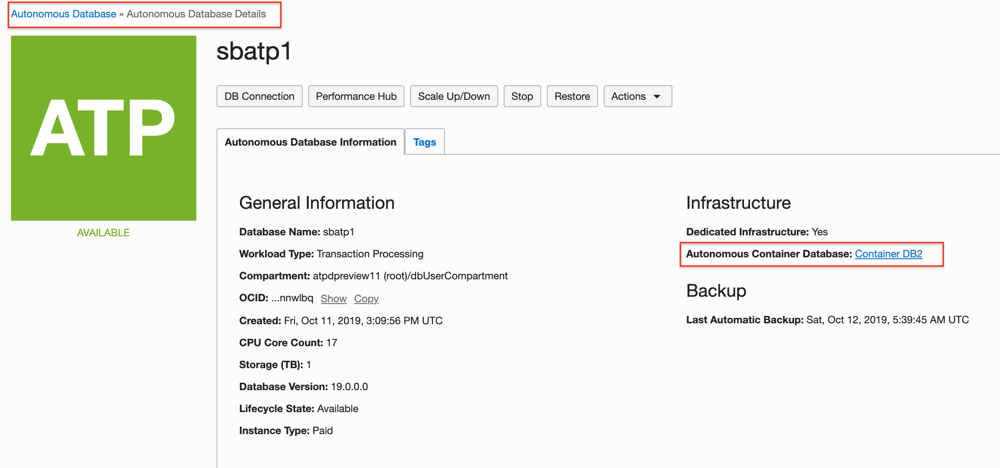
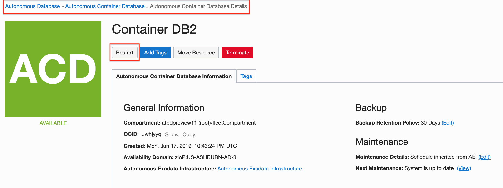
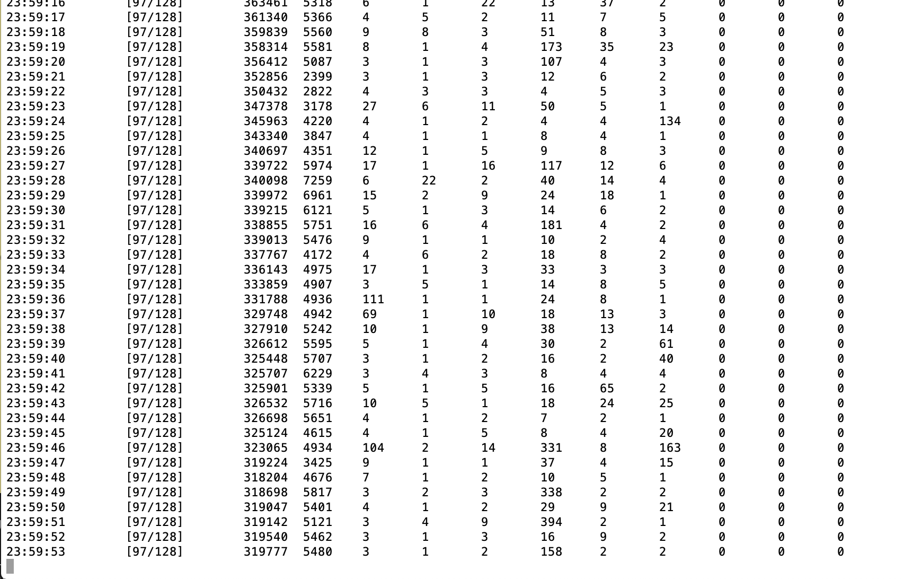
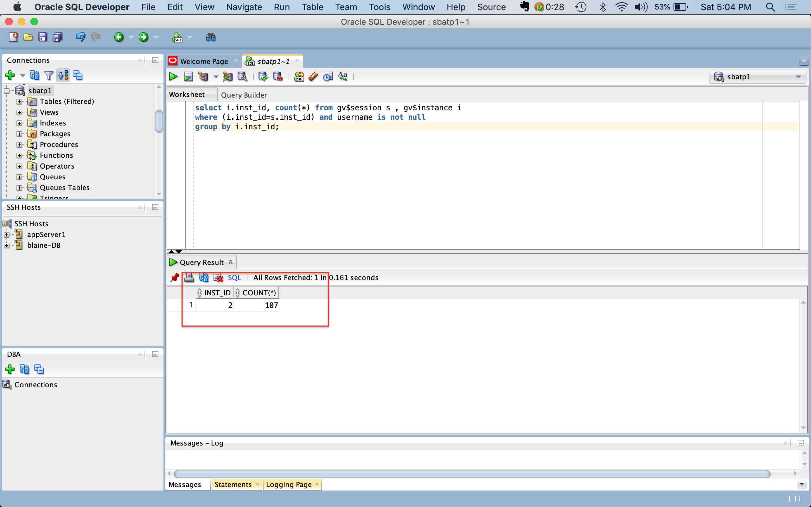

<table class="tbl-heading"><tr><td class="td-logo">


Sept 1, 2019
</td>
<td class="td-banner">
# Setup Zero downtime configurations with Transparent Application Continuity
</td></tr><table>

To **log issues**, click [here](https://github.com/oracle/learning-library/issues/new) to go to the github oracle repository issue submission form.

## Introduction


** The autonomous database service is built to deliver the highest possible uptime with the least amount of user maintenance. All patching operations are done by rolling the RAC cluster nodes. In this lab, you can test how a node failure or patching operation may impact ( or not) a transactional application**

## Objectives

As an adminstrator,
- Simulate a production workload using Swingbench load generator
- Restart the underlying Container DB and observe impact on the application


## Required Artifacts & pre-requisites

- An Oracle Cloud Infrastructure account

- A pre-provisioned instance of Oracle Developer Client image configured with Swingbench in an application subnet. Refer to [Lab 15](Swingbench.md)

- A pre-provisioned Autonomous Transaction Processing instance. Refer to [Lab 4](./ProvisionADB.md)

- Successful completion of [Lab 5](./1ConfigureDevClient.md) and [Lab 15](./Swingbench.md)

## Steps

### **STEP 1: Connect to your autonomous database instance using SQL Developer Client**

<span style="color:red">Note: To complete this lab its mandatory you have a developer client image configured with swingbench, an autonomous dedicated database instance with the wallet uploaded to the dev client. Follow instructions in [Lab 5](./1ConfigureDevClient.md) and [Lab 15](./Swingbench.md) </span>


**The remainder of this lab assumes you are connected to the image through VNC Viewer and are operating from the image itself and not your local machine.**

- Connect to your developer client machine over VNC and invoke SQL Developer. Refer to [Lab 5](./1ConfigureDevClient.md) for detailed instructions 

- Next, open a connection to your dedicated autonomous DB instance. Once again, refer to [Lab 5](./1ConfigureDevClient.md) if you do not know how to do that.




- Run this SQL statement in the SQL Worksheet to determine how clients are connected to the RAC instances

````
select i.inst_id, count(*) from gv$session s , gv$instance i 
where (i.inst_id=s.inst_id) and username is not null 
group by i.inst_id;
````

Note how client connects are distributed across RAC instances. 

``For ADB instances deployed with 16+ OCPUs, connections are load balanced across RAC nodes. For instances with < 16 OCPUs, services run on one of the 2 RAC instances and fail over to the second node during failures or maintenance operations.``

### **STEP 2: Start the Swingbench Order Entry workload on developer client**

Now, lets start the Swingbench order entry application and see how the connections build up.


- Generate loads on your database by running the charbench utility in your developer client machine. ssh into your dev client and use the command below. There are 2 parameters you can change to modify the amount of load and users being generated. ``The –uc flag specifies the number of users that will be ramped up, in the case below 64. The –rt flag specifies the total running time which is set to 30 seconds by default.``  You can stop running charbench at any time with **Ctrl C.**

```
/home/opc/swingbench/bin/charbench -c /home/opc/swingbench/configs/SOE_Server_Side_V2.xml \
            -cf ~/Downloads/your_wallet.zip \
            -cs yourdb_tp \
            -u soe \
            -p yourpassword \
            -v users,tpm,tps,vresp \
            -intermin 0 \
            -intermax 0 \
            -min 0 \
            -max 0 \
            -uc 64 
```


Once swingbench starts running your will see results similar to the screenshot below. The first column is a time stamp, the second column indicates how many users of the total users requested with the **-uc** parameter are active, and of interest is the 3rd column which indicates transactions per second. **If you see any intermittent  error messages, ignore those for now.**


You may rerun the query in SQL Developer frequently to see how the connections build up as the workload runs.



### **STEP 3: Restart the underlying Container Database**


One way to simulate a node failure or even a patching operation is to restart the CDB. The service manages all patching operations using RAC rolling i.e. it moves active connections to the surviving nodes while shutting down one node at a time and performing the patch operation on all software components of the node. 

- Navigate to your database details page on the OCI Console



- Click on the link for the source Container Database as shown in the screenshot above to navigate to the Container DB details page



- On the container DB details page, click 'Restart' and confirm.


- Go back to the terminal and observe the impact on the workload



You will notice that the workload runs as usual while the CDB restarts. That is because the service waits for a specified time for existing transactions to complete.

Allow for the swingbench workload to complete after the specified 30 sec interval. If you configured it to run longer, you may kill the workload by pressing Ctrl+C in the terminal window.

The service now takes advantage of this window and starts bringing down node (instance) 1 if its ready. If you now restart the workload you will see it running on instance 2 on node 2. Check that out in SQL developer once again.



Note that the entire workload now runs on node 2. If you terminate the workload and restart it, it will once again run on node 1 or balance across both nodes depending on the number of OCPUs deployed in the service.


<table>
<tr><td class="td-logo">

[](#)</td>
<td class="td-banner">
### Congratulations! You successfully tested the HA capabilities of your autonomous database service.


</td>
</tr>
<table>