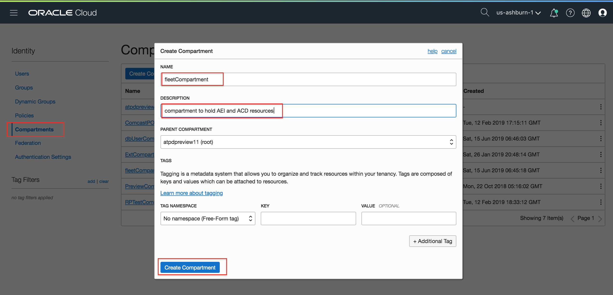
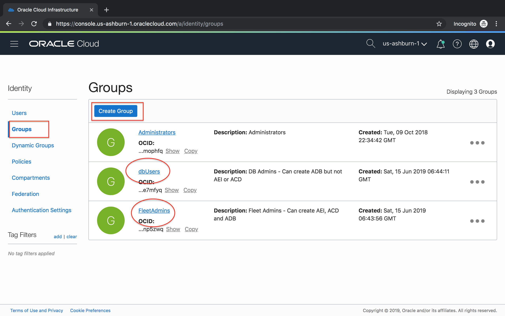
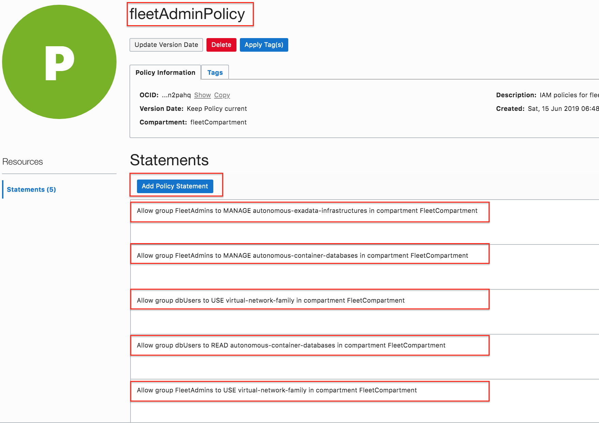
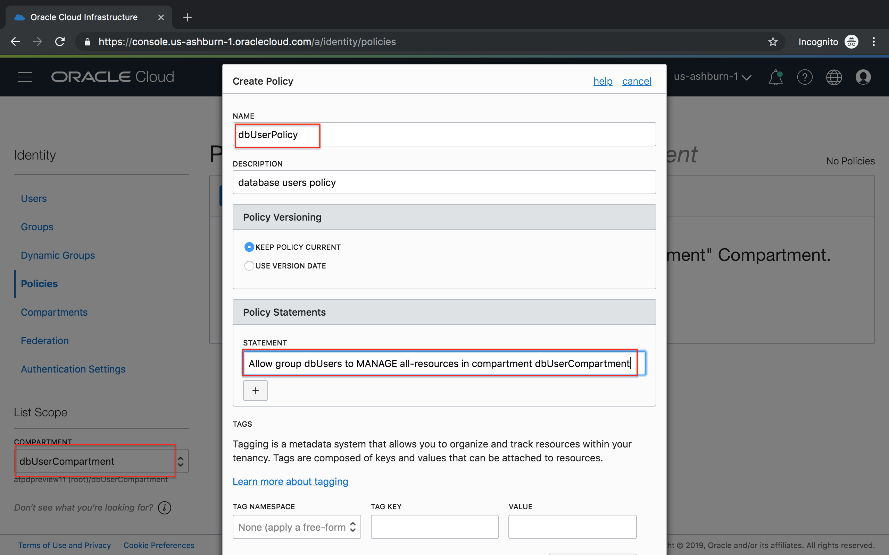
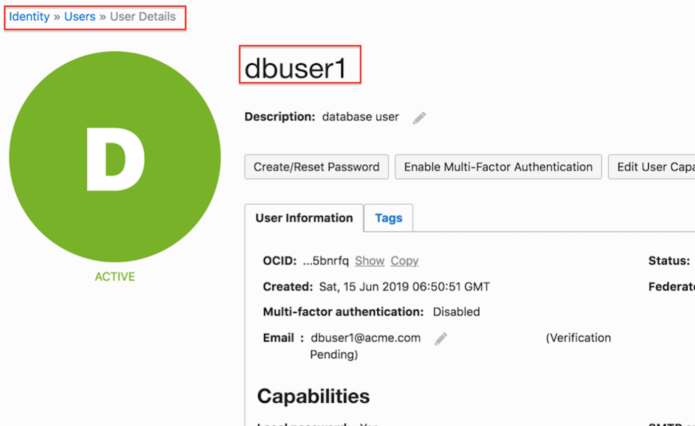
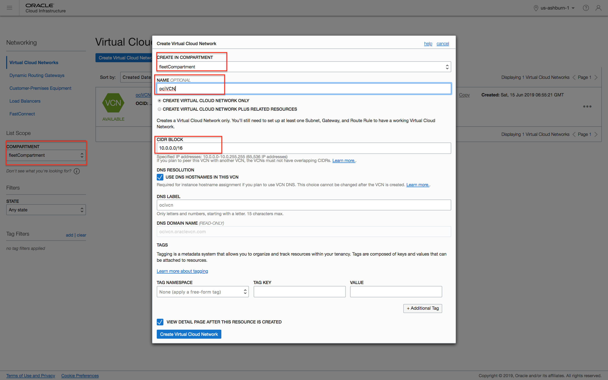
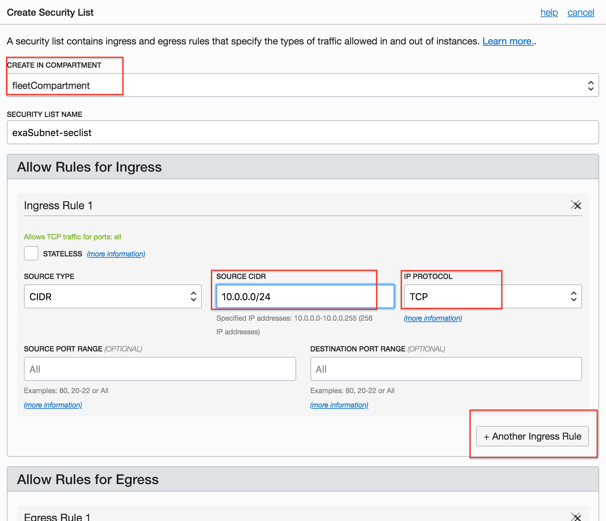
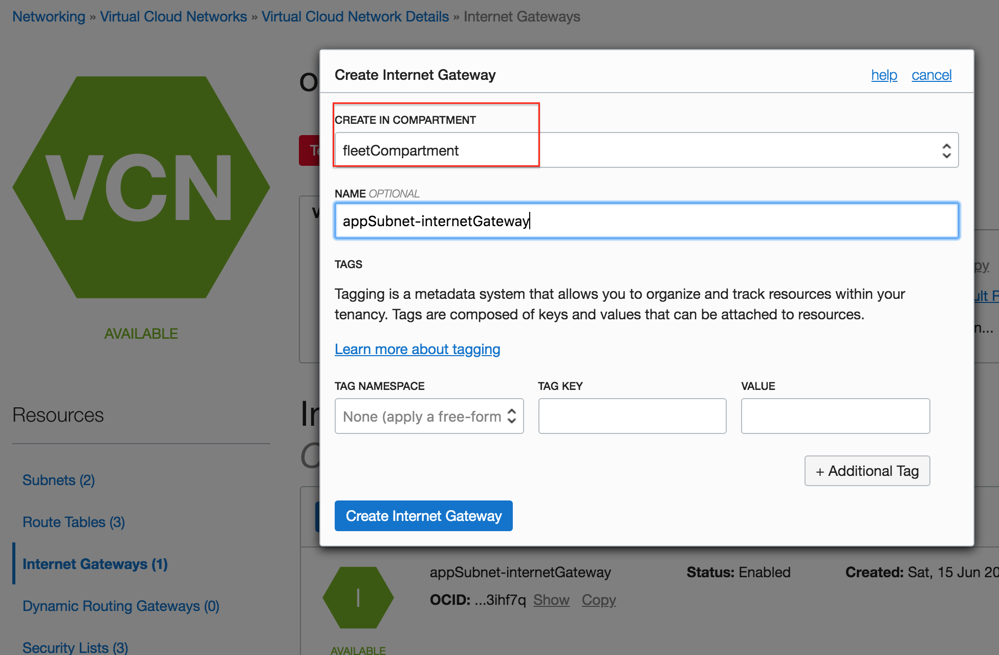
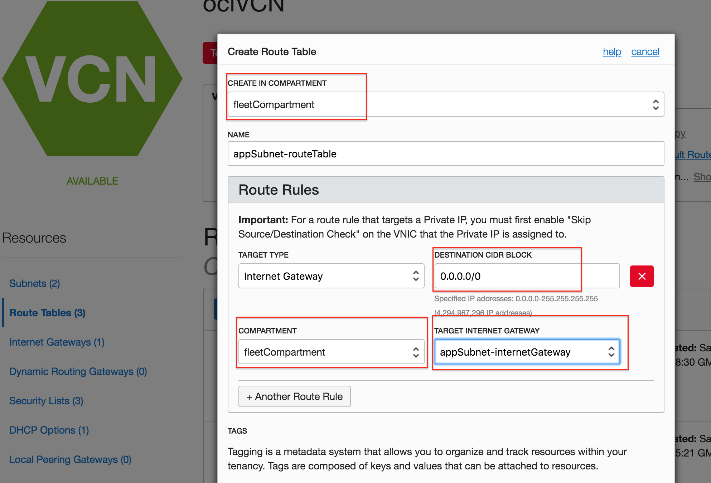
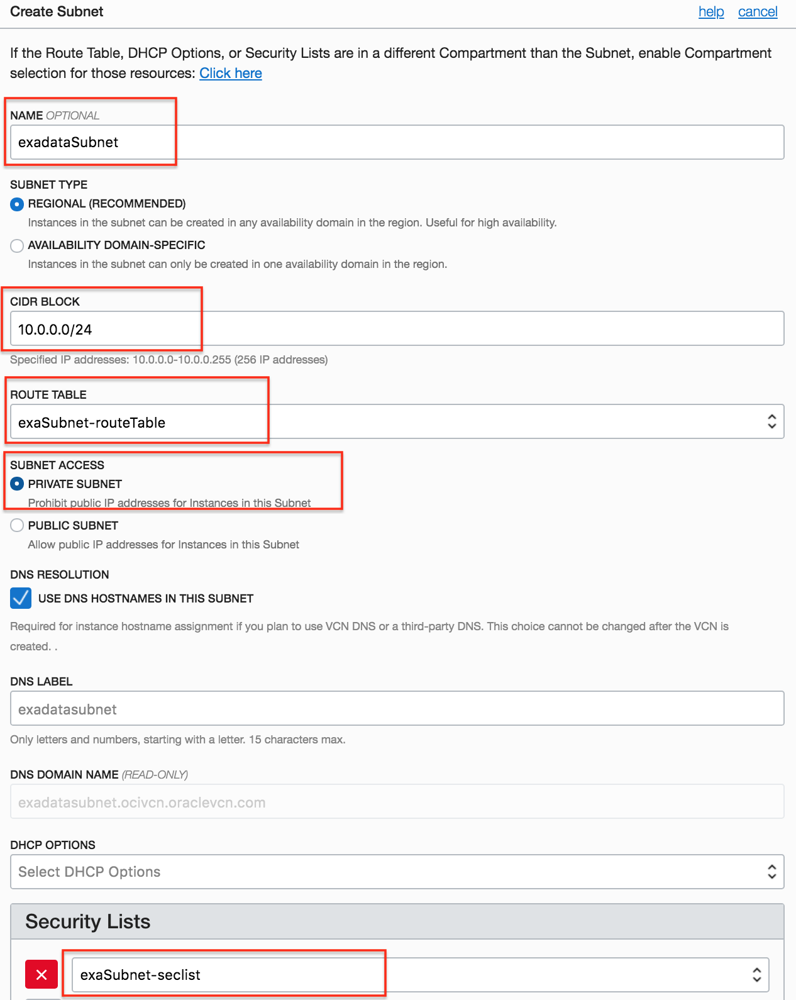

<table class="tbl-heading"><tr><td class="td-logo">

June 13, 2019
</td>
<td class="td-banner">
# Lab 1: Preparing your private data center in the Oracle Cloud Infrastructure 
</td></tr><table>

To **log issues**, click [here](https://github.com/oracle/learning-library/issues/new) to go to the github oracle repository issue submission form.

## Introduction

The Oracle dedicated autonomous database runs on dedicated Exadata hardware in the Oracle Cloud Infrastructure. That means you have your own personal slice of high performance hardware akin to running your own private cloud in a public cloud setting. Lets take a look at some best practices to setting up your autonomous data platform.

## Objectives

As an OCI account administrator with network resource privileges,

1. Create compartments and user groups with the right set of access policies for separation of duties
2. Create fleet admin and database user accounts
3. Layout a secure network for the database and application infrastructure

## Required Artifacts
- An Oracle Cloud Infrastructure account with privileges to create users, IAM policies and networks.
- Since this is the starting point to building your dedicated autonomous database platform, an admin account is recommended.

## Steps

### STEP 1: Create compartments, groups, users and IAM policies
For separation of duties Oracle recommends a fleet administrator provision the exadata infrastucture and container databases while the database users simply become consumers of these resources and provision their databases on it. 

​	

We will use the following structure in line with this best practice recommendation,

A fleetCompartment to hold the Autonomous Exadata Infrastructure  (AEI) and Autonomous Container Databases (ACD) 

A dbUserCompartment for database and application user objects such as Autononomous Databases (ADBs) and application client machines. While for the purpose of this lab we create a single dbUser compartment, in practice, each user may have their own compartment for further isolation

The fleet Admin will have IAM policies to create and manage AEI, ACDs and network resources in the fleet compartment. Alternatively, a network admin may first provision the VCN and Subnets while a fleet admin then provisions the Exadata Infrastructure and Container databases

Database users in the dbUser compartment will have priviledges to **USE**  AEI and ACD resources in the fleet compartment only. They cannot create, delete or modify those resources. A database user may have complete read/write privileges on their own compartments where they can create and destroy database and application instances

**a. Lets create compartments  fleetComparment and dbUserCompartment** as shown

**b. Create groups fleetAdmins and dbUsers**

**c. Now, add the following IAM policies on the fleetAdminCompartment**

The following policy statement on the fleetCompartment ensure group fleetAdmins and dbUsers have the right privileges as explained earlier. Note how fleet admins have 'manage' privileges while dbUsers have 'use' privileges

- Allow group fleetAdmins to MANAGE autonomous-exadata-infrastructures in compartment fleetCompartment

- Allow group fleetAdmins to MANAGE autonomous-container-databases in compartment fleetCompartment

- Allow group fleetAdmins to USE virtual-network-family in compartment fleetCompartment

- Allow group dbUsers to READ autonomous-container-databases in compartment fleetCompartment

Similarly, create a dbUserPolicy on the dbUserCompartment as show. **Make sure you pick the right compartment before you hit the 'Create Policy' button**

- Allow group dbUsers to MANAGE autonomous-databases in compartment dbUserCompartment

- Allow group dbUsers to MANAGE autonomous-backups in compartment dbUserCompartment

- Allow group dbUsers to USE virtual-network-family in compartment dbUserCompartment

- Allow group dbUsers to MANAGE instance-family in compartment dbUserCompartment

You may alternatively choose to grant 'MANAGE all-resources' privileges to users that need to provision databases and other cloud resources in their own private compartment as shown below

**d. And finally, lets create a fleet admin and a database user**  <u>and add them to their respective groups</u>. Any additional fleet admins or database users will simply need to be added to their groups and they will automatically assume their group privileges

You now have the users, groups and compartments setup to provision an autonomous database platform

### STEP 2: Layout a secure network for the database and application infrastructure

 Setting up the right network upfront is important since you cannot reverse most aspects of your network without completely destroying and rebuilding it. While your network administrators are  ultimately responsible for choosing the right network topology as per corporate network guidelines, here's a best practice recommendation for setting up a secure network for your database and applications

Here its assumed that the reader has some basic understanding of networking components and SDNs. If you are absolutely new to this subject, I suggest you refer to the OCI network documentation to get an understanding of VCNs, Subnets, Security lists, routers, gateways etc.

Your OCI network can be treated as your own private datacenter. Therefore we choose a network topology with a single Virtual Cloud Network (VCN) and multiple subnets for hosting database and application infrastructure.

We will follow these security guidelines as we build the network,

1. Each subnet we build will have its own security list and route table. We will not use the default seclist or route table or share them among subnets
2. Database infrastructure will be in a private subnet with no access from outside the VCN
3. Ingress ports will be opened on an as needed basis.
4. Only external facing public subnets will have an internet gateway
5. External facing hosts will have port 22 open for ingress ssh traffic

**Login to  OCI as a network admin or a fleet admin**

1. Create a VCN in <u>fleetCompartment</u> with CIDR block 10.0.0.0/16 which provide for 64k IP addresses for the various subnets within this network

2. Lets add two security lists to this VCN, one for each of the two subnets we would deploy for the database and application networks. Each subnet has its own security list as defined in the table below.

| Subnet        | CIDR range  | Security List     | Security Rules                                               |
| ------------- | ----------- | ----------------- | ------------------------------------------------------------ |
| exadataSubnet | 10.0.0.0/24 | exaSubnet-seclist | ingress/egress: Allow All TCP, UDP, SNMP traffic within the subnet  Allow TCP traffic on ports 1521,  from appSubnet |
| appSubnet     | 10.0.1.0/24 | appSubnet-seclist | Ingress: Allow TCP traffic from public internet to port 22 ( ssh)  Allow All TCP traffic within subnet |

Start deploying the above configuration in the following order,

**a. Create seclists exaSubnet-seclist and appSubnet-seclist.**
 An example screenshot below shows adding the exaSubnet-seclist in the fleetCompartment with an ingress rule for TCP traffic. Similarly, add rules to this seclist for UDP and ICMP traffic and an egress rule per table above

**b. Create an internet gateway** for hosts in the public subnets to be accessible over the internet. This is optional and depends on wether you want any hosts in the public domain. Typically bastion hosts can be setup in a public subnet for ssh access. In these tutorial, for simplicity, we will setup our developer client machines in the public subnet

**c. Create a route table for the appSubnet** to route traffic to the internet gateway

Note the destination CIDR block 0.0.0.0/0 indicate ALL IP addresses globally i.e. to any host anywhere on the internet. You can limit it to specific hosts or network as desired. For eg, you can limit it to hosts in your corporate network or to a specific host such as your personal laptop as long as it has a unique public IP address.

Now that you have all the required components to associate with your AEI and application subnets, you may now process to deploy those subnets. An example screen shot is provided below for the exadataSubnet. Similarly create the appSubnet as per the table

<table>
<tr><td class="td-logo"></td>
<td class="td-banner">
### Fantastic! You have now setup your OCI network and users and are ready to deploy autonomous infrastructure, databases and applications.
</td>
</tr>
<table>
