<table class="tbl-heading"><tr><td class="td-logo">

June 13, 2019
</td>
<td class="td-banner">
# Lab 5: Connecting a developer client to an Autonomous Database
</td></tr><table>

## Introduction
Autonomous Transaction Processing provides all of the performance of the market-leading Oracle Database in an environment that is tuned and optimized for transaction processing workloads. Oracle Autonomous Transaction Processing ( or ATP ) service provisions in a few minutes and requires  very little manual ongoing administration.

Oracle Developer image is provided here to give you a jumpstart on developing applications on Oracle Autonomous Transaction Processing Service. The image is pre-configured with tools and language drivers so that you can configure a secure connection using Oracle SQL Developer, SQLCL and SQL*Plus.


To **log issues**, click [here](https://github.com/cloudsolutionhubs/autonomous-transaction-processing/issues/new) to go to the github oracle repository issue submission form.

## Objectives

- Learn how to configure a secure connection using Oracle SQL Developer, SQLCL and SQL*Plus.

## Required Artifacts

- Please ensure you are connected to your cloud account and have provisioned an ATP Dedicated instance. Refer <a href="./LabGuide100ProvisionAnATPDatabase.md" target="_blank">here</a> on how provision an ATP database.
- You have provisioned VCN (Virtual Cloud Network) on oracle cloud infrastructure to host Oracle Developer compute intance. 
- You have provisioned ATP Dedicated instance on your cloud account.

## Steps

### **STEP 1: Provision Compute Instance Using Oracle Cloud Developer Image**

- Log into your cloud account using your tenant name, username and password
- Click Compute Instance in the left side menu under services 

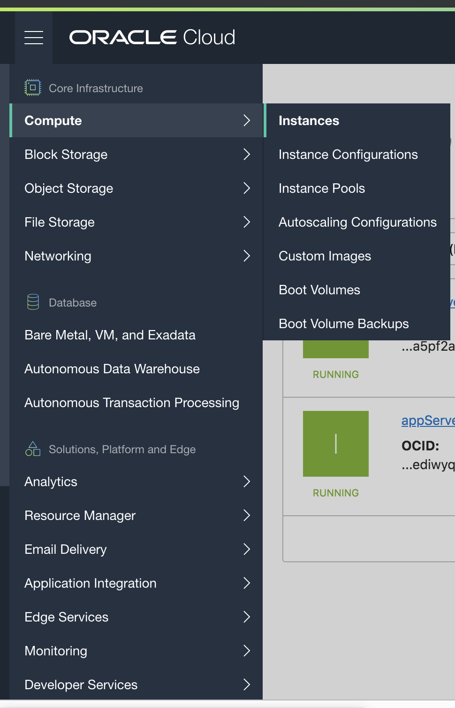

<br>

- Click create Instance


<br>

- Specify a name for compute instance

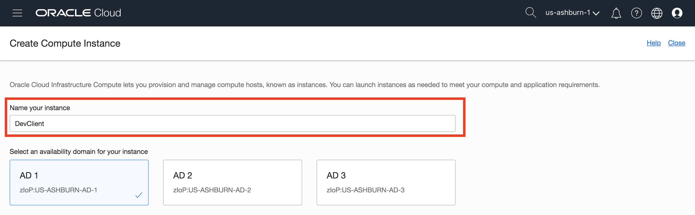

<br>

- Choose Oracle Cloud Developer image from Oracle Image section


<br>

- Choose instance type for Virtual Machine


<br>

- Add SSH key, you can choose to import ssh public key or paste ssh public key

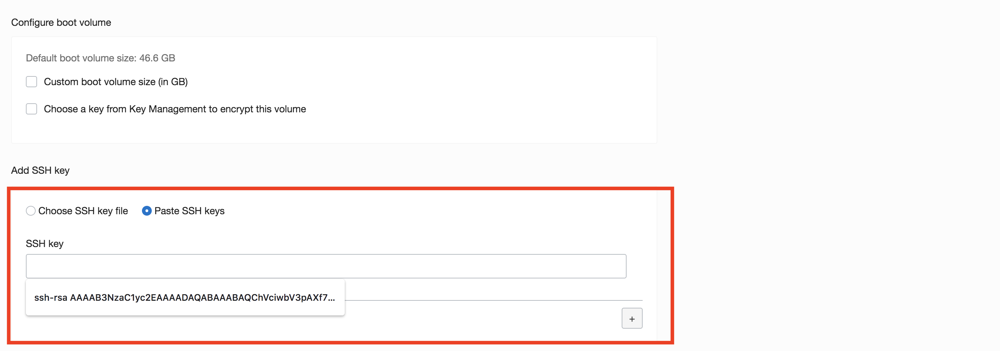

<br>

- Choose network, specify VCN that is used for ATP Dedicated Instance


<br>

#### Notes: In this lab, ATP Database is in the same network with DevClient instance. ATP database is in private subnet while DevClient is in public subnet.

<br>


- Once you created Developer client compute instance, it would take 2-3 mintues for the instance to be provisioned


<br>

- Once it finishes provisioning, you can click on the instance name to see details of it

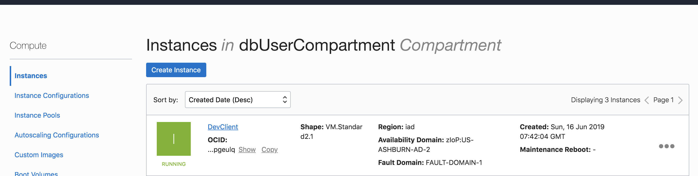

<br>
<br>

### **STEP 2: Download the secure connection wallet for your provisioned instance**

- Click on Menu and select Autonomous Transaction Processing

- On the ATP console, select your ATP instance provisioned in <a href="./LabGuide100ProvisionAnATPDatabase.md" target="_blank">LabGuide1.md</a>.


<br>

- Click on  **DB Connection** to open up Database Connection pop-up window


<br>

- Click on **Download** to supply a password for the wallet and download your client credentials.
#### Please use below Keystore password to download the client credentials

```
WElcome#1234
```


<br>
- Once you have downloaded your wallet, you will be navigated to ATP overview page

- The credentials zip file contains the encryption wallet, Java keystore and other relevant files to make a secure TLS 1.2 connection to your database from client applications. Store this file in a secure location.

<br>
<br>

### **STEP 3: Connect to ATP Dedicated instance using Oracle SQL Developer**

- SSH into DevClient Compute instance

```
# ssh opc@IP
```

- Configure VNC viewer on DevClient Compute Instance

- Install the tigervnc-server package

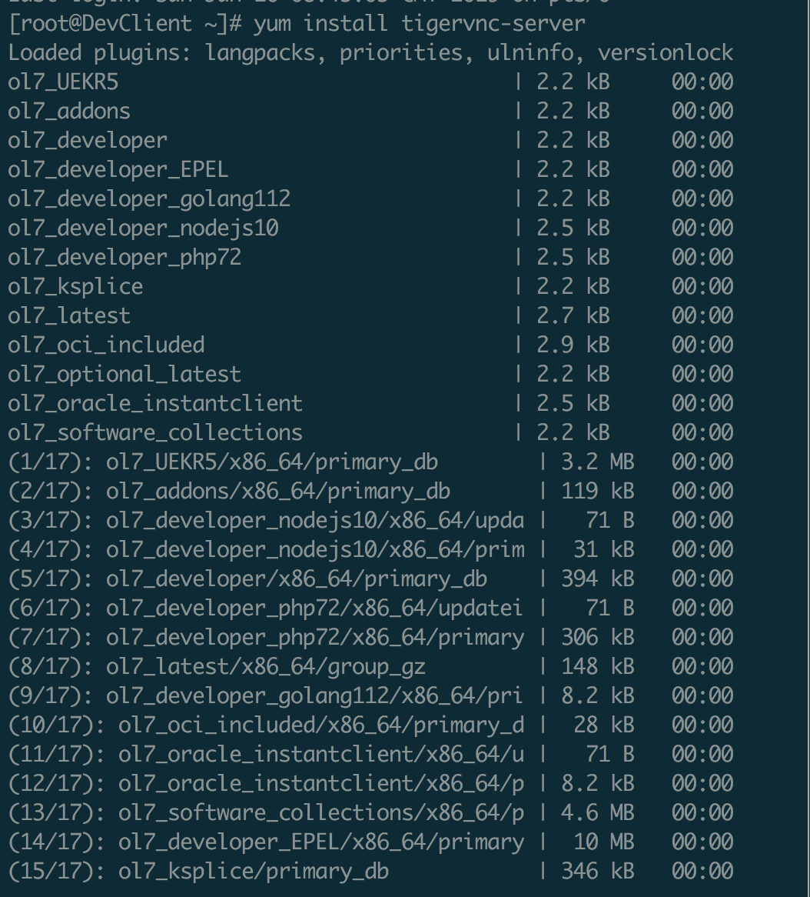
<br>

- Create the VNC environment for the VNC users

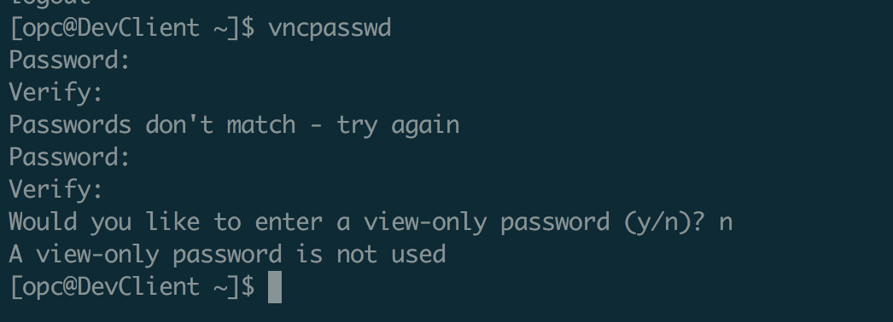
<br>

- Create a service unit configuration file for each VNC desktop that is to be made available on the system

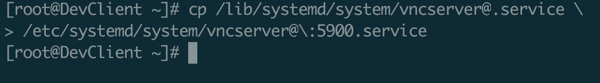
<br>

- Copy the vncserver@.service template file, for example:
```
# cp /lib/systemd/system/vncserver@.service \
/etc/systemd/system/vncserver@\:display.service
```
- Edit the service unit configuration files

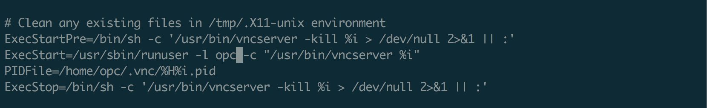
<br>

- Start the VNC desktops
```
# systemctl daemon-reload
# systemctl start vncserver-vncuser@\:display.service
# systemctl enable vncserver-vncuser@\:display.service
```


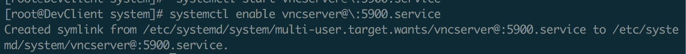
<br>

- Configure the VNC desktops

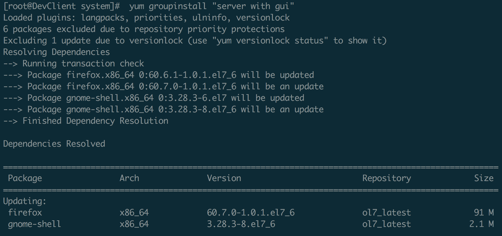
<br>

- Start the VNC desktops, run following command in the machine where vnc viewer is intalled
```
# ssh -i id_rsa -L <port>:localhost:<port> opc@IP -N
```
Example
```
# ssh -i id_rsa -L 5901:localhost:5901 opc@IP -N
```

- Using VNC viewer to visualize DevClient Compute Instance

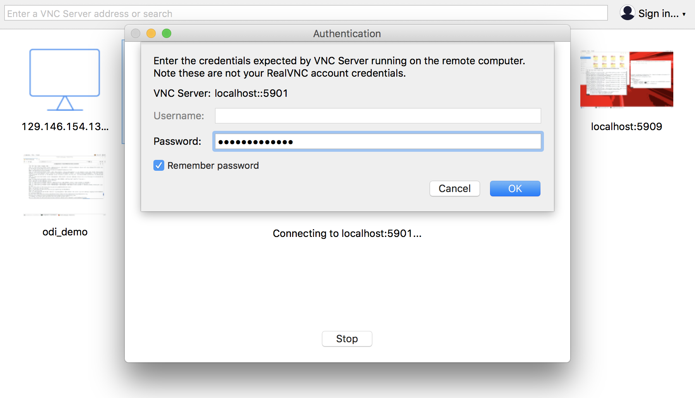
<br>


- Launch SQL Developer from Application, Programming, SQL developer


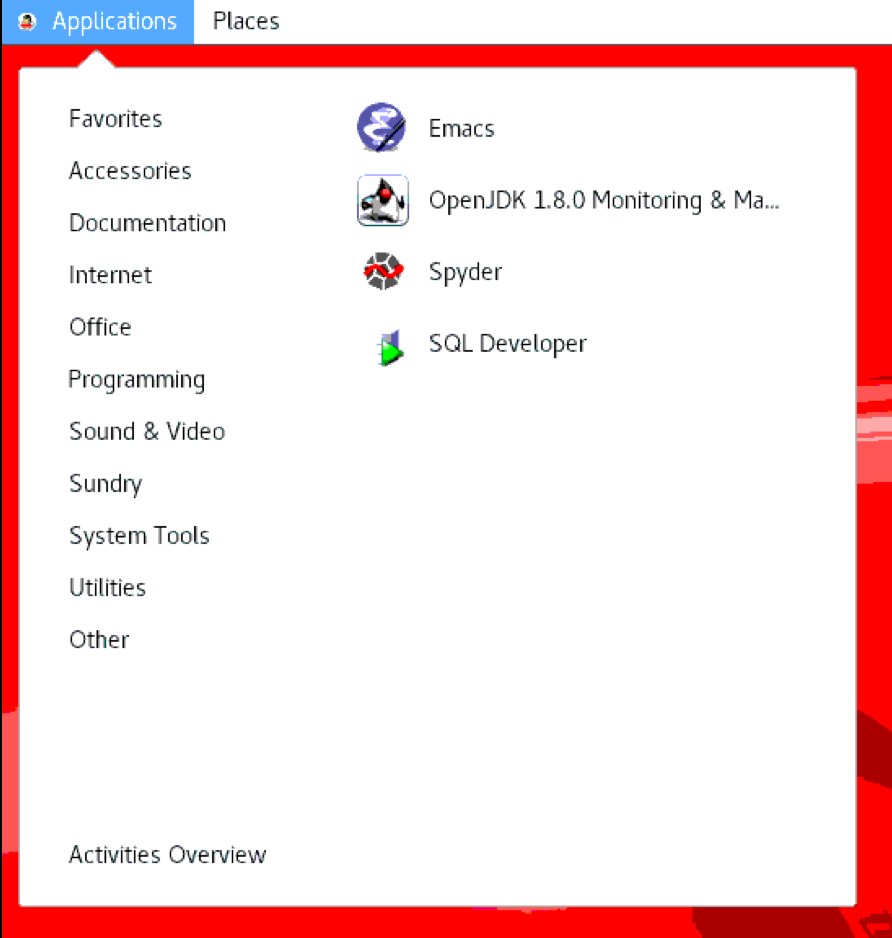
<br>

Enter the following in New database connection

**Connection Name**: Name for your connection

**Username**: admin

**Password**: WElcome#1234

**Connection Type**: Cloud Wallet

**Role**: Default

**Configuration File**: Click on Browse and select the wallet file you downloaded

**Service**: 'databasename_high' Database name followed by suffix low, medium or high. These suffixes determine degree of parallelism used and are relevant for a DSS workload. For OLTP workloads it's safe to select any of them. Example: **atpd_high**

- Test your connection and save. The **Status** bar will show **Success** if it is a successful connection.

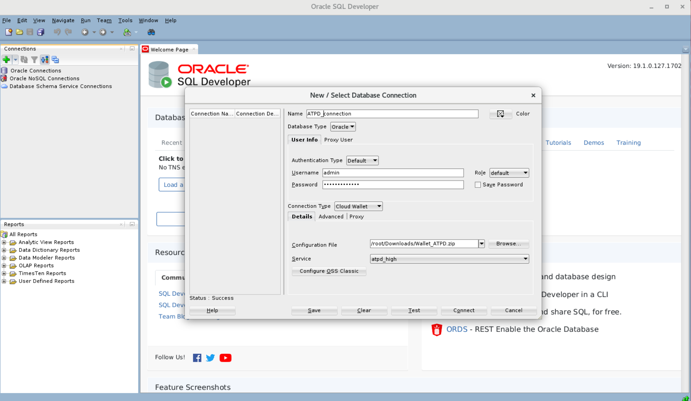
<br>

Click on **Connect**. You now have a secure connection to your cloud database.

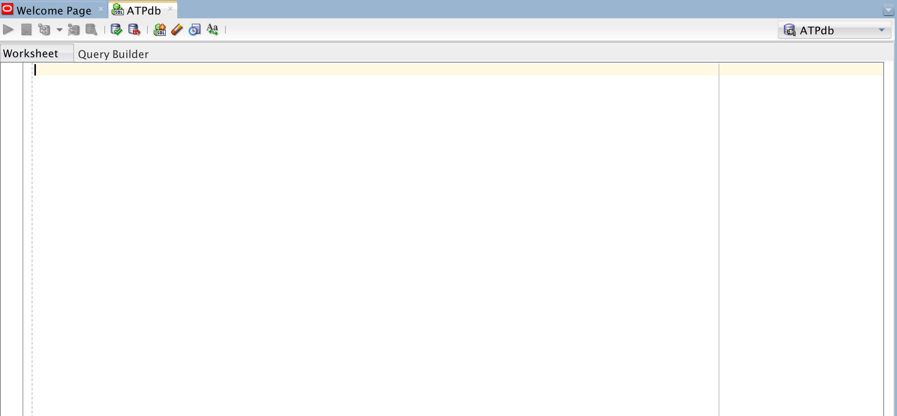
<br>

You now have connected your Autonomous Transaction Processing Cloud instance to Oracle SQL Developer.

### **Connect to ATP instance using Oracle SQLCL**

- Get started connecting to a database using SQL and SQLPLUS *if you have already created an ATP instance*. 

**Please make sure:**

- **You have downloaded your wallet of the database you created and placed the files in the local directory mapped to /home/opc/ in your container**

- **For SQL CL you will need the zip file in /home/opc**

SQL CL

```
sql /nolog
```

```
SQL> set cloudconfig /home/opc/Wallet_ATPD.zip
```


```
SQL> connect admin@atpd_high  (replace 'atpd_high' with an appropriate service for your instance)
```
Provide your admin password and you are in!


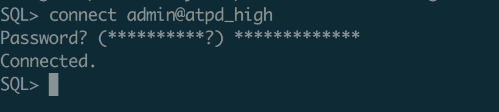

<br>
<br>

### **Connect to ATP instance using Oracle SQL*Plus**

SQL PLUS

For SQL*Plus, you will need to unzip the wallet in your local folder and edit sqlnet.ora as follows-

- Edit the sqlnet.ora file in /home/opc/wallet and change the line ?/network/admin:

Before:
```
WALLET_LOCATION = (SOURCE = (METHOD = file) (METHOD_DATA = (DIRECTORY="?/network/admin")))
SSL_SERVER_DN_MATCH=yes
```

After:
```
WALLET_LOCATION = (SOURCE = (METHOD = file) (METHOD_DATA = (DIRECTORY="/home/opc/wallet")))
SSL_SERVER_DN_MATCH=yes
```

- Now, run:

```
sqlplus admin@atpd_high
```


-   You are now ready to move to the next lab.

<table>
<tr><td class="td-logo">[](#)</td>
<td class="td-banner">
## Great Work - All Done!
</td>
</tr>
<table>