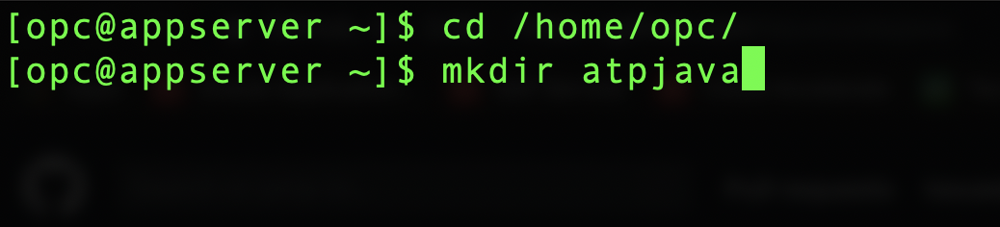
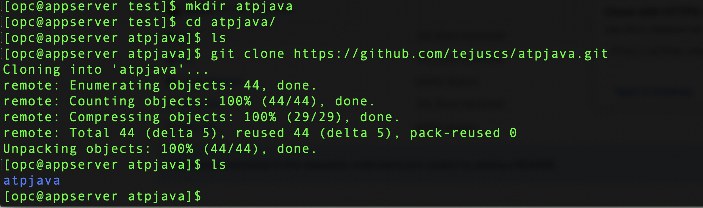
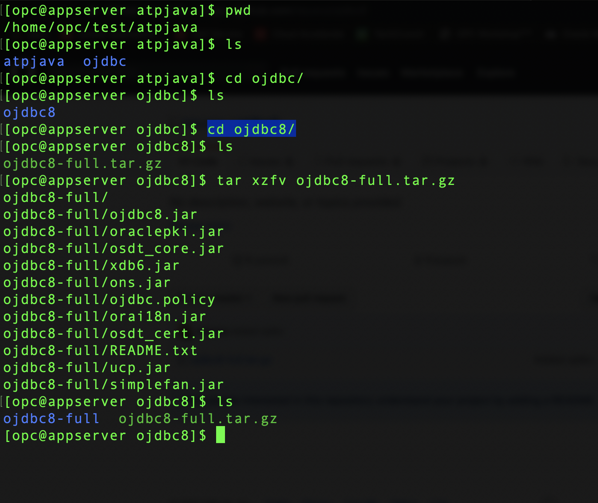
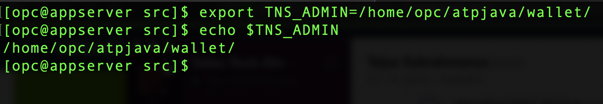
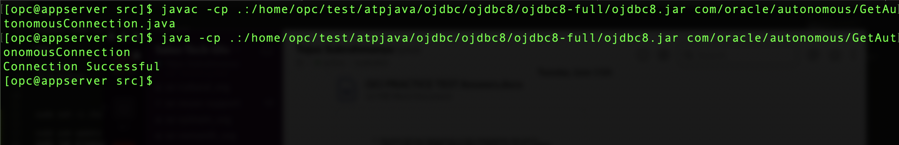

<table class="tbl-heading"><tr><td class="td-logo">

June 13, 2019
</td>
<td class="td-banner">
# Lab 8: Building and deploying Java application stacks on dedicated autonomous infrastructure
</td></tr><table>

## Introduction

This lab walks through how to confugure a linux host machine running on Orcle Cloud Infrastructure to run your Java applications and connect to Oracle Autononous Transaction Processin Dedicated database.

You are provided with a sample java application for this lab.


To **log issues**, click [here](https://github.com/cloudsolutionhubs/autonomous-transaction-processing/issues/new) to go to the github oracle repository issue submission form.

## Objectives

- Learn how to build a linux Java application server and connect it to an Oracle ATP Dedicated database


## Required Artifacts

-  The following lab requires an Oracle Public Cloud account. You may use your own cloud account, a cloud account that you obtained through a trial, or a training account whose details were given to you by an Oracle instructor.

- This lab requires Oracle Cloud Developer Image launched in Compute instances.

## Steps

### **STEP 1: SSH into Oracle Cloud Developer image and clone Java application**

- Login to your Oracle Cloud Infrastructure account and click on **Menu** and select **Compute** and **Instances**


- Select the right Oracle Developer Cloud image you created in earlier labs. 

- Copy the public IP address of the instance in a note pad. 


### For Mac users

- Open Terminal and SSH into linux host machine

```
sudo ssh -i /path_to/sshkeys/id_rsa opc@publicIP
```


### For Windows users

- You can connect to and manage linux host mahine using SSH client. Recent versions of Windows 10 provide OpenSSH client commands to create and manage SSH keys and make SSH connections from a command prompt.

- Other common Windows SSH clients you can install locally is PuTTY. Click [here](https://docs.microsoft.com/en-us/azure/virtual-machines/linux/ssh-from-windows) to follow the steps to connect to linux host machine from you windows using PuTTY.


### Cloning Java application git repository

- Once you have successfully SSH into the linux host machine create a new directory in /home/opc/

```
cd /home/opc/

mkdir atpjava
```




- Clone atpjava git repository into atpjava directory 

```
cd /home/opc/atpjava/

git clone https://github.com/tejuscs/atpjava.git
```


- Clone ojdbc8-full git repository into ojdbc director 

```
cd /home/opc/atpjava/

mkdir ojdbc

cd ojdbc

git clone https://github.com/tejuscs/ojdbc8.git

cd ojdbc/

cd ojdbc8/

tar xzfv ojdbc8-full.tar.gz
```


- You are now ready to move to step 2

### **STEP 2: Secure Copy ATP Dedicated database wallet to linux host machine**

- Login to Oracle Cloud Infrastructure account and click on **Menu** and **Autonomous Transaction Processing**


- Click on Autonomous Database and select your previously created database


- Click on DB Connection and under Download Client Credential(Wallet) click **Download**


- Database connections to you Autonomous Database use a secure connection. You will be asked to create a password for yopu wallet. 

- Enter **Password** and **Confirm password** and click on **Download**


- The credentials zip file contains the encryption wallet, Java keystore and other relevant files to make a secure TLS 1.2 connection to your database from client applications. Store this file in a secure location.

- Let us now secure copy the downloaded wallet to our linux host machine

- Open Terminal in your laptop and type in the following commands

#### Note: Please change the path for both private ssh key and wallet in below command

```
sudo scp -i /Path/to/your/private_ssh_key /Path/to/your/downloaded_wallet opc@publicIP:/tmp/
```


- You are now ready to move to step 3

### **STEP 3: Confuigure env variables and run java application in linux host machine**

We have now succesfully secured copied wallet into our linux host machine. We will now configure env variuables and database config files and run our java applicaiton.

- Open terminal in your laptop and SSH into linux host machine

```
ssh -i /path/to/your/private_ssh_key opc@PublicIP
```

- Once we are in our linux host machine copy SCP wallet into atpjava directory which we created in earlier steps

```
cd /tmp/

mv Wallet_ATPDedicatedDB.zip /home/opc/atpjava/
```

- Create a new directory for wallet and unzip the wallet

```
cd /home/opc/atpjava/

mkdir wallet

unzip Wallet_ATPDedicatedDB.zip -d /home/opc/atpjava/wallet/
```

- Configure sqlnet.ora in our wallet folder

```
cd /home/opc/atpjava/wallet/

vi sqlnet.ora
```

- Change **DIRECTORY** path to /home/opc/atpjava/wallet/ and save the file


- Configure database configuration file

```
cd /home/opc/atpjava/atpjava/src

vi dbconfig.properties
```

- Change **dbinstance**, **dbcredpath**, **dbuser**, **dbpassword** and save the file

#### Note: dbinstance - yourdbname_low; dbcredpath - path to your wallet file; dbuser - admin; dbpassword - password you entered while creating the database


- Run java application

```
cd /home/opc/atpjava/atpjava/src
```

- Export TNS_ADMIN

```
export TNS_ADMIN=/home/opc/atpjava/wallet/
```

- Verify TNS_ADMIN path

```
echo $TNS_ADMIN
```



- Set class path

```
javac -cp .:/home/opc/atpjava/ojdbc/ojdbc8/ojdbc8-full/ojdbc8.jar com/oracle/autonomous/GetAutonomousConnection.java
```

- Run application 

```
java -cp .:/home/opc/atpjava/ojdbc/ojdbc8/ojdbc8-full/ojdbc8.jar com/oracle/autonomous/GetAutonomousConnection
```




-   You are now ready to move to the next lab.

<table>
<tr><td class="td-logo">[](#)</td>
<td class="td-banner">
## Great Work - All Done!
</td>
</tr>
<table>