<table class="tbl-heading"><tr><td class="td-logo">

June 13, 2019
</td>
<td class="td-banner">
# Lab 9: Using CLI commands to work with your Autonomous databases
</td></tr><table>
 

## Introduction

This lab walks you through some examples using the Oracle Cloud Infrastructure Command Line Interface for Autonomous Transaction Processing - Dedicated.

The CLI is a small footprint tool that you can use on its own or with the Console to complete Oracle Cloud Infrastructure tasks. The CLI provides the same core functionality as the Console, plus additional commands. Some of these, such as the ability to run scripts, extend the Console's functionality.

This CLI and sample is dual-licensed under the Universal Permissive License 1.0 and the Apache License 2.0; third-party content is separately licensed as described in the code.

The CLI is built on Python (version 2.7.5 or later), running on Mac, Windows, or Linux. The Python code makes calls to Oracle Cloud Infrastructure APIs to provide the functionality implemented for the various services. These are REST APIs that use HTTPS requests and responses. For more information, see [About the API](https://docs.cloud.oracle.com/iaas/Content/API/Concepts/usingapi.htm)


To **log issues**, click [here](https://github.com/oracle/learning-library/issues/new) to go to the github oracle repository issue submission form.

## Objectives
- Configure Oracle Cloud Infrastructure Command Line Interface
- Run examples using OCI-CLI for Autonomous Transaction Processing database


## Required Artifacts

- The following lab requires an Oracle Cloud account. You may use your own cloud account, a cloud account that you obtained through a trial, or a training account whose details were given to you by an Oracle instructor.

- A user created in that account, in a group with a policy that grants the desired permissions. This account user can be you, another person, or a system that calls the API. For an example of how to set up a new user, group, compartment, and policy, see [Adding Users](https://docs.cloud.oracle.com/iaas/Content/GSG/Tasks/addingusers.htm)

- Developer Image provided in the OCI Marketplace.

    - To download the Developer Image. Login to Oracle Cloud Console and then click on the Hamburger Menu on top left of the screen and navigate to Marketplace. Provision the Developer image on OCI by answering few basic questions.

    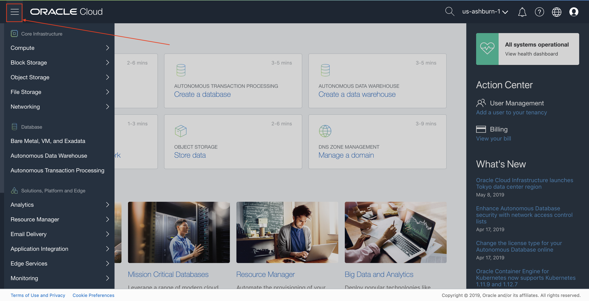
    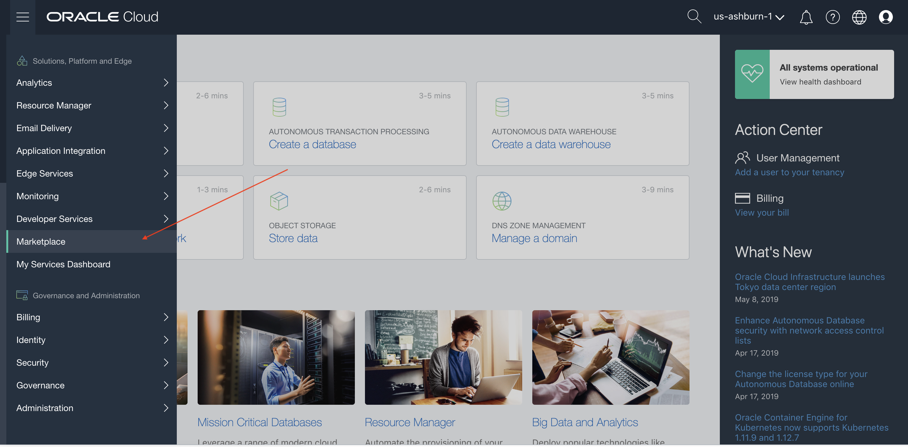
    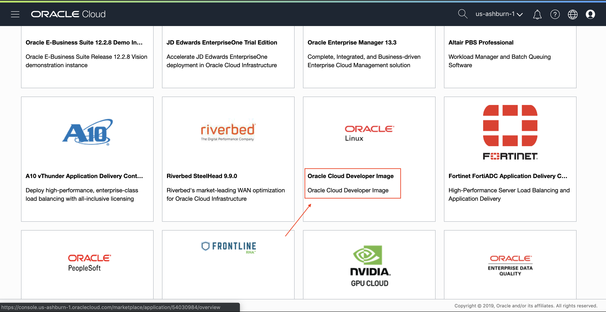
    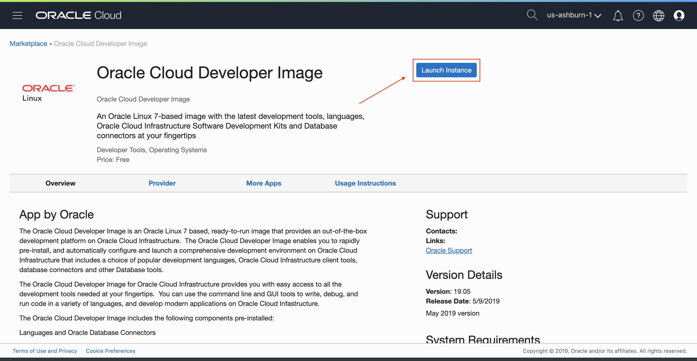
    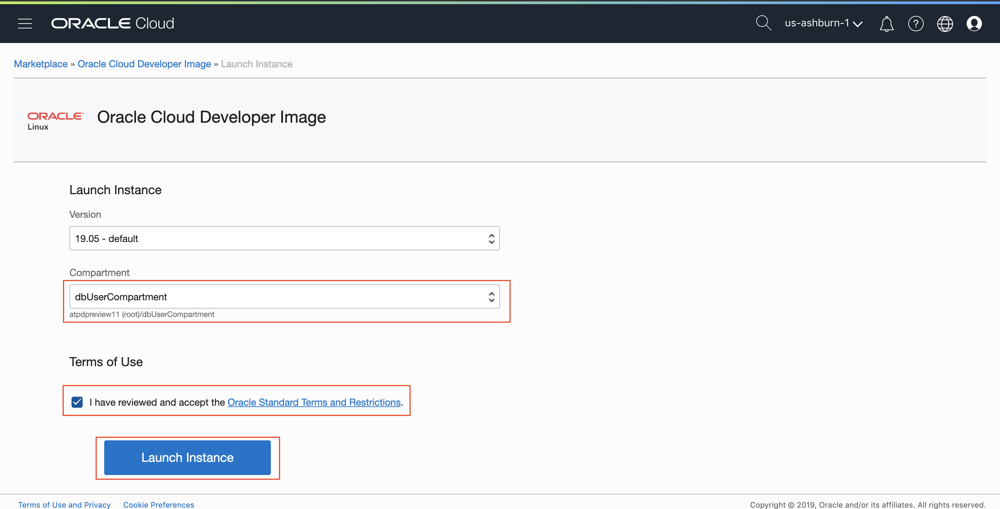
    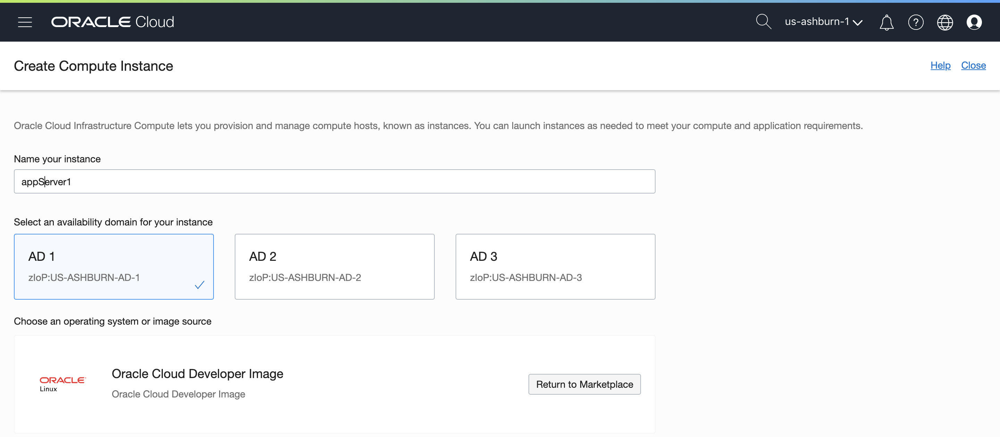
    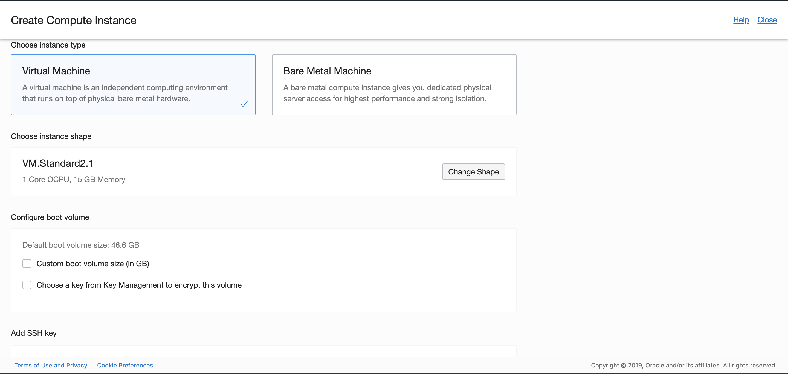
    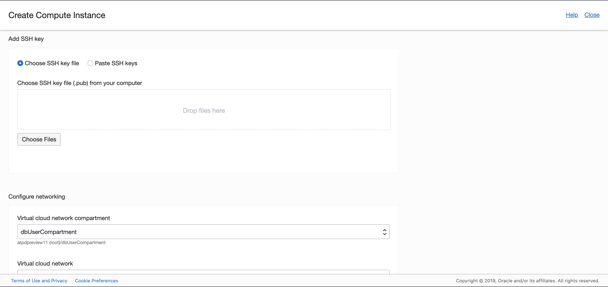
    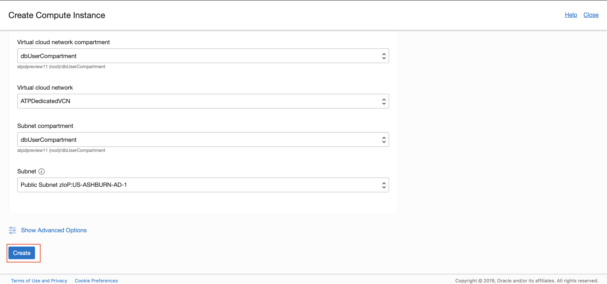
    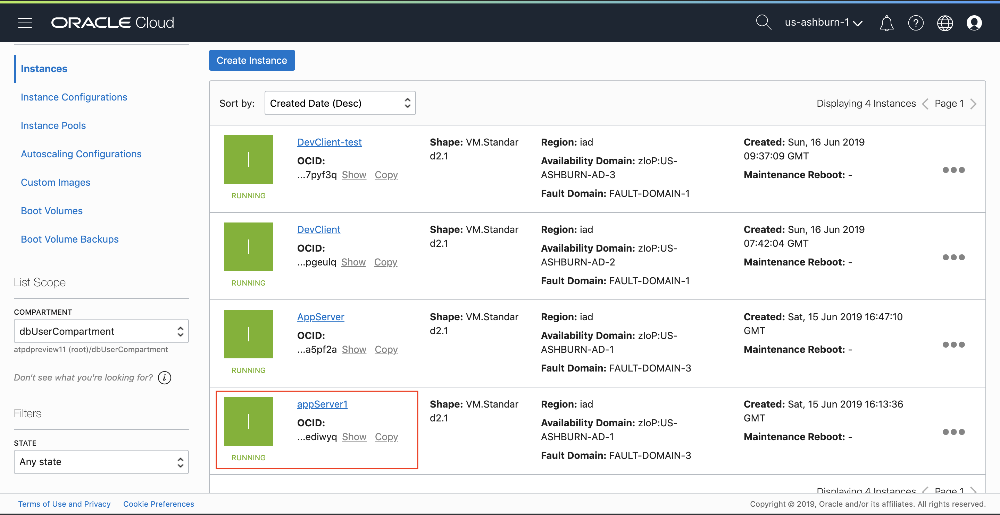

#### Note: The developer image is configured and installed with all the necessary tools, SDK's and CLI most commonly used for Developer and DBA tasks.

## Steps

### **STEP 1: Verifying the installed Oracle Cloud Infrastructure Command Line Interface (OCI-CLI)**

- We are going to use the preconfigured developer image available in the Marketplace on OCI console. This developer image is already configured with most of the required tools, SDK's and CLI's like Python, Node.js, Java, OCI-CLI, etc. Now, we are just going to verify whether the installed version meets our requirement for this lab.

#### Verifiying the OCI-CLI version

In this lab we are going to need the OCI-CLI which supports ATP-Dedicated database. To verify the whether OCI-CLI installed is the correct version needed for ATP-Dedicated database, run the following commands:

- Verifying if OCI-CLI is installed: 
    - Log in to the developer image using ssh or VNC viewer.Here we have used ssh to login. Type OCI and hit enter. You must see the various options which you can use with OCI-CLI.
    
    ```
    $ ssh -i <ssh_key> opc@<ip address>
    $ oci
    ```
    - You are going to see the options similar to the below example.

        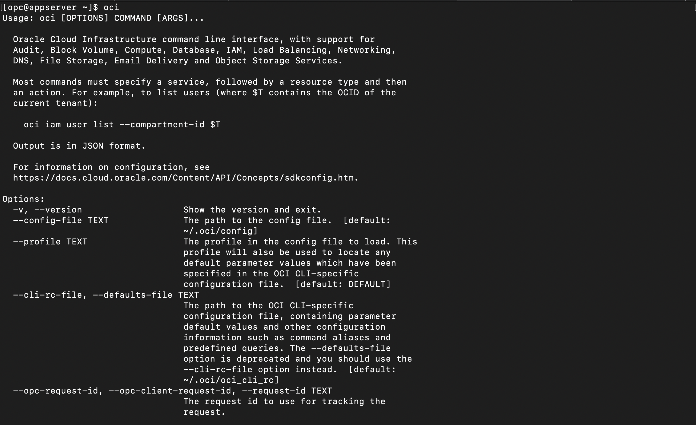
        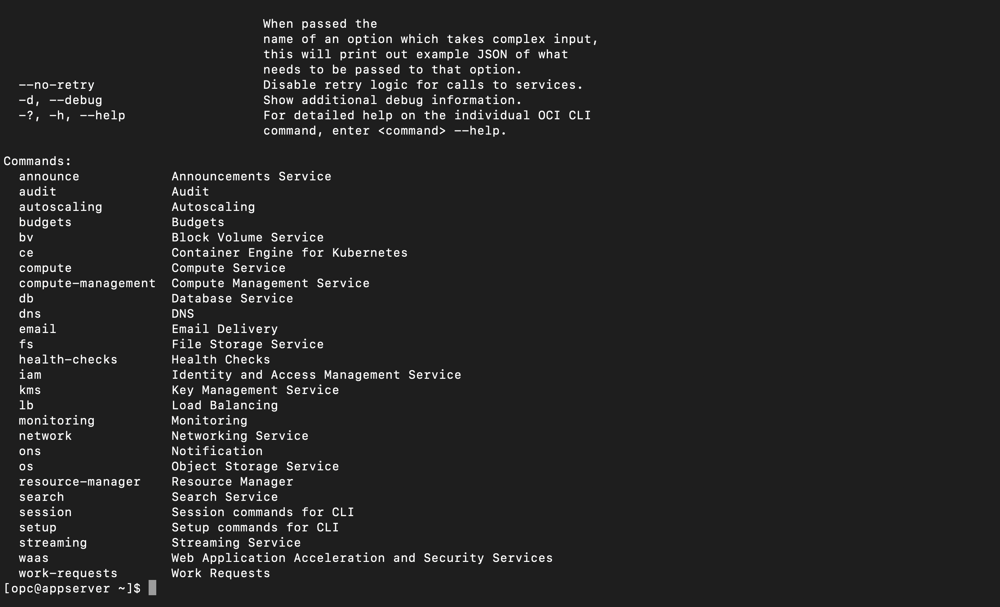

    - Verifying ATP Dedicated command options

        - On the same terminal, type the below commands and check for the ATP-Dedicated database options as shown below.

        ```
        $ oci db --help
        ```

        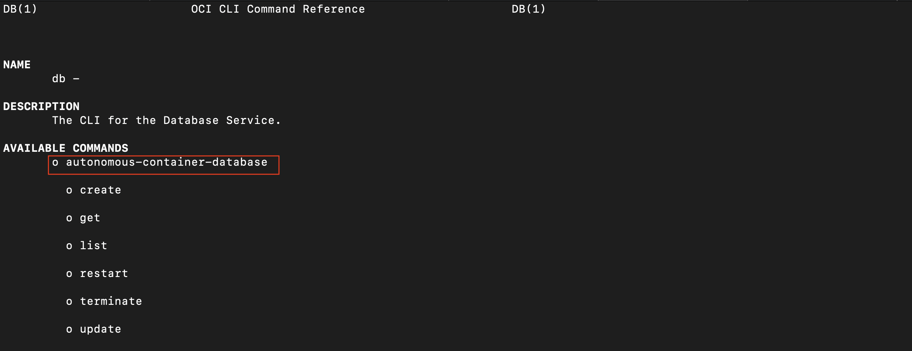

        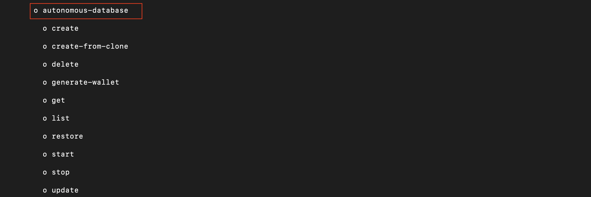

        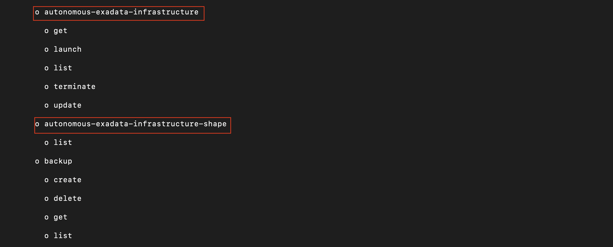

        - **Execute the below command and check if you have the "--is-dedicated" option in the list. This option is needed and mandatory when you are creating the ATP-Dedicated database. This is how OCI-CLI is going to differentiate between ATP serverless and ATP dedicated database. If the --is-dedicated option is set to True, then an ATP-Dedicated database will be provisioned. If this is set to False, then a ATP-Serverless database instance will be provisioned.**

        ```
        $ oci db autonomous-database create -h
        ```

        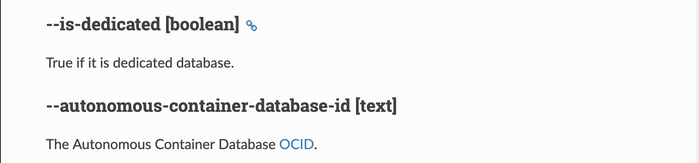


### **STEP 2: Configure OCI CLI**

- This step describes the required configuration for the CLI and includes optional configurations that enable you to extend CLI functionality. 

- Before using the CLI, you have to create a config file that contains the required credentials for working with Oracle Cloud Infrastructure. You can create this file using a setup dialog or manually, using a text editor.

- To have the CLI walk you through the first-time setup process, step by step, use

```
oci setup config
```

- The command prompts you for the information required for the config file and the API public/private keys. The setup dialog generates an API key pair and creates the config file.


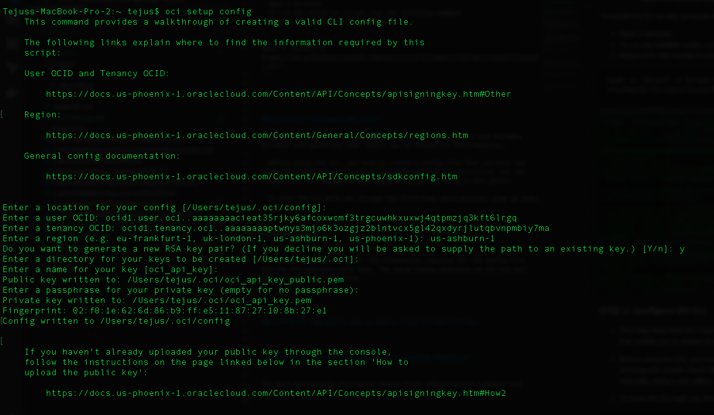

- Once you run the above command, you will need to enter the following:

    - **Enter a location for your config [/home/opc/.oci/config]**: Press Return key
    - **Enter a user OCID**: This is located on your user information page in OCI console

    Login to OCI console and click on Menu, Identity and Users. Click on the User and navigate to User Details page. Copy the User OCID.

    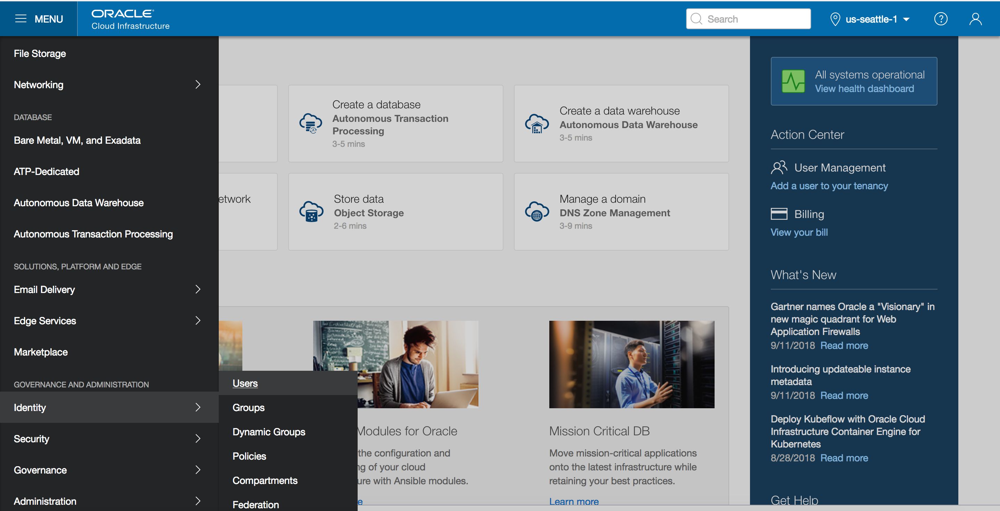

    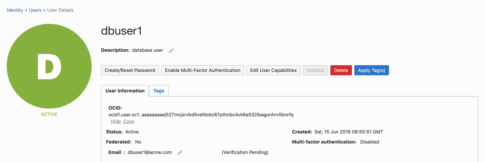


    - **Enter a tenancy OCID**: This is located in the bottom left of your OCI console
    
    Login to OCI console click on User icon on top right corner on the page and click on Tenancy and copy Tenancy OCID

    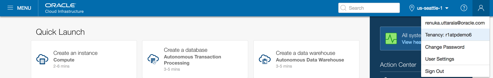

    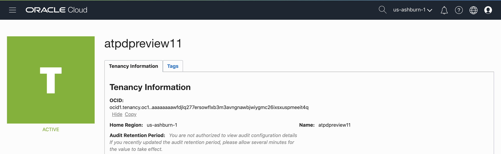

    - **Enter a region (e.g. eu-frankfurt-1, uk-london-1, us-ashburn-1, us-phoenix-1)**: Select a region

    - **Do you want to generate a new RSA key pair? (If you decline you will be asked to supply the path to an existing key.) [Y/n]**: Y
    - **Enter a directory for your keys to be created [/home/opc/.oci]**: Press Return key
    - **Enter a name for your key [oci_api_key]**: Press Return key
    - **Enter a passphrase for your private key (empty for no passphrase)**: Press Return key
    
### **STEP 3: Add public key to Oracle Cloud Infrastructure**

- Now that you have a private / public key combo , you must add it to OCI Console:

Add public key to OCI User setting

- Open Terminal and navigate to folder containing **oci_api_key_public.pem**. Copy the public key.

```
cat oci_api_key_public.pem
```

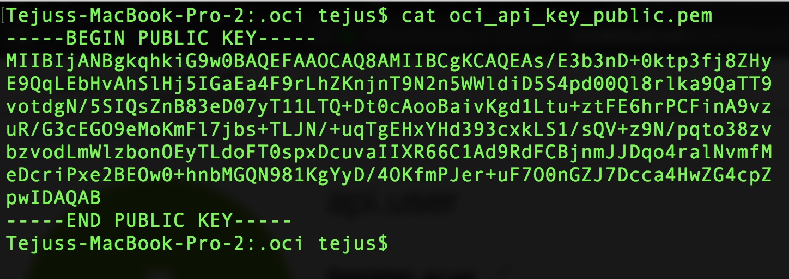

- Login to your OCI console and click on Menu and select Identity and Users. Select a User and navigate to User Detail page.

- Click on Add Public Key under API Keys section.


- Paste Public key which you copied from CLI in Add Public Key

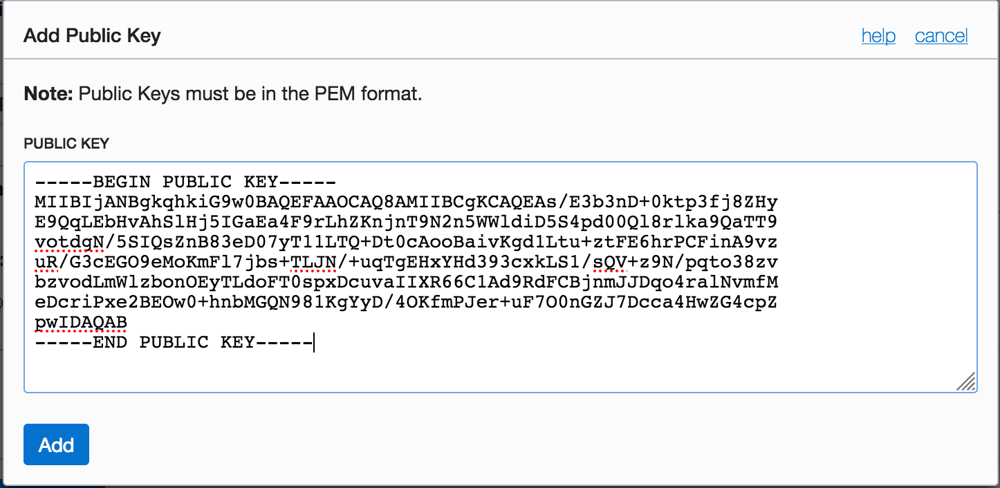


Once you add the key run the below command to autocomplete OCI setup.

```
oci setup autocomplete
```


### **STEP 4: Interacting with Oracle Autonomous Database**

Now that you have setup OCI CLI, let us now look at examples of using Autonomous Transaction Processing Database. 

#### Creating Database

Open your command line interface and run the following command to create an Autonomous Transaction Processing Database

```
oci db autonomous-database create --admin-password [password] --compartment-id [OCID] --cpu-core-count [integer] --data-storage-size-in-tbs [integer] --db-name [Database Name] --is-dedicated True --autonomous-container-database-id [OCID]
```

Container Database OCID can be found by clicking on the hamburger menu on the top left corner of OCI Dashboard, then navigating to Autonomous Transaction Processing > Container Database.

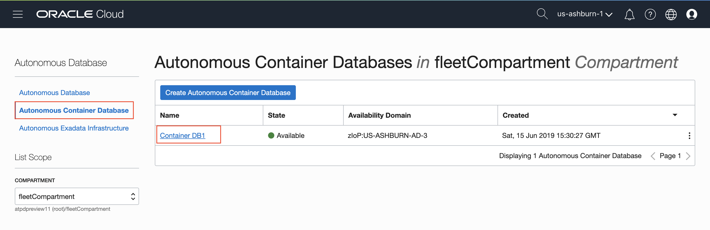

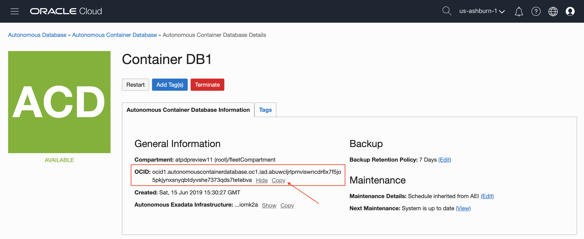

For example:

```
oci db autonomous-database create --admin-password "WElcome_123#" -c ocid1.compartment.oc1..aaaaaaaaditjcqg4pp7a7izwthnk4c6apz4bapczjz7ff4vy2ttfvwwfifra --cpu-core-count 1 --data-storage-size-in-tbs 1 --db-name "AbdulATPD" --is-dedicated True --autonomous-container-database-id ocid1.autonomouscontainerdatabase.oc1.iad.abuwcljrlpmviswncdr6x7f5jo5pkjynxsnyqbtdyvshe7373qds7tetebva
```

You are expected to see the following output in the command line interface

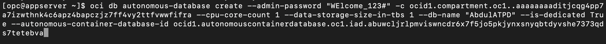


#### Get Database

Open your command line interface and run the following command to get details of an Autonomous Transaction Processing Database

```
oci db autonomous-database get --autonomous-database-id [OCID]
```

For Example:

```
oci db autonomous-database get --autonomous-database-id ocid1.autonomousdatabase.oc1.iad.abuwcljri2ydrtmg472fhrt67ddxm26mldj2s6gokywxfhuvuvrrhmn7mlna
```

You are expected to see the following output in the command line interface

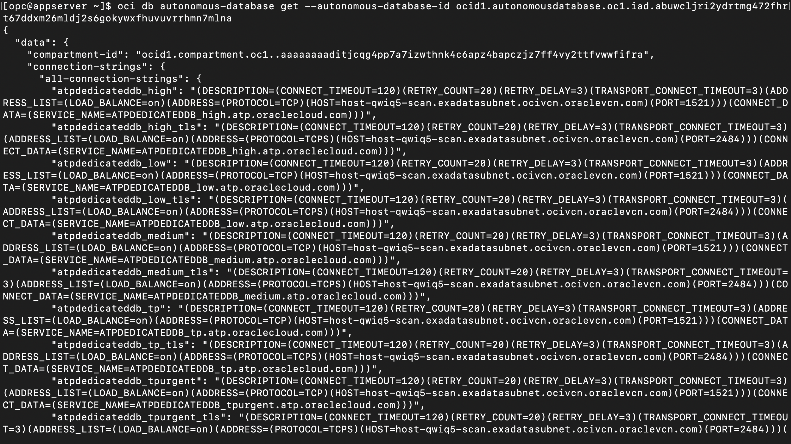
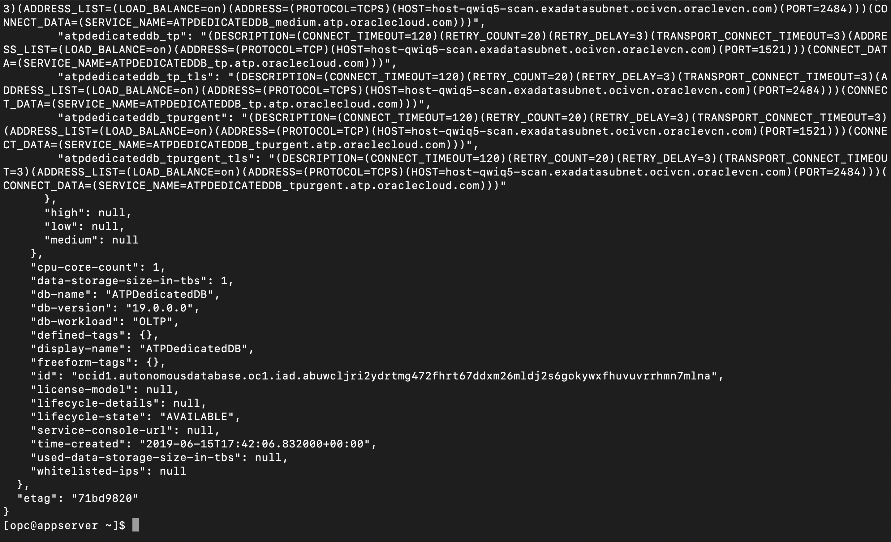

#### Listing Database

Open your command line interface and run the following command to List all Autonomous Transaction Processing Database

```
oci db autonomous-database list --compartment-id [OCID]
```

For example:

```
oci db autonomous-database list -c ocid1.compartment.oc1..aaaaaaaahnmqede4hg2sdom74lpljjwyu6nc6o2jr77rc5wagez3cwutu57a
```

You are expected to see the following output in the command line interface

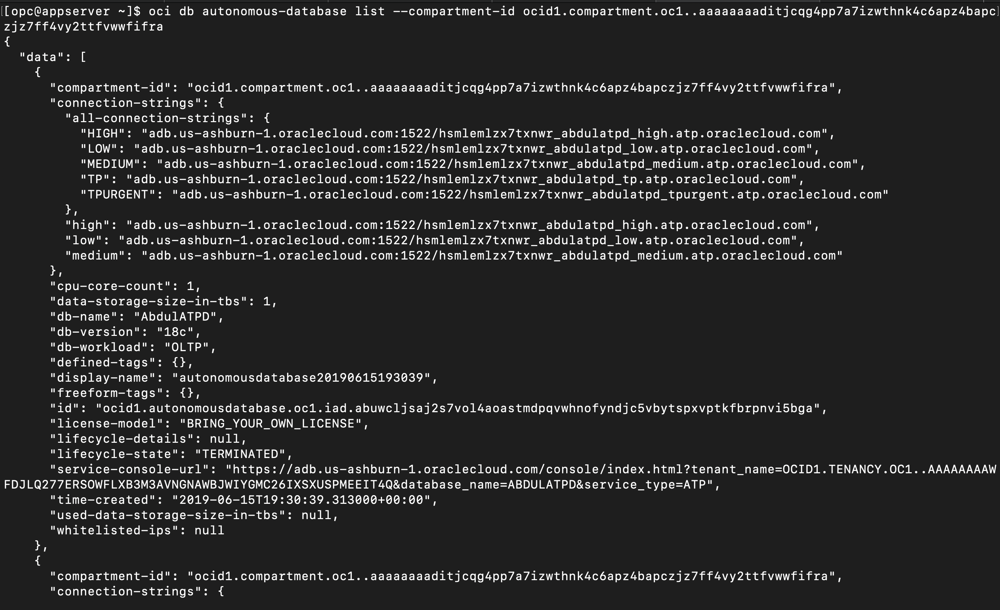

Run the following command to List all Autonomous Transaction Processing Database in a specific Container Database.

```
oci db autonomous-database list --autonomous-container-database-id [OCID]
```

For Example:

```
oci db autonomous-database list --autonomous-container-database-id ocid1.autonomouscontainerdatabase.oc1.iad.abuwcljrlpmviswncdr6x7f5jo5pkjynxsnyqbtdyvshe7373qds7tetebva
```

You are expected to see the following output in the command line interface

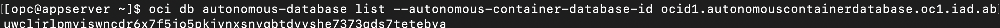
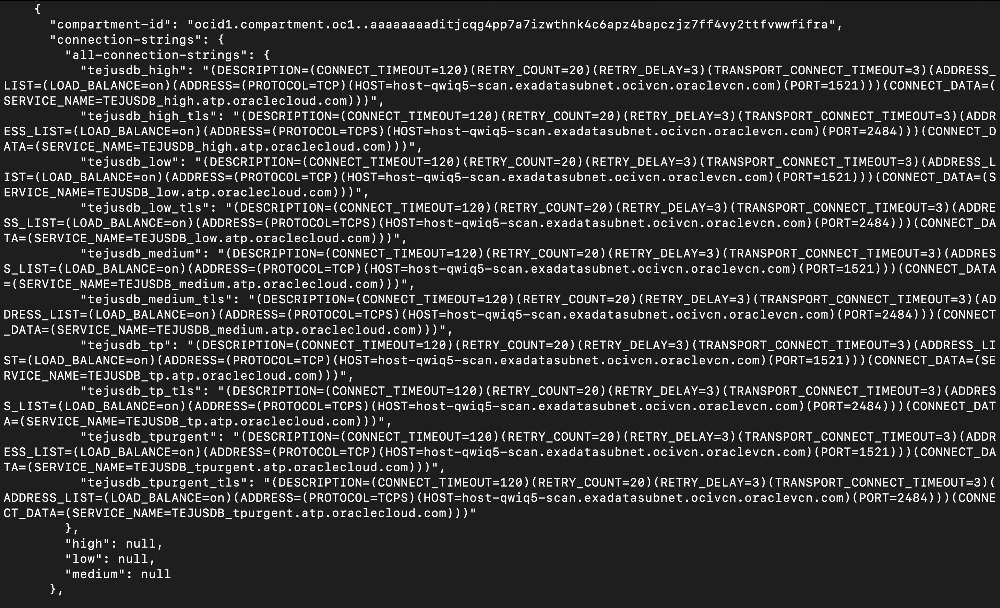

#### Deleting Database

Open your command line interface and run the following command to delete an Autonomous Transaction Processing Database

```
 oci db autonomous-database delete --autonomous-database-id [OCID]
```

For example:

```
oci db autonomous-database delete --autonomous-database-id ocid1.autonomousdatabase.oc1.iad.abuwcljror7qyzfpt2wwmypfyzlsbkksvg3srgeppe2bc7gbjkhipd73flva
```

You are expected to see the following output in the command line interface.

You will be asked **Are you sure you want to delete this resource? [y/N]** type Y to comfirm.


Login to OCI console and naviagte to Autonomous Transaction Processing Database from Menu and confirm that the database is **Terminating**.


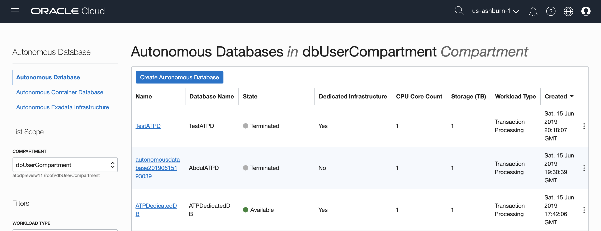


#### Bonus Step: In similar way you can try the follwing examples

#### Restore Databse 

Open your command line interface and run the following command to Restore Autonomous Transaction Processing Database

```
oci db autonomous-database restore --autonomous-database-id [OCID] --timestamp [datetime]
```

#### Start Database

Open your command line interface and run the following command to Start Autonomous Transaction Processing Database

```
oci db autonomous-database start --autonomous-database-id [OCID]
```

#### Stop Database

Open your command line interface and run the following command to Stop Autonomous Transaction Processing Database

```
oci db autonomous-database stop --autonomous-database-id [OCID]
```

#### Update Database

```
oci db autonomous-database update --autonomous-database-id [OCID] --cpu-core-count [integer]
```

For further examples on how to work with OCI CLI with different services please refer to Oracle documentation [here](https://docs.cloud.oracle.com/iaas/tools/oci-cli/latest/oci_cli_docs/cmdref/db.html).


You have successfully configured Oracle Cloud Infrastructure Command Line Interface and ran examples on Autonomous Transaction Processing - Dedicated Infrastructure Database.

-  You are now ready to move to the next lab.

<table>
<tr><td class="td-logo">[](#)</td>
<td class="td-banner">
## Great Work - All Done!
</td>
</tr>
<table>