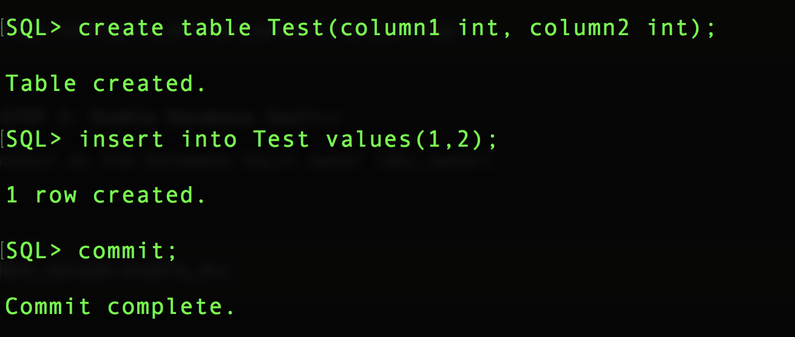

<table class="tbl-heading"><tr><td class="td-logo">

June 13, 2019
</td>
<td class="td-banner">
# Lab 1: Preparing your private data center in the Oracle Cloud Infrastructure 
</td></tr><table>

To **log issues**, click [here](https://github.com/oracle/learning-library/issues/new) to go to the github oracle repository issue submission form.

## Introduction

Oracle Autonomous Database supports Oracle Database Vault, which you can use to implement powerful security controls within your dedicated database. These unique security controls restrict access to application data by privileged database users, reducing the risk of insider and outside threats and addressing common compliance requirements.

You can deploy controls to block privileged account access to application data and control sensitive operations inside the database. Trusted paths can be used to add additional security controls to authorized data access and database changes. Through the runtime analysis of privileges and roles, you can increase the security of existing applications by implementing least privileges and reducing the attack profile of your database accounts. Oracle Database Vault secures existing database environments transparently, eliminating costly and time consuming application changes.

## Objectives

To configure and enable Enable Oracle Database Vault in your dedicated Autonomous Database


## Required Artifacts

-   The following lab requires an Oracle Cloud account. You may use your own cloud account, a cloud account that you obtained through a trial, or a training account whose details were given to you by an Oracle instructor.
- Access to OCI Autonomous transaction processing console
- A pre-provisioned autonomous database with admin access
- A pre-provisioned developer client with network access to database

## Steps

### **STEP 1: Create Database Vault Owner and Account Manager**

-	Connect as the ADMIN user to your dedicated database.

-	Create the Database Vault owner and account manager users; for example:

```

create user dbv_owner identified by WElcome_123#;
grant create session to dbv_owner;
create user dbv_acctmgr identified by WElcome_123#;
grant create session to dbv_acctmgr;

```


-	Next, let's verify that Database Vault is not turned on with the command:

```
SELECT VALUE FROM V$OPTION WHERE PARAMETER = 'Oracle Database Vault';
```


### **STEP 2: Configure Database Vault**

-	Login as the ADMIN user. Provide the owner and account manager user names that we created in Step 1

```

exec dvsys.configure_dv('dbv_owner','dbv_acctmgr');

```


### **STEP 3: Enable Database Vault**

-	Connect as the Database Vault owner (dbv_owner)

-	Let's create a table in this schema and add a single row for testing.

```
create table Test(column1 int, column2 int);
insert into Test values(1,2);
commit;
```



-	Next, let's enable the Database Vault

```

exec dbms_macadm.enable_dv;

```


- Restart the Autonomous Database instance

- Once the Database is back up and running, let's verify that Database Vault is turned on.

- Connect as ADMIN user and run:

```
SELECT VALUE FROM V$OPTION WHERE PARAMETER = 'Oracle Database Vault';
```


- We can see that now the value is TRUE. We have enabled Database Vault

- Even though we are the ADMIN user we should NOT be able to access any other schema's or other user's permissions. We run into a REALM issue


- We have successfully enabled Database Vault


<table>
<tr><td class="td-logo">[](#)</td>
<td class="td-banner">
### You have learned a few tips and tricks
</td>
</tr>
<table>
